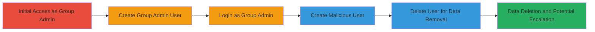

---
tags:
  - nextcloud
  - privilege-escalation
  - data-deletion
  - rce
  - filesystem-abuse
type: attack_chain
tools: []
tactics:
  - '[[Privilege Escalation]]'
verified: false
platforms:
  - Web
  - Linux
submitted: true
complexity: medium
created_at: '2023-10-01T00:00:00Z'
procedures:
  - '[[procedures/Create-and-Assign-Group-Admin-User]]'
  - '[[procedures/Login-as-Group-Admin]]'
  - '[[procedures/Create-User-Matching-Data-Subdirectory]]'
  - '[[procedures/Delete-User-to-Remove-Data-Directory]]'
step_count: 4
techniques:
  - '[[Exploitation for Privilege Escalation]]'
  - '[[Data Destruction]]'
updated_at: '2025-12-14T17:29:57.055Z'
description: >-
  Group administrators in Nextcloud can exploit user creation and deletion to
  delete arbitrary data directories, including critical admin data, and
  potentially escalate privileges under Apache by removing .htaccess files for
  RCE.
skill_level: intermediate
impact_level: high
id: a56a3d34-d834-4fa4-870a-1eb61ae07a68
validated: true
mitre_tactics:
  - '[[Privilege Escalation]]'
mitre_techniques:
  - '[[Exploitation for Privilege Escalation]]'
  - '[[Data Destruction]]'
---
# Nextcloud Arbitrary Data Deletion via User Management Exploitation

Multi-stage attack chain demonstrating how group admins can delete arbitrary data from the Nextcloud 'data' directory by abusing user creation and deletion functions, leading to data loss and potential RCE under Apache configurations.

## Chain Metrics Dashboard

| Metric | Value |
|--------|-------|
| Chain Status | Unverified |
| Total Steps | 4 |
| Execution Time | ~5 minutes |
| Skill Level | Intermediate |
| Complexity | Medium |
| Impact Level | High |

## Attack Flow Visualization

## Prerequisites & Requirements

### Required Tools

- Web browser for Nextcloud interface access

### Target Environment

- Nextcloud instance (Web platform)
- PHP and Apache web server
- Filesystem access to 'data' directory (e.g., /var/www/nextcloud/data)
- Required services/ports: HTTP/HTTPS on port 80/443
- Network access requirements: Direct access to Nextcloud admin interface

### Initial Access Requirements

- Valid credentials as a Nextcloud group administrator
- No prior shell access needed; exploits web interface

## Detailed Attack Procedures

### Step 1: Create Group Admin User
procedure: [[procedures/Create-and-Assign-Group-Admin-User]]

**Objective**: Establish a controlled group admin account to perform subsequent user management actions.

**Instructions**: Access the Nextcloud admin settings via the web interface. Navigate to Users section, create a new user, and assign them as admin to an arbitrary group. This leverages existing admin privileges to set up the exploit vector.

**Expected Output**: Confirmation of user creation and group admin assignment in the users list.

**Success Indicators**:
- New user appears in the users table with group admin role
- No errors during creation

### Step 2: Login as Group Admin
procedure: [[procedures/Login-as-Group-Admin]]

**Objective**: Authenticate as the newly created group admin to gain permissions for user creation and deletion.

**Instructions**: Use the Nextcloud login page to authenticate with the credentials of the new group admin user. Ensure the session is active and admin functions are accessible.

**Expected Output**: Successful dashboard load with admin menu options visible.

**Success Indicators**:
- Access to user management section granted
- Group admin privileges confirmed in profile or settings

### Step 3: Create User Matching Data Subdirectory
procedure: [[procedures/Create-User-Matching-Data-Subdirectory]]

**Objective**: Create a user whose name collides with an existing subdirectory in the 'data' directory, such as 'files_external' or 'appdata_{random}'.

**Instructions**: In the user management interface, enter a username that matches a target subdirectory path (e.g., 'files_external'). Proceed with user creation without additional validation checks being triggered.

**Expected Output**: New user created, and Nextcloud attempts to create data/{username} directory, but since it already exists, it may overwrite or conflict.

**Success Indicators**:
- User listed in users without errors
- Filesystem shows no immediate deletion but potential overlap

### Step 4: Delete User to Remove Data Directory
procedure: [[procedures/Delete-User-to-Remove-Data-Directory]]

**Objective**: Trigger deletion of the user, which removes the corresponding data/{username} directory, erasing arbitrary critical data.

**Instructions**: Select the malicious user in the admin interface and execute the delete function. Confirm deletion, which invokes filesystem removal of data/{username}.

**Expected Output**: User removed from list; target subdirectory (e.g., data/files_external) deleted from filesystem.

**Success Indicators**:
- Target data directory gone (verify via server access or logs)
- Under Apache, if .htaccess removed, direct PHP access possible leading to RCE

## Attack Chain Summary

### Key Achievements

1. Unauthorized deletion of admin and app data directories
2. Potential removal of .htaccess files enabling direct file access
3. Privilege escalation to webserver user (www-data) for RCE via PHP execution

## Technique & Tactic Coverage

### MITRE ATT&CK Techniques

- [[Exploitation for Privilege Escalation]] Exploitation for Privilege Escalation
- [[Data Destruction]] Data Destruction

### MITRE ATT&CK Tactics

- [[Privilege Escalation]] Privilege Escalation

---

*Last updated: 2023-10-01T00:00:00Z*
