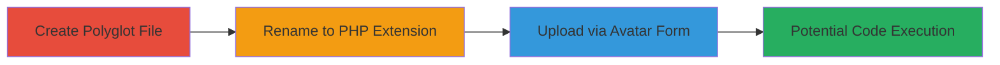

# Nextcloud Avatar Upload Bypass via Polyglot PHP-JPEG File

Multi-stage attack chain demonstrating a file upload bypass in Nextcloud's avatar functionality using a polyglot file that combines a valid JPEG image with embedded PHP code. The attack exploits insufficient validation in the avatar controller, allowing the upload of files that could lead to remote code execution if server-side renaming or configuration changes expose the PHP content.

## Chain Metrics Dashboard

| Metric | Value |
|--------|-------|
| Chain Status | Unverified |
| Total Steps | 3 |
| Execution Time | ~5 minutes |
| Skill Level | Intermediate |
| Complexity | Medium |
| Impact Level | High |

## Attack Flow Visualization

## Prerequisites & Requirements

### Required Tools

- None (manual file creation or download)

### Target Environment

- Nextcloud instance with avatar upload enabled
- Web platform running PHP
- Access to the user avatar upload form

### Initial Access Requirements

- Authenticated user account in Nextcloud
- Network access to the Nextcloud server
- No prior elevated privileges needed

## Detailed Attack Procedures

### Step 1: Create Polyglot File
procedure: [[procedures/Create-Polyglot-JPEG-PHP-File]]

**Objective**: Obtain or create a valid JPEG file embedding PHP code to pass image validation while containing executable content.

**Instructions**: Download a pre-made polyglot file from provided examples or create one by embedding PHP code (e.g., `<?php phpinfo(); ?>`) into a valid JPEG structure using a hex editor or script. Ensure the file validates as a JPEG but reveals PHP when interpreted as text.

**Expected Output**: A file like `image1.jpg` that is structurally a valid image but contains hidden PHP.

**Success Indicators**:
- File opens as a valid image in viewers
- Text editor shows embedded PHP code

### Step 2: Rename File
procedure: [[procedures/Rename-Polyglot-File-to-PHP]]

**Objective**: Change the file extension to .php to prepare for potential execution if the server serves it accordingly.

**Instructions**: Rename the polyglot file from `image1.jpg` to `image1.php` using file explorer or command line.

**Expected Output**: File now has .php extension while retaining JPEG validity.

**Success Indicators**:
- File extension updated
- MIME type still detects as image/jpeg when checked

### Step 3: Upload File
procedure: [[procedures/Upload-Polyglot-File-via-Nextcloud-Avatar-Form]]

**Objective**: Upload the malicious file through Nextcloud's avatar form, bypassing verification checks.

**Instructions**: Log in to Nextcloud, navigate to the avatar upload form, and submit the `image1.php` file. The upload succeeds because `/core/controller/avatarcontroller.php` uses `$image->valid()` and MIME detection, which pass for the polyglot.

**Expected Output**: File uploaded and renamed to 'avatar_upload' on server, stored without triggering execution (but vulnerable to config changes).

**Success Indicators**:
- Upload completes without errors
- Avatar appears as the image (confirming JPEG validity)
- Server logs show upload in image directory

## Attack Chain Summary

### Key Achievements

1. Successful bypass of image verification using polyglot file
2. Upload of PHP-embedded content disguised as avatar
3. Potential for RCE if server renaming is altered or misconfigured

## Technique & Tactic Coverage

### MITRE ATT&CK Techniques

- [[Exploit Public-Facing Application]] Exploit Public-Facing Application
- [[Remote File Copy]] Ingress Tool Transfer

### MITRE ATT&CK Tactics

- [[Initial Access]] Initial Access
- [[Execution]] Execution

---
*Last updated: 2024-10-05T12:00:00Z*
