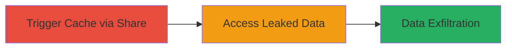

# Nextcloud Deck Cache Leakage for Unauthorized Card Data Access

Multi-stage attack chain demonstrating data leakage via shared caching in Nextcloud's Deck and Talk apps.

## Chain Metrics Dashboard

| Metric | Value |
|--------|-------|
| Chain Status | Unverified |
| Total Steps | 2 |
| Execution Time | ~5 minutes |
| Skill Level | Intermediate |
| Complexity | Low |
| Impact Level | Medium |

## Attack Flow Visualization

## Prerequisites & Requirements

### Required Tools

- Web browser (e.g., Chrome)

### Target Environment

- Nextcloud server with Deck and Talk apps enabled
- PHP-based web application
- User accounts with access to Deck and Talk

### Initial Access Requirements

- Valid user credentials for Nextcloud (User1 for setup, User2 for exploitation)
- Knowledge of boardId and cardId (e.g., from shared links or enumeration)
- Access to the same Talk conversation or leaked link

## Detailed Attack Procedures

### Step 1: Trigger Cache via Deck Card Share
procedure: [[procedures/Trigger-Deck-Card-Cache-via-Talk-Share]]

**Objective**: Cache deck card reference data in the shared ReferenceManager cache by sharing a card link in a Talk conversation, making it accessible without user isolation.

**Instructions**: Log in as User1, navigate to a Deck board, select a card, generate its shareable link, and post it in a Talk conversation. This triggers caching in ReferenceManager.php using a user-independent prefix.

**Expected Output**: The card link is shared, and reference data is cached server-side without errors.

**Success Indicators**:
- Link posted successfully in Talk
- No access errors for User1
- Cache entry created (verifiable via server logs if accessible)

### Step 2: Access Leaked Card Data
procedure: [[procedures/Access-Leaked-Card-Data-with-Known-IDs]]

**Objective**: Retrieve unauthorized deck card information from the shared cache using known boardId/cardId, bypassing access controls.

**Instructions**: As User2, access the Talk conversation or use the known boardId/cardId to request the reference. The ReferenceManager serves the cached data from CardReferenceProvider.php without user-specific checks.

**Expected Output**: User2 views deck card details (e.g., title, description) that they lack direct permissions for.

**Success Indicators**:
- Card data displayed to User2
- Data matches User1's private card
- No permission denied errors

## Attack Chain Summary

### Key Achievements

1. Bypassed user isolation in caching mechanism
2. Leaked sensitive deck card data to unauthorized users
3. Demonstrated minimal conditions for exploitation (prior cache and ID knowledge)

## Technique & Tactic Coverage

### MITRE ATT&CK Techniques

- [[Data from Information Repositories]] Data from Information Repositories
- [[Exploit Public-Facing Application]] Exploit Public-Facing Application

### MITRE ATT&CK Tactics

- [[Collection]] Collection

---
*Last updated: 2023-10-01T00:00:00Z*
