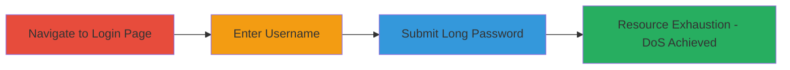

---
tags:
  - dos
  - nextcloud
  - web
  - hashing-exhaustion
type: attack_chain
tools: []
tactics:
  - '[[Impact]]'
verified: false
platforms:
  - Web
submitted: true
complexity: low
created_at: '2023-10-01T00:00:00Z'
procedures:
  - '[[procedures/Trigger-Nextcloud-Login-DoS-with-Long-Password]]'
step_count: 3
techniques:
  - '[[OS Exhaustion Flood]]'
updated_at: '2025-12-14T17:26:48.614Z'
description: >-
  A denial-of-service attack exploiting unbounded password length in Nextcloud's
  demo login page, causing CPU and memory exhaustion during hashing.
skill_level: beginner
impact_level: medium
id: d6ecb05c-6079-44ee-98a7-b9cb90d3e214
validated: true
mitre_tactics:
  - '[[Impact]]'
mitre_techniques:
  - '[[OS Exhaustion Flood]]'
---
# Nextcloud Demo DoS via Excessive Password Length in Login Hashing

Multi-stage attack chain demonstrating a denial-of-service vulnerability in the Nextcloud demo login page. The attack leverages a flawed password hashing implementation that does not enforce maximum password lengths, allowing an attacker to submit an extremely long password (e.g., 1,000,000 characters) which exhausts CPU and memory resources during the hashing process. This renders the login page unresponsive and can make the entire demo site unavailable. Note that this affects only the demo environment and not production Nextcloud instances.

## Chain Metrics Dashboard

| Metric | Value |
|--------|-------|
| Chain Status | Unverified |
| Total Steps | 3 |
| Execution Time | ~1 minute |
| Skill Level | Beginner |
| Complexity | Low |
| Impact Level | Medium |

## Attack Flow Visualization

## Prerequisites & Requirements

### Required Tools

- Web browser (e.g., Chrome, Firefox)

### Target Environment

- Nextcloud demo instance
- Web platform accessible via HTTPS
- No specific ports required beyond standard 443

### Initial Access Requirements

- Public internet access to the demo URL
- No credentials needed
- No prior access required

## Detailed Attack Procedures

### Step 1: Navigate to Login Page
procedure: [[procedures/Trigger-Nextcloud-Login-DoS-with-Long-Password]]

**Objective**: Access the vulnerable login endpoint to prepare for the DoS attempt.

**Instructions**: Open a web browser and navigate to the Nextcloud demo login page.

**Expected Output**: The login form loads, displaying fields for username and password.

**Success Indicators**:
- Login page is accessible and responsive
- URL confirms: https://demo2.nextcloud.com/index.php/login

### Step 2: Enter Username
procedure: [[procedures/Trigger-Nextcloud-Login-DoS-with-Long-Password]]

**Objective**: Simulate a login attempt by providing a username to reach the password submission stage.

**Instructions**: In the username field, enter any arbitrary username, such as "test" or an existing demo account like "admin".

**Expected Output**: The username field accepts the input without error, allowing focus on the password field.

**Success Indicators**:
- Username input is accepted
- Password field becomes active

### Step 3: Submit Long Password
procedure: [[procedures/Trigger-Nextcloud-Login-DoS-with-Long-Password]]

**Objective**: Trigger resource exhaustion by submitting an excessively long password, causing the hashing process to overload CPU and memory.

**Instructions**: In the password field, input a very long string, approximately 1,000,000 characters. Generate this by repeating a sequence like "123456789" multiple times (e.g., using browser developer tools or a text editor to paste). Then, submit the form by clicking the login button.

**Expected Output**: The page becomes unresponsive, with high CPU usage visible in browser task manager or server monitoring. The site may timeout or crash the login service.

**Success Indicators**:
- Browser or server shows resource exhaustion (e.g., 100% CPU)
- Login attempt hangs indefinitely
- Subsequent access to the site is delayed or fails

## Attack Chain Summary

### Key Achievements

1. Successfully accessed the vulnerable Nextcloud demo login page.
2. Bypassed input validation by submitting unbounded password length.
3. Induced DoS through hashing exhaustion, impacting site availability.

## Technique & Tactic Coverage

### MITRE ATT&CK Techniques

- [[OS Exhaustion Flood]]

### MITRE ATT&CK Tactics

- [[Impact]]

---
*Last updated: 2023-10-01T00:00:00Z*
