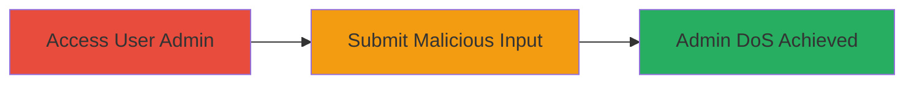

---
tags:
  - dos
  - nextcloud
  - input-validation
  - uncontrolled-resource-consumption
type: attack_chain
tools: []
tactics:
  - '[[Impact]]'
verified: false
platforms:
  - Web
submitted: true
complexity: low
created_at: '2023-10-01T00:00:00Z'
procedures:
  - '[[procedures/Trigger-DoS-in-Nextcloud-User-Administration]]'
step_count: 1
techniques:
  - '[[Endpoint Denial of Service]]'
updated_at: '2025-12-14T17:28:45.005Z'
description: >-
  A denial-of-service attack exploiting improper input validation in Nextcloud's
  user administration feature, preventing admins from editing or managing users.
skill_level: basic
impact_level: high
id: 68975f23-3900-4852-b1c4-be0785b4d87c
validated: true
mitre_tactics:
  - '[[Impact]]'
mitre_techniques:
  - '[[Endpoint Denial of Service]]'
---
# Nextcloud DoS: Disrupt Admin User Management via Improper Input Validation

Multi-stage attack chain demonstrating a complete attack workflow targeting Nextcloud's user administration to cause a denial of service for admins.

## Chain Metrics Dashboard

| Metric | Value |
|--------|-------|
| Chain Status | Unverified |
| Total Steps | 1 |
| Execution Time | ~1 minutes |
| Skill Level | Basic |
| Complexity | Low |
| Impact Level | High |

## Attack Flow Visualization

## Prerequisites & Requirements

### Required Tools

- Web browser (e.g., for authenticated access)

### Target Environment

- Nextcloud Server (web-based)
- Authenticated access to user administration page
- No specific ports beyond standard HTTP/HTTPS (80/443)

### Initial Access Requirements

- Valid user account with admin privileges or ability to impersonate/edit users
- Network access to the Nextcloud instance
- No prior access needed beyond login

## Detailed Attack Procedures

### Step 1: Trigger DoS in User Administration
procedure: [[procedures/Trigger-DoS-in-Nextcloud-User-Administration]]

**Objective**: Submit malicious input to the user administration feature to break the page, denying admins access to edit or manage user data.

**Instructions**: Log in to the Nextcloud instance as a user with sufficient privileges to access the admin user management interface. Navigate to the user administration page, select a target user, and attempt to edit their details by entering specially crafted input (e.g., excessively long strings, special characters, or payloads that cause rendering failures due to lack of validation). Submit the form to trigger the vulnerability.

**Expected Output**: The user administration page becomes unresponsive or broken, displaying errors or failing to load, preventing further admin actions on users.

**Success Indicators**:
- Admin page fails to load or edit functions are disabled
- Attempts to access or modify user data result in errors or blank pages

## Attack Chain Summary

### Key Achievements

1. Successfully disrupts Nextcloud's user administration functionality
2. Prevents admins from editing or managing users, impacting server operations
3. Exploits a web-based input validation flaw for high-impact DoS with minimal effort

## Technique & Tactic Coverage

### MITRE ATT&CK Techniques

- [[Endpoint Denial of Service]]

### MITRE ATT&CK Tactics

- [[Impact]]

---
*Last updated: 2023-10-01T00:00:00Z*
