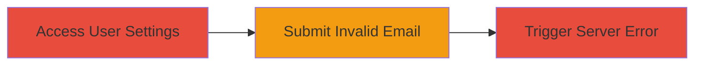

---
tags:
  - dos
  - nextcloud
  - input-validation
  - web-vulnerability
type: attack_chain
tools: []
tactics:
  - '[[Impact]]'
verified: false
platforms:
  - Web
submitted: true
complexity: low
created_at: '2023-10-01T00:00:00Z'
procedures:
  - '[[procedures/Trigger-Nextcloud-DoS-via-Email-Field]]'
step_count: 1
techniques:
  - '[[Endpoint Denial of Service]]'
  - '[[Exploit Public-Facing Application]]'
updated_at: '2025-12-14T17:26:30.362Z'
description: >-
  Exploit an input validation flaw in Nextcloud's user settings form by
  submitting 'Array' as the email value, triggering a 500 Internal Server Error
  and enabling denial of service through repeated requests.
skill_level: beginner
impact_level: medium
id: 0c760a89-cc30-4ffc-b2ac-1863a75f8119
validated: true
mitre_tactics:
  - '[[Impact]]'
mitre_techniques:
  - '[[Endpoint Denial of Service]]'
  - '[[Exploit Public-Facing Application]]'
---
# Nextcloud DoS via Invalid Email Submission in User Settings

Multi-stage attack chain demonstrating a complete attack workflow targeting Nextcloud's user settings for denial of service.

## Chain Metrics Dashboard

| Metric | Value |
|--------|-------|
| Chain Status | Unverified |
| Total Steps | 1 |
| Execution Time | ~1 minute |
| Skill Level | Beginner |
| Complexity | Low |
| Impact Level | Medium |

## Attack Flow Visualization



## Prerequisites & Requirements

### Required Tools

- None (uses standard HTTP client like curl or browser)

### Target Environment

- Nextcloud instance (PHP-based web application)
- Web platform with user authentication
- Access to user settings endpoint (e.g., /index.php/settings/users/{user_id}/settings)

### Initial Access Requirements

- Authenticated user session (valid Nextcloud login required)
- Network access to the Nextcloud server
- No prior privilege escalation needed

## Detailed Attack Procedures

### Step 1: Trigger DoS in User Settings
procedure: [[procedures/Trigger-Nextcloud-DoS-via-Email-Field]]

**Objective**: Submit invalid input to the email field in Nextcloud user settings, causing a server-side exception and 500 error that disrupts service availability.

**Instructions**: Authenticate to the Nextcloud instance and navigate to the user settings page. Use [[commands/curl-nextcloud-dos]] to simulate a form submission with the email parameter set to 'Array', which bypasses validation and triggers an unhandled error.

```bash
curl -X POST 'https://target.nextcloud.com/index.php/settings/users/{user_id}/settings' \
  -H 'Cookie: your_session_cookie_here' \
  -d 'email=Array&other_form_fields...'
```

Replace {user_id} with the actual user ID (e.g., TweLbFT93aqRnEfF), and include necessary session cookies and other form parameters from a legitimate request.

**Expected Output**: HTTP 500 Internal Server Error response from the server, indicating the exception was triggered.

**Success Indicators**:
- Server returns 500 error
- Repeated submissions cause increased server load or temporary unresponsiveness

## Attack Chain Summary

### Key Achievements

1. Successful triggering of server error via simple form input
2. Demonstration of input validation weakness in Nextcloud
3. Potential for scalable DoS by automating repeated requests

## Technique & Tactic Coverage

### MITRE ATT&CK Techniques

- [[Endpoint Denial of Service]] Endpoint Denial of Service
- [[Exploit Public-Facing Application]] Exploit Public-Facing Application

### MITRE ATT&CK Tactics

- [[Impact]] Impact

---
*Last updated: 2023-10-01T00:00:00Z*
