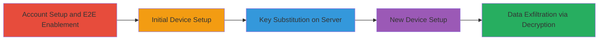

# Nextcloud E2E Encryption Public Key Substitution via Server Access

Multi-stage attack chain demonstrating a complete attack workflow exploiting a vulnerability in Nextcloud's end-to-end encryption implementation on Desktop and Android clients.

## Chain Metrics Dashboard

| Metric | Value |
|--------|-------|
| Chain Status | Unverified |
| Total Steps | 5 |
| Execution Time | ~30 minutes |
| Skill Level | Intermediate |
| Complexity | Medium |
| Impact Level | High |

## Attack Flow Visualization

## Prerequisites & Requirements

### Required Tools

- Server access (e.g., admin privileges or compromise tools like [[tools/Metasploit]] for initial access)

### Target Environment

- Nextcloud server with E2E encryption enabled
- Desktop or Android clients
- Required services: Nextcloud web interface and E2E encryption module
- Network access: Attacker must have administrative or file system access to the Nextcloud server

### Initial Access Requirements

- Compromised Nextcloud server (evil admin scenario)
- User account on the server
- No special credentials for client setup beyond standard user login

## Detailed Attack Procedures

### Step 1: Account Setup and E2E Enablement
procedure: [[procedures/Setup-Nextcloud-Account-and-Enable-E2E-Encryption]]

**Objective**: Establish a user account and activate E2E encryption on the server to prepare for the attack.

**Instructions**: Create a standard user account via the Nextcloud web interface and enable the E2E encryption app in server settings.

**Expected Output**: User account created; E2E encryption module activated and visible in app settings.

**Success Indicators**:
- User login successful
- E2E encryption option available in user settings

### Step 2: Initial Device Setup
procedure: [[procedures/Initial-Device-Setup-and-Data-Upload]]

**Objective**: Set up the first device, generate keys, and upload initial encrypted data to establish the baseline.

**Instructions**: On the primary device (Desktop or Android client), enable E2E encryption, generate the keypair, store the recovery nonce, and upload sample files.

**Expected Output**: Keypair generated; nonce saved; files encrypted and uploaded to server.

**Success Indicators**:
- Encryption enabled on device
- Files visible as encrypted on server
- Nonce recovery key obtained

### Step 3: Server Key Substitution
procedure: [[procedures/Server-Public-Key-Substitution]]

**Objective**: Replace the user's public key with the attacker's key on the server to enable MITM.

**Instructions**: With server access, locate the user's public key in the Nextcloud database or file system (typically in user data directories) and substitute it with the attacker's generated public key.

**Expected Output**: User's public key file or database entry updated to attacker's key.

**Success Indicators**:
- Key substitution confirmed via server logs or direct inspection
- No immediate client errors

### Step 4: New Device Setup
procedure: [[procedures/New-Device-Setup-with-Nonce-Recovery]]

**Objective**: Set up an additional device, which downloads the tampered public key without verification.

**Instructions**: On the new device, log in to the Nextcloud account, initiate E2E setup, and use the recovery nonce to restore the private key.

**Expected Output**: Device connected; private key restored via nonce; public key downloaded (tampered).

**Success Indicators**:
- Device syncs without key mismatch errors
- E2E encryption appears active

### Step 5: Compromised Data Upload and Decryption
procedure: [[procedures/Compromised-Data-Upload-and-Decryption]]

**Objective**: Upload data from the new device, which encrypts to the attacker's key, allowing decryption.

**Instructions**: Upload files from the new device; attacker then decrypts using their private key.

**Expected Output**: Files uploaded and encrypted to attacker's public key; attacker successfully decrypts files.

**Success Indicators**:
- New files appear on server
- Attacker can read plaintext of uploaded files

## Attack Chain Summary

### Key Achievements

1. Bypassed E2E encryption verification to substitute public keys
2. Achieved man-in-the-middle decryption of user data from new devices
3. Demonstrated complete breakdown of confidentiality in multi-device setups

## Technique & Tactic Coverage

### MITRE ATT&CK Techniques

- [[Adversary-in-the-Middle]] Adversary-in-the-Middle
- [[Forge Web Credentials]] Forge Web Credentials

### MITRE ATT&CK Tactics

- [[Defense Evasion]] Defense Evasion
- [[Collection]] Collection

---
*Last updated: 2023-10-01T00:00:00Z*
