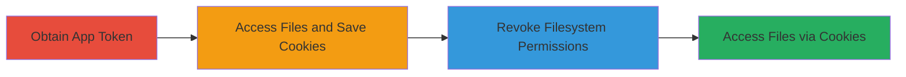

---
tags:
  - nextcloud
  - access-control-bypass
  - session-persistence
  - app-token
  - filesystem-access
type: attack_chain
tools: []
tactics:
  - '[[Persistence]]'
  - '[[Defense Evasion]]'
verified: false
platforms:
  - Web
  - Nextcloud
submitted: true
complexity: medium
created_at: '2024-10-01T00:00:00Z'
procedures:
  - '[[procedures/Obtain-Nextcloud-App-Token]]'
  - '[[procedures/Access-Files-and-Save-Session-Cookies]]'
  - '[[procedures/Revoke-App-Token-Filesystem-Permissions]]'
  - '[[procedures/Access-Files-Using-Saved-Cookies]]'
step_count: 4
techniques:
  - '[[Steal Application Access Token]]'
  - '[[Valid Accounts]]'
updated_at: '2025-12-14T17:29:28.253Z'
description: >-
  Demonstrates bypassing Nextcloud app token revocation by using saved session
  cookies to maintain unauthorized filesystem access.
skill_level: intermediate
impact_level: high
id: ffbb814d-1b24-48cb-b275-339a17915c92
validated: true
mitre_tactics:
  - '[[Persistence]]'
  - '[[Defense Evasion]]'
mitre_techniques:
  - '[[Steal Application Access Token]]'
  - '[[Valid Accounts]]'
---
# Nextcloud Filesystem Access Persistence via Session Cookies After App Token Revocation

Multi-stage attack chain demonstrating a complete attack workflow exploiting an improper access control vulnerability in Nextcloud.

## Chain Metrics Dashboard

| Metric | Value |
|--------|-------|
| Chain Status | Unverified |
| Total Steps | 4 |
| Execution Time | ~5 minutes |
| Skill Level | Intermediate |
| Complexity | Medium |
| Impact Level | High |

## Attack Flow Visualization

## Prerequisites & Requirements

### Required Tools

- Web browser or [[curl]] for API interactions
- Access to a Nextcloud instance with app token creation privileges

### Target Environment

- Nextcloud web application (PHP-based)
- Required services: Filesystem access via web interface or API
- Network access: Direct HTTP/HTTPS to Nextcloud server

### Initial Access Requirements

- Valid user account in Nextcloud with permission to create app tokens
- No prior elevated privileges needed, but administrative access for revocation simulation

## Detailed Attack Procedures

### Step 1: Obtain App Token
procedure: [[procedures/Obtain-Nextcloud-App-Token]]

**Objective**: Acquire an app token with filesystem access permissions to initiate authenticated sessions.

**Instructions**: Log in to the Nextcloud instance and generate an app token via the user settings or API, ensuring it includes filesystem read/write permissions.

**Expected Output**: A generated app token string usable for authentication.

**Success Indicators**:
- App token created successfully
- Token verifiable via API call to list files

### Step 2: Access Files and Save Cookies
procedure: [[procedures/Access-Files-and-Save-Session-Cookies]]

**Objective**: Use the app token to authenticate, access target files, and capture session cookies for later reuse.

**Instructions**: Authenticate with the app token to access the filesystem, then save the resulting session cookies from the response headers.

**Expected Output**: Successful file access and captured cookies (e.g., `nc_session_id` or similar).

**Success Indicators**:
- Files readable via authenticated session
- Cookies saved without errors

### Step 3: Revoke Permissions
procedure: [[procedures/Revoke-App-Token-Filesystem-Permissions]]

**Objective**: Revoke filesystem access for the app token to test the control mechanism.

**Instructions**: Update the app token settings in Nextcloud to explicitly remove filesystem permissions.

**Expected Output**: Permissions revoked, confirmed via token details.

**Success Indicators**:
- Token shows no filesystem access
- Direct token use for file access fails

### Step 4: Bypass Revocation
procedure: [[procedures/Access-Files-Using-Saved-Cookies]]

**Objective**: Demonstrate persistent access by reusing saved session cookies, bypassing the revocation.

**Instructions**: Submit requests to the filesystem using the saved cookies instead of the revoked token.

**Expected Output**: Unauthorized file access succeeds despite revocation.

**Success Indicators**:
- Files accessible via cookies
- No permission errors encountered

## Attack Chain Summary

### Key Achievements

1. Obtained app token with filesystem access
2. Captured persistent session cookies during authenticated access
3. Revoked token permissions without invalidating sessions
4. Maintained unauthorized filesystem access post-revocation, leading to potential data exposure

## Technique & Tactic Coverage

### MITRE ATT&CK Techniques

- [[Steal Application Access Token]] Steal Application Access Token
- [[Valid Accounts]] Valid Accounts

### MITRE ATT&CK Tactics

- [[Persistence]] Persistence
- [[Defense Evasion]] Defense Evasion

---
*Last updated: 2024-10-01T00:00:00Z*
