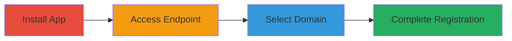

---
tags:
  - nextcloud
  - id4me
  - openid-connect
  - authentication-bypass
  - unauthorized-access
type: attack_chain
tools: []
tactics:
  - '[[Initial Access]]'
commands:
  - '[[commands/curl-access-id4me-endpoint]]'
platforms:
  - Web
complexity: low
procedures:
  - '[[procedures/Install-and-Enable-User-OIDC-App]]'
  - '[[procedures/Access-ID4me-Endpoint-Unauthenticated]]'
  - '[[procedures/Select-Custom-ID4me-Domain]]'
  - '[[procedures/Complete-Unauthorized-Registration]]'
step_count: 4
techniques:
  - '[[Exploit Public-Facing Application]]'
description: >-
  Exploitation of improper access control in Nextcloud's user_oidc app allowing
  unauthorized user account creation via ID4me even when disabled
skill_level: beginner
impact_level: medium
id: 375f382b-b59a-4759-a4d6-cf1a4ffb5d5a
created_at: '2025-12-13T09:01:26.597Z'
updated_at: '2025-12-13T09:01:26.597Z'
verified: false
validated: true
submitted: true
mitre_tactics:
  - '[[Initial Access]]'
mitre_techniques:
  - '[[Exploit Public-Facing Application]]'
---
# Nextcloud ID4me Vulnerability Exploitation for Unauthorized Account Creation

Multi-stage attack chain demonstrating how to exploit a vulnerability in Nextcloud's user_oidc app to create unauthorized user accounts via the ID4me feature, even when it is disabled. This allows attackers to register new accounts and potentially access instance-wide features like chat rooms.

## Chain Metrics Dashboard

| Metric | Value |
|--------|-------|
| Chain Status | Unverified |
| Total Steps | 4 |
| Execution Time | ~5 minutes |
| Skill Level | Beginner |
| Complexity | Low |
| Impact Level | Medium |

## Attack Flow Visualization



## Prerequisites & Requirements

### Required Tools

- None (browser-based)

### Target Environment

- Nextcloud server with user_oidc app installed
- Port 8080 open (or relevant port)
- Web platform

### Initial Access Requirements

- No credentials required
- Access to the Nextcloud server URL
- Ability to set up or use a dummy ID4me server

## Detailed Attack Procedures

### Step 1: Install and Enable User OIDC App
procedure: [[procedures/Install-and-Enable-User-OIDC-App]]

**Objective**: Set up the vulnerable user_oidc app on the Nextcloud server to enable the ID4me feature.

**Instructions**: Install the user_oidc app on the Nextcloud server and enable the OpenID Connect feature, which includes ID4me. This step assumes administrative access to the server for installation, but the exploitation targets instances where ID4me is supposedly disabled.

**Expected Output**: The app is installed and the ID4me feature is available, even if hidden.

**Success Indicators**:
- user_oidc app appears in Nextcloud apps list
- OpenID Connect is enabled

### Step 2: Access ID4me Endpoint Unauthenticated
procedure: [[procedures/Access-ID4me-Endpoint-Unauthenticated]]

**Objective**: Directly access the ID4me endpoint as an unauthenticated user, bypassing the disabled login button.

**Instructions**: Open the URL in a browser or use [[commands/curl-access-id4me-endpoint]] to access the endpoint:

```bash
curl http://localhost:8080/apps/user_oidc/id4me
```

This reaches the active controller despite the feature being disabled.

**Expected Output**: The ID4me authentication page or response is returned.

**Success Indicators**:
- Endpoint responds without authentication errors
- Access to ID4me interface granted

### Step 3: Select Custom ID4me Domain
procedure: [[procedures/Select-Custom-ID4me-Domain]]

**Objective**: Choose a custom domain pointing to a dummy ID4me server to simulate authentication.

**Instructions**: In the ID4me interface, select 'id4me.cloud.wtf' as the domain, which is configured to point to a test server that handles fake authentication requests.

**Expected Output**: Redirect to the dummy server for authentication simulation.

**Success Indicators**:
- Domain selection accepted
- Redirect to custom server occurs

### Step 4: Complete Unauthorized Registration
procedure: [[procedures/Complete-Unauthorized-Registration]]

**Objective**: Finish the registration process to create and log in as a new user account.

**Instructions**: Follow the redirects from the dummy server, which simulates successful authentication and redirects back to Nextcloud, resulting in a new account creation.

**Expected Output**: New user account created and logged in.

**Success Indicators**:
- New account appears in Nextcloud users
- Access to features like chat rooms granted

## Attack Chain Summary

### Key Achievements

1. Bypassed disabled ID4me feature
2. Created unauthorized user account
3. Gained access to instance-wide resources

## Technique & Tactic Coverage

### MITRE ATT&CK Techniques

- [[Exploit Public-Facing Application]]

### MITRE ATT&CK Tactics

- [[Initial Access]]

*Last updated: [TIMESTAMP]*
