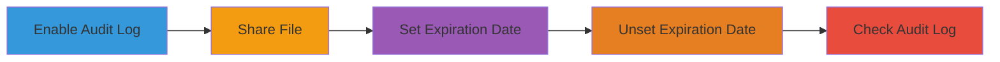

---
tags:
  - nextcloud
  - audit-log
  - insufficient-logging
  - file-sharing
  - vulnerability
type: attack_chain
tools: []
tactics: []
commands: []
platforms:
  - Web
complexity: low
procedures:
  - '[[procedures/Enable-Nextcloud-Audit-Log]]'
  - '[[procedures/Create-File-Share-in-Nextcloud]]'
  - '[[procedures/Set-Expiration-Date-on-Share]]'
  - '[[procedures/Unset-Expiration-Date-on-Share]]'
  - '[[procedures/Verify-Audit-Log-Entries]]'
step_count: 5
techniques: []
description: >-
  Demonstrates a vulnerability in Nextcloud where unsetting the expiration date
  on a shared file fails to produce a meaningful audit log entry, resulting in
  an incomplete audit trail for administrative actions on shares.
skill_level: intermediate
impact_level: medium
id: 1375d0de-f55c-462a-a3e4-769bcd0b6297
created_at: '2025-12-14T17:29:09.999Z'
updated_at: '2025-12-14T17:29:09.999Z'
verified: false
validated: true
submitted: true
---
# Nextcloud Insufficient Logging on Share Expiration Date Unsetting

Multi-stage attack chain demonstrating a complete workflow to expose the logging deficiency in Nextcloud's admin audit feature when modifying share expiration dates.

## Chain Metrics Dashboard

| Metric | Value |
|--------|-------|
| Chain Status | Unverified |
| Total Steps | 5 |
| Execution Time | ~5 minutes |
| Skill Level | Intermediate |
| Complexity | Low |
| Impact Level | Medium |

## Attack Flow Visualization

## Prerequisites & Requirements

### Required Tools

- None (uses Nextcloud web interface)

### Target Environment

- Nextcloud instance (version affected by CVE or similar, e.g., pre-patch for this issue)
- Web browser access
- Administrative privileges

### Initial Access Requirements

- Valid admin credentials for Nextcloud
- Direct network access to the Nextcloud web application
- No prior access needed beyond login

## Detailed Attack Procedures

### Step 1: Enable Audit Log
procedure: [[procedures/Enable-Nextcloud-Audit-Log]]

**Objective**: Activate the audit logging feature to monitor subsequent administrative actions on shares.

**Instructions**: Log in to the Nextcloud admin interface, navigate to Apps > Active apps, search for "Audit Log", and enable it. Confirm activation in the settings.

**Expected Output**: Audit log app status shows as enabled; log file or viewer becomes accessible.

**Success Indicators**:
- Audit log app is listed as active
- No errors during enablement

### Step 2: Share a File
procedure: [[procedures/Create-File-Share-in-Nextcloud]]

**Objective**: Create a share for a test file to set up the scenario for expiration date modifications.

**Instructions**: Log in as a user, select a file in the file manager, click the Share icon, and create a public or user share link without an expiration date initially.

**Expected Output**: Share link generated and visible in the sharing interface.

**Success Indicators**:
- Share created successfully
- Share details displayed in UI

### Step 3: Set Expiration Date on Share
procedure: [[procedures/Set-Expiration-Date-on-Share]]

**Objective**: Configure an expiration date on the share to establish a baseline logged action.

**Instructions**: In the share settings, locate the expiration date field, enter a future date (e.g., 7 days from now), and save the changes.

**Expected Output**: Expiration date applied to the share; UI reflects the new setting.

**Success Indicators**:
- Share now shows expiration date
- Action completes without errors

### Step 4: Unset Expiration Date on Share
procedure: [[procedures/Unset-Expiration-Date-on-Share]]

**Objective**: Remove the expiration date to trigger the vulnerable logging behavior.

**Instructions**: Return to the share settings, clear or remove the expiration date field, and save the changes.

**Expected Output**: Expiration date removed from the share; UI updates accordingly.

**Success Indicators**:
- Share no longer has an expiration date
- Save action succeeds

### Step 5: Check Audit Log
procedure: [[procedures/Verify-Audit-Log-Entries]]

**Objective**: Review the audit log to observe the incomplete or useless entry for the unset action, confirming the vulnerability.

**Instructions**: Navigate to the admin settings or log viewer, filter for share-related events, and examine entries for the set and unset actions.

**Expected Output**: Log shows a proper entry for setting the expiration but a vague or useless entry (e.g., no details on unsetting) for the removal.

**Success Indicators**:
- Set expiration logged with details
- Unset expiration results in incomplete log entry

## Attack Chain Summary

### Key Achievements

1. Enabled audit logging to prepare for monitoring
2. Created and modified a file share to test expiration handling
3. Exposed the logging flaw, demonstrating potential for hidden administrative changes
4. Highlighted risks to compliance and security auditing in Nextcloud environments

## Technique & Tactic Coverage

### MITRE ATT&CK Techniques

- None directly applicable (focuses on system weakness rather than adversary technique)

### MITRE ATT&CK Tactics

- None directly applicable

---

*Last updated: 2023-10-01T00:00:00Z*

## References

- [Nextcloud | Report #1200810 - Admin audit is not properly logging unsetting of expiration date | HackerOne](https://hackerone.com/reports/1200810)
