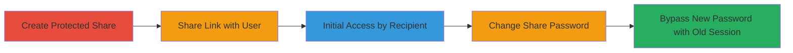

---
tags:
  - nextcloud
  - authentication-bypass
  - session-persistence
  - improper-authentication
type: attack_chain
tools: []
tactics:
  - '[[Initial Access]]'
verified: false
platforms:
  - Web
submitted: true
complexity: low
created_at: '2023-10-01T00:00:00Z'
procedures:
  - '[[procedures/Nextcloud-Share-Password-Bypass]]'
step_count: 5
techniques:
  - '[[Valid Accounts]]'
updated_at: '2025-12-14T17:31:30.494Z'
description: >-
  Demonstrates an improper authentication vulnerability in Nextcloud where
  changing the password on a protected share does not invalidate existing user
  sessions, allowing unauthorized continued access to shared resources.
skill_level: low
impact_level: high
id: 510aa364-a6fb-48c8-af4c-a0c2d86d2a82
validated: true
mitre_tactics:
  - '[[Initial Access]]'
mitre_techniques:
  - '[[Valid Accounts]]'
---
# Nextcloud Password-Protected Share Authentication Bypass via Persistent Sessions

Multi-stage attack chain demonstrating a complete attack workflow exploiting an authentication flaw in Nextcloud's password-protected sharing feature.

## Chain Metrics Dashboard

| Metric | Value |
|--------|-------|
| Chain Status | Unverified |
| Total Steps | 5 |
| Execution Time | ~5 minutes |
| Skill Level | Low |
| Complexity | Low |
| Impact Level | High |

## Attack Flow Visualization

## Prerequisites & Requirements

### Required Tools

- None (uses Nextcloud web interface)

### Target Environment

- Nextcloud instance (version affected by CVE or similar, e.g., pre-fix for this issue)
- Enabled sharing feature with password protection
- Administrative or user access to create shares

### Initial Access Requirements

- Valid Nextcloud user account (UserA) with sharing permissions
- Recipient (UserB) with the share link
- No special network position required; standard web access

## Detailed Attack Procedures

### Step 1: Create Password-Protected Share
procedure: [[procedures/Nextcloud-Share-Password-Bypass]]

**Objective**: Set up a password-protected share to demonstrate the vulnerability.

**Instructions**: Log in to Nextcloud as UserA. Navigate to the file or folder to share, select the sharing option, enable password protection, and set an initial password (e.g., "oldpass"). Generate the share link.

**Expected Output**: A protected share link is created and ready to distribute.

**Success Indicators**:
- Share link generated with password requirement enabled
- No errors in share creation

### Step 2: Share Link with Recipient
procedure: [[procedures/Nextcloud-Share-Password-Bypass]]

**Objective**: Distribute the protected link to allow initial access.

**Instructions**: Copy the share link from the Nextcloud interface and send it to UserB via email, chat, or any medium.

**Expected Output**: UserB receives the link and can attempt access.

**Success Indicators**:
- Link successfully shared
- UserB confirms receipt

### Step 3: Initial Access by Recipient
procedure: [[procedures/Nextcloud-Share-Password-Bypass]]

**Objective**: Gain initial authenticated access to establish a persistent session.

**Instructions**: UserB opens the share link in a browser, enters the initial password ("oldpass"), and accesses the shared content. Interact with the share to ensure a session is active (e.g., view or download files).

**Expected Output**: Access granted to the shared resources without errors.

**Success Indicators**:
- Content visible and accessible
- Browser session cookie or token established for the share

### Step 4: Change Share Password
procedure: [[procedures/Nextcloud-Share-Password-Bypass]]

**Objective**: Update the share password to simulate a security update, which should invalidate old sessions but does not.

**Instructions**: As UserA, return to the share settings in Nextcloud, update the password to a new value (e.g., "newpass"), and save the changes.

**Expected Output**: Password updated successfully in the share configuration.

**Success Indicators**:
- New password set without errors
- Share remains active

### Step 5: Bypass New Password with Old Session
procedure: [[procedures/Nextcloud-Share-Password-Bypass]]

**Objective**: Demonstrate the vulnerability by accessing the share without the new password.

**Instructions**: UserB refreshes the browser page or revisits the share link without clearing cookies/sessions. Attempt to access the content again.

**Expected Output**: Continued access to the shared resources without prompting for the new password.

**Success Indicators**:
- Access granted using the old session
- No password prompt for the updated password

## Attack Chain Summary

### Key Achievements

1. Successful creation and initial access to a password-protected share
2. Password change that fails to enforce re-authentication
3. Unauthorized persistent access bypassing security controls

## Technique & Tactic Coverage

### MITRE ATT&CK Techniques

- [[Valid Accounts]]

### MITRE ATT&CK Tactics

- [[Initial Access]]

---
*Last updated: 2023-10-01T00:00:00Z*
