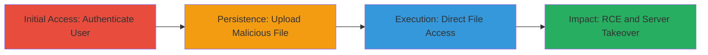

# Nextcloud RCE and XSS via Web-Accessible Data Directory Misconfiguration

Multi-stage attack chain demonstrating exploitation of Nextcloud's default configuration where the data directory is inside the web root, enabling direct access to uploaded files for remote code execution (RCE) and cross-site scripting (XSS). This requires a user account with upload permissions and a misconfigured Apache server lacking proper .htaccess protections on HTTP ports.

## Chain Metrics Dashboard

| Metric | Value |
|--------|-------|
| Chain Status | Unverified |
| Total Steps | 4 |
| Execution Time | ~5 minutes |
| Skill Level | Intermediate |
| Complexity | Medium |
| Impact Level | High |

## Attack Flow Visualization

## Prerequisites & Requirements

### Required Tools

- Web browser for authentication and upload
- Knowledge of PHP scripting for malicious payloads

### Target Environment

- Nextcloud 16.0.4.1 or similar versions with default config
- Apache/2.4.25 on Debian
- Data directory at /var/www/nextcloud/data (inside web root)
- Ports 80 (HTTP) and 443 (HTTPS) open
- AllowOverride disabled or misconfigured on port 80, bypassing .htaccess

### Initial Access Requirements

- Valid non-admin user credentials (e.g., username 'attacker')
- Network access to the Nextcloud instance
- No prior admin access needed, but upload permissions required

## Detailed Attack Procedures

### Step 1: Authenticate as User
procedure: [[procedures/Authenticate-as-Nextcloud-User]]

**Objective**: Gain authenticated access to the Nextcloud instance to enable file upload capabilities.

**Instructions**: Use a web browser to log in with a non-admin user account that has file upload permissions. Navigate to the Nextcloud login page and enter credentials for the 'attacker' user.

**Expected Output**: Successful login redirect to the Nextcloud dashboard, confirming access to the files app.

**Success Indicators**:
- Dashboard loads without errors
- Access to 'Files' section granted

### Step 2: Upload Malicious PHP Script
procedure: [[procedures/Upload-Malicious-PHP-Script-to-Nextcloud]]

**Objective**: Upload a PHP file containing malicious code to the user's data directory, which is stored in a predictable path.

**Instructions**: In the Nextcloud Files interface, create and upload a file named 'shell.php' with PHP code such as `<?php system($_GET['cmd']); ?>`. The file will be saved to /data/attacker/files/shell.php relative to the web root.

**Expected Output**: Upload confirmation in the interface, with the file visible in the user's files list.

**Success Indicators**:
- File appears in the Files app
- No upload errors or restrictions

### Step 3: Directly Access Uploaded PHP File
procedure: [[procedures/Directly-Access-Uploaded-PHP-File]]

**Objective**: Bypass Nextcloud's protections by directly requesting the uploaded file via its URL, exploiting the web-accessible data directory.

**Instructions**: In a web browser, navigate to the direct URL: https://www.ournextclouddomain.com/data/attacker/files/shell.php. The server will serve the file due to the misconfigured data directory.

**Expected Output**: The PHP file loads and executes, potentially displaying output or waiting for parameters.

**Success Indicators**:
- HTTP 200 response with PHP execution (no download prompt)
- No 403/404 errors indicating protection

### Step 4: Execute RCE via Web-Accessible PHP File
procedure: [[procedures/Execute-RCE-via-Web-Accessible-PHP-File]]

**Objective**: Trigger remote code execution on the server, leading to shell access, data extraction, or further compromise.

**Instructions**: Append a command parameter to the URL, e.g., https://www.ournextclouddomain.com/data/attacker/files/shell.php?cmd=whoami. The PHP code executes the system command, returning output.

**Expected Output**: Command output displayed in the browser, such as the web server user (e.g., 'www-data').

**Success Indicators**:
- Arbitrary commands execute successfully
- Potential for server takeover or data exfiltration

## Attack Chain Summary

### Key Achievements

1. Authenticated upload of executable files without validation
2. Direct web access to data directory bypassing Nextcloud protections
3. Remote code execution enabling server compromise
4. Potential XSS via HTML file uploads for client-side attacks

## Technique & Tactic Coverage

### MITRE ATT&CK Techniques

- [[Remote File Copy]] Ingress Tool Transfer
- [[Python]] PHP
- [[Drive-by Compromise]] Drive-by Compromise

### MITRE ATT&CK Tactics

- [[Initial Access]] Initial Access
- [[Execution]] Execution

---
*Last updated: 2023-10-01T00:00:00Z*
