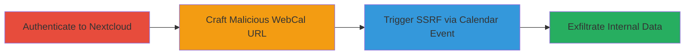

# Nextcloud SSRF Bypass via IPv6-Embedded IPv4 in Calendar WebCal URLs

Multi-stage attack chain demonstrating a complete SSRF exploitation workflow in Nextcloud, targeting the Calendar and DAV apps to bypass SSRF protections and access internal resources.

## Chain Metrics Dashboard

| Metric | Value |
|--------|-------|
| Chain Status | Unverified |
| Total Steps | 3 |
| Execution Time | ~5 minutes |
| Skill Level | Intermediate |
| Complexity | Medium |
| Impact Level | High |

## Attack Flow Visualization



## Prerequisites & Requirements

### Required Tools

- [[tools/nextcloud_ssrf.py]]

### Target Environment

- Nextcloud instance running vulnerable Calendar and DAV apps (e.g., versions prior to patch for CVE-2019-11324 or similar)
- Web server on port 80
- PHP environment with filter_var function
- Internal services accessible via localhost (127.0.0.1)

### Initial Access Requirements

- Valid admin or privileged user credentials for Nextcloud
- Network access to the Nextcloud web interface
- No prior access needed beyond authentication

## Detailed Attack Procedures

### Step 1: Authenticate to Nextcloud Instance
procedure: [[procedures/Authenticate-to-Nextcloud-Instance]]

**Objective**: Gain authenticated access to the Nextcloud instance as an admin or privileged user to enable calendar interactions.

**Instructions**: Use provided credentials to log in via the web interface or API. This establishes a session for subsequent API calls.

**Expected Output**: Successful login with session token or cookie for authenticated requests.

**Success Indicators**:
- Access to dashboard and calendar app
- API endpoints respond with 200 OK for authenticated user

### Step 2: Craft SSRF Bypass WebCal URL
procedure: [[procedures/Craft-SSRF-Bypass-WebCal-URL]]

**Objective**: Construct a malicious WebCal URL that embeds an IPv4 address (e.g., 127.0.0.1) within an IPv6 format to evade PHP's filter_var validation after bracket removal.

**Instructions**: Manually build the URL like `http://[0:0:0:0:0:ffff:127.0.0.1]:80/secret.ics`. Test validation logic if possible using PHP snippets to confirm bypass.

**Expected Output**: Validated URL that passes SSRF filters but resolves to internal IP.

**Success Indicators**:
- URL parses as IPv6 without brackets
- filter_var returns true for the embedded format

### Step 3: Trigger SSRF via Calendar Event Creation
procedure: [[procedures/Trigger-SSRF-via-Calendar-Event-Creation]]

**Objective**: Inject the malicious URL into a calendar event, triggering the server-side RefreshWebcalJob to fetch internal resources and exfiltrate data.

**Instructions**: Use the Python script to create an ICS event with the URL: Execute [[commands/nextcloud-ssrf-exploit]] with target details.

```bash
python nextcloud_ssrf.py http://192.168.0.105/nextcloud/nextcloud/ admin "[password]" http://[0:0:0:0:0:ffff:127.0.0.1]:80/secret.ics
```

Monitor the calendar for the event and check server logs or responses for fetched content.

**Expected Output**: Calendar event created; server fetches `/secret.ics` from localhost, potentially returning or logging internal data.

**Success Indicators**:
- Event appears in calendar
- Internal file content accessible or exfiltrated
- No SSRF filter rejection

## Attack Chain Summary

### Key Achievements

1. Bypassed SSRF protections using IPv6 embedding
2. Forced server to access localhost resources with its privileges
3. Enabled data exfiltration from internal services via authenticated calendar features

## Technique & Tactic Coverage

### MITRE ATT&CK Techniques

- [[Exploit Public-Facing Application]]

### MITRE ATT&CK Tactics

- [[Initial Access]]

---
*Last updated: 2023-12-14T00:00:00Z*
