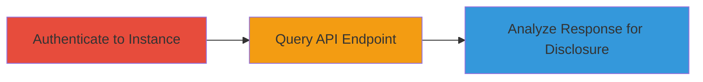

---
tags:
  - information-disclosure
  - nextcloud
  - path-disclosure
  - api
  - reconnaissance
type: attack_chain
tools: []
tactics:
  - '[[Discovery]]'
verified: false
platforms:
  - Web
  - PHP
submitted: true
complexity: low
created_at: '2023-10-01T00:00:00Z'
procedures:
  - '[[procedures/Authenticate-to-Nextcloud-Instance]]'
  - '[[procedures/Query-Nextcloud-Cloud-User-API]]'
  - '[[procedures/Analyze-API-Response-for-Path-Disclosure]]'
step_count: 3
techniques:
  - '[[File and Directory Discovery]]'
  - '[[Gather Victim Host Information]]'
updated_at: '2025-12-14T17:26:12.110Z'
description: >-
  An authenticated information disclosure attack that reveals the full server
  installation path through the Nextcloud OCS API, aiding reconnaissance for
  further exploitation.
skill_level: beginner
impact_level: low
id: 4cc211fd-a67a-487c-9332-9fcd05700e18
validated: true
mitre_tactics:
  - '[[Discovery]]'
mitre_techniques:
  - '[[File and Directory Discovery]]'
  - '[[Gather Victim Host Information]]'
---
# Nextcloud Server Installation Path Disclosure via Cloud User API

Multi-stage attack chain demonstrating reconnaissance via information disclosure in a Nextcloud instance. An authenticated user can query the OCS API to expose the internal server path, such as the data storage location, which reveals filesystem details useful for further attacks like path traversal or privilege escalation planning.

## Chain Metrics Dashboard

| Metric | Value |
|--------|-------|
| Chain Status | Unverified |
| Total Steps | 3 |
| Execution Time | ~2 minutes |
| Skill Level | Beginner |
| Complexity | Low |
| Impact Level | Low |

## Attack Flow Visualization



## Prerequisites & Requirements

### Required Tools

- [[commands/curl-nextcloud-user-endpoint]]

### Target Environment

- Nextcloud web application (any version with the vulnerable OCS API)
- PHP-based web server
- Valid user credentials for authentication

### Initial Access Requirements

- Network access to the Nextcloud instance (e.g., via browser or HTTP client)
- User account (can be admin or standard user post-installation)
- No prior access needed beyond authentication

## Detailed Attack Procedures

### Step 1: Authenticate to Nextcloud Instance
procedure: [[procedures/Authenticate-to-Nextcloud-Instance]]

**Objective**: Gain authenticated access to the Nextcloud instance to enable API queries.

**Instructions**: Log in via the web interface or use an HTTP client to establish a session. Use a web browser to navigate to the login page and enter credentials, or simulate with curl by posting login details and capturing the session cookie.

**Expected Output**: Successful login redirect or session cookie/token.

**Success Indicators**:
- Access to the Nextcloud dashboard
- Valid session established for API calls

### Step 2: Query Nextcloud Cloud User API
procedure: [[procedures/Query-Nextcloud-Cloud-User-API]]

**Objective**: Send a GET request to the OCS API endpoint to retrieve user data, including sensitive path information.

**Instructions**: Use [[commands/curl-nextcloud-user-endpoint]] to perform the GET request to `/ocs/v1.php/cloud/user?format=json`, including authentication headers or cookies from the login step.

```bash
curl -H "OCS-APIRequest: true" -u username:password https://nextcloud.example.com/ocs/v1.php/cloud/user?format=json
```

**Expected Output**: JSON response with user details.

**Success Indicators**:
- HTTP 200 response
- JSON payload received without errors

### Step 3: Analyze API Response for Path Disclosure
procedure: [[procedures/Analyze-API-Response-for-Path-Disclosure]]

**Objective**: Inspect the API response to extract and identify the exposed server path.

**Instructions**: Parse the JSON response for the `storageLocation` field, which contains the full local path (e.g., `/home/bohwaz/www/tmp/nextcloud/data/bohwaz`). Use tools like jq for parsing if needed.

**Expected Output**: Revealed path such as `/home/user/www/nextcloud/data/user`.

**Success Indicators**:
- `storageLocation` field present with absolute filesystem path
- Confirmation of internal server structure exposure

## Attack Chain Summary

### Key Achievements

1. Authenticated access to Nextcloud API
2. Retrieval of user data exposing server paths
3. Reconnaissance data for potential follow-on attacks like directory traversal

## Technique & Tactic Coverage

### MITRE ATT&CK Techniques

- [[File and Directory Discovery]] File and Directory Discovery
- [[Gather Victim Host Information]] Gather Victim Host Information

### MITRE ATT&CK Tactics

- [[Discovery]] Discovery

---
*Last updated: 2023-10-01T00:00:00Z*
