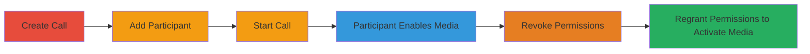

---
tags:
  - nextcloud
  - talk
  - privacy-violation
  - authorization-bypass
  - remote-surveillance
type: attack_chain
tools: []
tactics:
  - '[[Collection]]'
verified: false
platforms:
  - Web
submitted: true
complexity: medium
created_at: '2023-10-01T00:00:00Z'
procedures:
  - '[[procedures/Create-Call-as-Moderator]]'
  - '[[procedures/Add-Participant-to-Call]]'
  - '[[procedures/Start-the-Call]]'
  - '[[procedures/Participant-Joins-and-Enables-Media]]'
  - '[[procedures/Revoke-Participant-Permissions]]'
  - '[[procedures/Regrant-Participant-Permissions-to-Reactivate-Media]]'
step_count: 6
techniques:
  - '[[Audio Capture]]'
  - '[[Video Capture]]'
updated_at: '2025-12-14T17:29:09.820Z'
description: >-
  Attack chain exploiting a vulnerability in Nextcloud Talk app where a
  moderator can remotely reactivate a participant's camera and microphone by
  re-granting permissions after revocation, without user consent.
skill_level: intermediate
impact_level: high
id: 4f83d5ac-cb06-48f6-8fe9-c151471bb667
validated: true
mitre_tactics:
  - '[[Collection]]'
mitre_techniques:
  - '[[Audio Capture]]'
  - '[[Video Capture]]'
---
# Nextcloud Talk Moderator Remote Media Activation via Permission Regrant

Multi-stage attack chain demonstrating a complete attack workflow exploiting permission management flaws in Nextcloud's Talk app to remotely activate participant media without consent.

## Chain Metrics Dashboard

| Metric | Value |
|--------|-------|
| Chain Status | Unverified |
| Total Steps | 6 |
| Execution Time | ~5 minutes |
| Skill Level | Intermediate |
| Complexity | Medium |
| Impact Level | High |

## Attack Flow Visualization

## Prerequisites & Requirements

### Required Tools

- Nextcloud instance with Talk app installed and enabled
- Moderator privileges in a Talk call

### Target Environment

- Nextcloud platform (Web-based)
- Services: nextcloud-spreed-signaling
- Tech stack: Nextcloud, Spreed (Talk app)
- Network access: Internal or authenticated access to Nextcloud instance

### Initial Access Requirements

- Valid moderator account credentials
- Participant account that can join calls
- No prior access needed beyond authentication

## Detailed Attack Procedures

### Step 1: Create a Call as Moderator
procedure: [[procedures/Create-Call-as-Moderator]]

**Objective**: Initiate a new video/audio call session in Nextcloud Talk to set up the environment for permission manipulation.

**Instructions**: Log in to the Nextcloud instance as the moderator (User A). Navigate to the Talk app from the main dashboard. Click on the "New call" button in the Talk interface to create a new call room. Configure the call as a video call if not defaulted.

**Expected Output**: A new call room is created, visible in the Talk app, ready for participants to join.

**Success Indicators**:
- Call room appears in the active calls list
- Moderator controls are available in the interface

### Step 2: Add Participant to the Call
procedure: [[procedures/Add-Participant-to-Call]]

**Objective**: Invite or add the target participant (User B) to the call to enable interaction.

**Instructions**: In the created call room, use the participant management section (typically a "+" icon or "Invite" button). Search for and select User B from the user list or enter their username/email. Confirm the addition to send the invitation.

**Expected Output**: User B receives a notification or link to join the call.

**Success Indicators**:
- User B is listed as a participant in the call room
- Invitation status shows as sent or accepted

### Step 3: Start the Call
procedure: [[procedures/Start-the-Call]]

**Objective**: Begin the call session to activate the media permission features.

**Instructions**: As the moderator, click the "Start call" or "Join" button in the call room interface. Ensure the call transitions to an active state where media controls are visible.

**Expected Output**: The call is live, with moderator controls for managing participants and permissions.

**Success Indicators**:
- Call status changes to "In progress"
- Audio/video streams are ready for activation

### Step 4: Participant Joins and Enables Media
procedure: [[procedures/Participant-Joins-and-Enables-Media]]

**Objective**: Have the participant join and voluntarily enable their camera (and optionally microphone) to set the state for later reactivation.

**Instructions**: User B logs in, navigates to the Talk app, and joins the invited call. Upon joining, User B clicks the camera icon to enable video and microphone icon if desired. Confirm media is active by checking the self-view preview.

**Expected Output**: Participant's camera feed is visible to the moderator, indicating media is enabled.

**Success Indicators**:
- Video/audio feed from User B is streaming
- Media indicators show as active in the call interface

### Step 5: Revoke Participant Permissions
procedure: [[procedures/Revoke-Participant-Permissions]]

**Objective**: Disable the participant's media by revoking all permissions, simulating a consent revocation.

**Instructions**: As moderator, access the participant management menu (click on User B's avatar or the settings gear). Select options to revoke camera and microphone permissions, or remove all access rights. Confirm the action to disable media.

**Expected Output**: User B's camera and microphone are turned off; no feed is visible.

**Success Indicators**:
- Media streams from User B stop
- Permission status shows as revoked in the interface

### Step 6: Regrant Participant Permissions to Reactivate Media
procedure: [[procedures/Regrant-Participant-Permissions-to-Reactivate-Media]]

**Objective**: Re-grant permissions to exploit the vulnerability, automatically reactivating the participant's media without their confirmation.

**Instructions**: In the same participant management menu, re-grant all permissions to User B, including camera and microphone access. The client-side implementation will automatically reactivate the previously enabled devices if not manually disabled by User B.

**Expected Output**: User B's camera and microphone turn on remotely, streaming feed to the moderator without User B's action.

**Success Indicators**:
- Unauthorized media activation occurs
- Privacy violation confirmed by unexpected feed visibility

## Attack Chain Summary

### Key Achievements

1. Established control over call permissions as moderator
2. Induced participant to enable media initially
3. Exploited permission regrant to force remote activation
4. Achieved unauthorized surveillance via audio/video capture

## Technique & Tactic Coverage

### MITRE ATT&CK Techniques

- [[Audio Capture]] Audio Capture
- [[Video Capture]] Video Capture

### MITRE ATT&CK Tactics

- [[Collection]] Collection

---
*Last updated: 2023-10-01T00:00:00Z*
