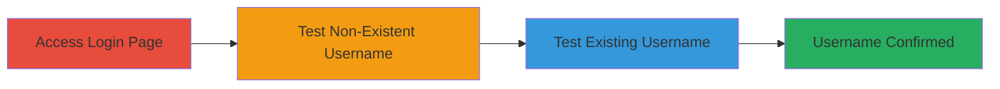

---
tags:
  - username-enumeration
  - information-disclosure
  - nextcloud
  - login-enumeration
type: attack_chain
tools: []
tactics:
  - '[[Discovery]]'
verified: false
platforms:
  - Web
submitted: true
complexity: low
created_at: '2023-10-01T00:00:00Z'
procedures:
  - '[[procedures/Access-Nextcloud-Admin-Login-Page]]'
  - '[[procedures/Test-Non-Existent-Username-for-Enumeration]]'
  - '[[procedures/Confirm-Existing-Username-via-Incorrect-Password-Error]]'
step_count: 3
techniques:
  - '[[Account Discovery]]'
updated_at: '2025-12-14T17:28:44.548Z'
description: >-
  A reconnaissance attack exploiting differing error messages in the Nextcloud
  admin login panel to enumerate valid usernames, enabling targeted follow-on
  exploits like brute-force or password reset attacks.
skill_level: beginner
impact_level: medium
id: 1502b990-762c-4b74-b671-f6862ff59a5b
validated: true
mitre_tactics:
  - '[[Discovery]]'
mitre_techniques:
  - '[[Account Discovery]]'
---
# Nextcloud Username Enumeration via Distinct Login Error Messages

Multi-stage attack chain demonstrating a complete reconnaissance workflow for enumerating usernames in Nextcloud's admin login panel through error message analysis.

## Chain Metrics Dashboard

| Metric | Value |
|--------|-------|
| Chain Status | Unverified |
| Total Steps | 3 |
| Execution Time | ~2 minutes |
| Skill Level | Beginner |
| Complexity | Low |
| Impact Level | Medium |

## Attack Flow Visualization

## Prerequisites & Requirements

### Required Tools

- Web browser (e.g., Chrome, Firefox)

### Target Environment

- Nextcloud instance with admin login panel
- Web platform
- PHP-based application
- Network access to the login endpoint

### Initial Access Requirements

- Publicly accessible Nextcloud login URL
- No credentials required for enumeration
- Direct network connectivity to the target

## Detailed Attack Procedures

### Step 1: Access Admin Login Page
procedure: [[procedures/Access-Nextcloud-Admin-Login-Page]]

**Objective**: Locate and access the Nextcloud admin login interface to prepare for enumeration testing.

**Instructions**: Open a web browser and navigate to the Nextcloud admin login page, typically at `https://target-domain.com/login` or the specific admin endpoint.

**Expected Output**: The login form is displayed, prompting for username and password.

**Success Indicators**:
- Login page loads without errors
- Form fields for username and password are visible

### Step 2: Test Non-Existent Username
procedure: [[procedures/Test-Non-Existent-Username-for-Enumeration]]

**Objective**: Submit a likely non-existent username to observe the baseline error message for invalid users.

**Instructions**: In the login form, enter a fabricated username such as 'charlietango' and any password (e.g., 'charlietango'). Submit the form and note the error message.

**Expected Output**: Error message stating 'Invalid Username'.

**Success Indicators**:
- Generic 'Invalid Username' error appears
- No specific username reference in the response

### Step 3: Confirm Existing Username
procedure: [[procedures/Confirm-Existing-Username-via-Incorrect-Password-Error]]

**Objective**: Test a suspected valid username with an incorrect password to verify existence via a distinct error.

**Instructions**: Enter a potential valid username such as 'frank' with an incorrect password (e.g., 'charlietango'). Submit and analyze the error.

**Expected Output**: Error message like 'The password you entered for username frank is incorrect'.

**Success Indicators**:
- Error message includes the username, confirming its validity
- Differentiation from non-existent username error

## Attack Chain Summary

### Key Achievements

1. Successful access to the vulnerable login endpoint
2. Identification of distinct error messages for user validation
3. Confirmation of at least one valid username for further exploitation

## Technique & Tactic Coverage

### MITRE ATT&CK Techniques

- [[Account Discovery]]

### MITRE ATT&CK Tactics

- [[Discovery]]

---
*Last updated: 2023-10-01T00:00:00Z*
