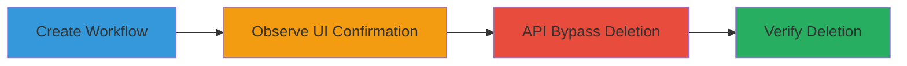

---
tags:
  - nextcloud
  - access-control-bypass
  - api
  - broken-access-control
  - workflow-deletion
type: attack_chain
tools: []
tactics:
  - '[[Initial Access]]'
commands:
  - '[[commands/nextcloud-delete-workflow-api]]'
verified: false
platforms:
  - Web
submitted: true
complexity: medium
created_at: '2024-01-01T00:00:00Z'
procedures:
  - '[[procedures/Create-Nextcloud-User-Workflow]]'
  - '[[procedures/Observe-UI-Password-Requirement-for-Deletion]]'
  - '[[procedures/Bypass-Deletion-via-OCS-API]]'
  - '[[procedures/Verify-Workflow-Deletion]]'
step_count: 4
techniques:
  - '[[Exploit Public-Facing Application]]'
updated_at: '2025-12-14T17:29:44.949Z'
description: >-
  Demonstrates bypassing password confirmation for deleting user workflows in
  Nextcloud by exploiting a broken access control in the OCS API endpoint.
skill_level: intermediate
impact_level: high
id: 97a9730b-84bc-4507-b826-4f0d2cad2d0c
validated: true
mitre_tactics:
  - '[[Initial Access]]'
mitre_techniques:
  - '[[Exploit Public-Facing Application]]'
---
# Nextcloud Workflow Deletion Bypass via OCS API

Multi-stage attack chain demonstrating a broken context-dependent access control (CDCA) vulnerability in Nextcloud's workflow management. An authenticated user can delete workflows via the OCS API without the password confirmation required in the web UI, leading to unauthorized destructive actions and potential data loss.

## Chain Metrics Dashboard

| Metric | Value |
|--------|-------|
| Chain Status | Unverified |
| Total Steps | 4 |
| Execution Time | ~5 minutes |
| Skill Level | Intermediate |
| Complexity | Medium |
| Impact Level | High |

## Attack Flow Visualization



## Prerequisites & Requirements

### Required Tools

- Web browser for UI interactions
- curl or similar for API requests

### Target Environment

- Nextcloud server with workflowengine app enabled
- Web platform access
- Authenticated user session

### Initial Access Requirements

- Valid Nextcloud user credentials
- Direct network access to the Nextcloud instance
- No prior elevated privileges needed

## Detailed Attack Procedures

### Step 1: Create Workflow
procedure: [[procedures/Create-Nextcloud-User-Workflow]]

**Objective**: Set up a test workflow to demonstrate the vulnerability.

**Instructions**: Navigate to the workflow settings in the Nextcloud UI and create a new workflow using the provided form.

**Expected Output**: A new workflow is listed in the UI with an assigned ID.

**Success Indicators**:
- Workflow appears in the user workflow list
- Workflow ID is visible or obtainable from the UI

### Step 2: Observe UI Password Requirement
procedure: [[procedures/Observe-UI-Password-Requirement-for-Deletion]]

**Objective**: Confirm the standard security control in the web UI for deletion.

**Instructions**: In the workflow settings UI, select the created workflow and attempt deletion, noting the password prompt.

**Expected Output**: A password confirmation dialog appears before deletion proceeds.

**Success Indicators**:
- Password prompt is triggered on delete attempt
- Deletion is blocked without correct password

### Step 3: Bypass via OCS API
procedure: [[procedures/Bypass-Deletion-via-OCS-API]]

**Objective**: Exploit the API endpoint to delete the workflow without password confirmation.

**Instructions**: Use an authenticated session to send a direct DELETE request to the OCS API endpoint for the workflow ID.

Execute [[commands/nextcloud-delete-workflow-api]] with the appropriate workflow ID:

```bash
curl -X DELETE "https://nextcloud.example.com/ocs/v2.php/apps/workflowengine/api/v1/workflows/user/3?format=json" -H "OCS-APIRequest: true" -b "cookie_session=your_session_cookie"
```

**Expected Output**: HTTP 200 OK response with JSON confirming deletion.

**Success Indicators**:
- No password prompt during API request
- Server responds with success status

### Step 4: Verify Deletion
procedure: [[procedures/Verify-Workflow-Deletion]]

**Objective**: Confirm the bypass worked by checking the UI.

**Instructions**: Refresh the workflow settings page in the UI to see if the workflow is removed.

**Expected Output**: The workflow no longer appears in the list.

**Success Indicators**:
- Workflow is absent from UI
- No errors or remnants in the interface

## Attack Chain Summary

### Key Achievements

1. Successfully created a test workflow for exploitation.
2. Confirmed UI enforces password confirmation.
3. Bypassed confirmation via direct API call, deleting the workflow.
4. Verified unauthorized deletion without additional authentication.

## Technique & Tactic Coverage

### MITRE ATT&CK Techniques

- [[Exploit Public-Facing Application]]

### MITRE ATT&CK Tactics

- [[Initial Access]]

---
*Last updated: 2024-01-01T00:00:00Z*
