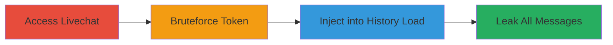

---
tags:
  - nosql-injection
  - rocket-chat
  - livechat
  - information-disclosure
  - mongodb
  - meteor
type: attack_chain
tools:
  - '[[tools/Web-Inspector]]'
tactics:
  - '[[Initial Access]]'
  - '[[Collection]]'
verified: false
platforms:
  - Web
  - Node.js
  - MongoDB
submitted: true
complexity: medium
created_at: '2023-10-01T00:00:00Z'
procedures:
  - '[[procedures/Access-Rocket-Chat-Livechat-Instance]]'
  - '[[procedures/Bruteforce-Visitor-Token-via-NoSQL-Injection]]'
  - '[[procedures/Leak-Livechat-Messages-via-NoSQL-Injection]]'
step_count: 4
techniques:
  - '[[Exploit Public-Facing Application]]'
  - '[[Data from Information Repositories]]'
updated_at: '2025-12-14T03:46:25.839Z'
description: >-
  Unauthenticated NoSQL injection chain exploiting Rocket.Chat's Livechat to
  bruteforce visitor tokens and leak all conversation messages from MongoDB.
skill_level: intermediate
impact_level: high
id: 0811fba3-d8a9-4d40-a4bc-066f86abd56a
validated: true
mitre_tactics:
  - '[[Initial Access]]'
  - '[[Collection]]'
mitre_techniques:
  - '[[Exploit Public-Facing Application]]'
  - '[[Data from Information Repositories]]'
---
# NoSQL Injection in Rocket.Chat Livechat to Leak Visitor Tokens and All Messages

Multi-stage attack chain demonstrating an unauthenticated exploitation of two NoSQL injection vulnerabilities in Rocket.Chat's Livechat feature to bruteforce visitor tokens and disclose all sensitive conversation messages stored in MongoDB.

## Chain Metrics Dashboard

| Metric | Value |
|--------|-------|
| Chain Status | Unverified |
| Total Steps | 4 |
| Execution Time | ~5-10 minutes |
| Skill Level | Intermediate |
| Complexity | Medium |
| Impact Level | High |

## Attack Flow Visualization



## Prerequisites & Requirements

### Required Tools

- [[tools/Web-Inspector]]

### Target Environment

- Web-based Rocket.Chat instance with Livechat enabled (e.g., https://open.rocket.chat/)
- Services: Livechat feature active
- Tech Stack: Meteor.js, Node.js, MongoDB
- Network access: Public internet access to the instance

### Initial Access Requirements

- No credentials required (unauthenticated)
- Browser with developer tools
- No prior access needed

## Detailed Attack Procedures

### Step 1: Access the Rocket.Chat Instance with Livechat Enabled
procedure: [[procedures/Access-Rocket-Chat-Livechat-Instance]]

**Objective**: Gain initial access to the Livechat interface to prepare for JavaScript execution.

**Instructions**: Navigate to the Rocket.Chat instance URL in a web browser and ensure the Livechat feature is visible and enabled. No login is required for visitor interactions.

**Expected Output**: Livechat widget or interface loaded on the page.

**Success Indicators**:
- Page loads without errors
- Livechat visitor mode accessible

### Step 2: Open Browser Web Inspector to Execute JavaScript
procedure: [[procedures/Access-Rocket-Chat-Livechat-Instance]]

**Objective**: Set up the environment for running custom Meteor JavaScript calls against the application.

**Instructions**: Open the browser's developer tools (Web Inspector) and navigate to the Console tab to execute JavaScript code interactively.

**Expected Output**: Console ready for input, with Meteor object available.

**Success Indicators**:
- No console errors on page load
- `Meteor` object accessible in console (type `Meteor` to verify)

### Step 3: Bruteforce and Leak Visitor Token Using NoSQL Injection
procedure: [[procedures/Bruteforce-Visitor-Token-via-NoSQL-Injection]]

**Objective**: Exploit the pre-authentication NoSQL injection in `livechat:loginByToken` to iteratively guess and obtain a valid visitor token via regex patterns.

**Instructions**: In the Web Inspector console, execute a JavaScript script that performs binary search on the token characters using `$regex` operator. The token is typically a 17-character hex string from '0123456789abcdef'. Run the bruteforce loop at ~4 requests/second to avoid rate limits.

Use [[commands/meteor-call-livechat-loginbytoken-regex]] for the core call:

```javascript
// Example bruteforce script snippet
let knownValid = ''; // Build prefix iteratively
let guesses = '0123456789abcdef'; // Character pool
Meteor.call('livechat:loginByToken', {"$regex": "^${knownValid}[${guesses}]"});
```

**Expected Output**: Successful match returns an object with `_id` property containing the visitor details; errors or null on mismatch.

**Success Indicators**:
- Valid token reconstructed (e.g., 'a1b2c3d4e5f67890')
- Visitor object returned without errors

### Step 4: Use Leaked Token to Load All Message History via Second NoSQL Injection
procedure: [[procedures/Leak-Livechat-Messages-via-NoSQL-Injection]]

**Objective**: Leverage the obtained token and inject into `livechat:loadHistory` to bypass room ID validation and retrieve all Livechat messages.

**Instructions**: With the leaked `token`, execute the injection payload in the console to match any room ID with `$regex: '.*'`. This queries all rooms accessible to the visitor.

Use [[commands/meteor-call-livechat-loadhistory-regex]]:

```javascript
const token = 'leaked_token_here';
Meteor.call('livechat:loadHistory', { token, rid: {"$regex":".*"} });
```

**Expected Output**: Array of all Livechat message objects, including sensitive visitor data.

**Success Indicators**:
- Messages array populated with data from multiple rooms
- No validation errors; full history leaked

## Attack Chain Summary

### Key Achievements

1. Unauthenticated bruteforce of visitor tokens via NoSQL injection in pre-auth login.
2. Bypass of room ID restrictions to access all conversation histories.
3. Disclosure of sensitive visitor information and messages from MongoDB.

## Technique & Tactic Coverage

### MITRE ATT&CK Techniques

- [[Exploit Public-Facing Application]]
- [[Data from Information Repositories]]

### MITRE ATT&CK Tactics

- [[Initial Access]]
- [[Collection]]

---

*Last updated: 2023-10-01T00:00:00Z*
