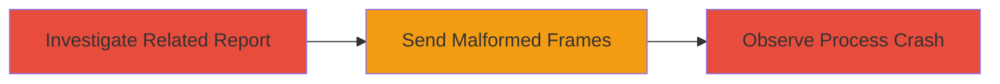

---
tags:
  - dos
  - node.js
  - nghttp2
  - http2
  - null-pointer
  - altsvc
type: attack_chain
tools: []
tactics:
  - '[[Privilege Escalation]]'
verified: false
platforms:
  - Node.js
  - Web
submitted: true
complexity: medium
created_at: '2023-10-01T00:00:00Z'
procedures:
  - '[[procedures/Investigate-Related-Vulnerability-Report]]'
  - '[[procedures/Trigger-nghttp2-DoS-with-Malformed-ALTSVC-Frames]]'
  - '[[procedures/Observe-and-Validate-Process-Crash]]'
step_count: 3
techniques:
  - '[[Exploit Public-Facing Application]]'
  - '[[Endpoint Denial of Service]]'
updated_at: '2025-12-14T17:26:37.470Z'
description: >-
  A multi-step attack chain exploiting a NULL pointer dereference vulnerability
  in the nghttp2 library used by Node.js, leading to a process crash and denial
  of service through malformed HTTP/2 ALTSVC and GOAWAY frames.
skill_level: intermediate
impact_level: high
id: f2d3be10-fc34-4f9d-8e45-a8501572a357
validated: true
mitre_tactics:
  - '[[Privilege Escalation]]'
mitre_techniques:
  - '[[Exploit Public-Facing Application]]'
  - '[[Endpoint Denial of Service]]'
---
# Node.js Denial of Service via nghttp2 NULL Pointer Dereference in ALTSVC Processing

Multi-stage attack chain demonstrating exploitation of a NULL pointer dereference in the nghttp2 library integrated into Node.js, triggered by malformed HTTP/2 ALTSVC and GOAWAY frames, resulting in a critical denial of service that crashes the Node.js process.

## Chain Metrics Dashboard

| Metric | Value |
|--------|-------|
| Chain Status | Unverified |
| Total Steps | 3 |
| Execution Time | ~5 minutes |
| Skill Level | Intermediate |
| Complexity | Medium |
| Impact Level | High |

## Attack Flow Visualization

## Prerequisites & Requirements

### Required Tools

- Custom HTTP/2 client or fuzzer (e.g., for crafting ALTSVC and GOAWAY frames)

### Target Environment

- Node.js server (versions prior to 10.4.1) with HTTP/2 enabled
- Remote network access to the target server on the HTTP/2 port (typically 443)

### Initial Access Requirements

- No credentials required; remote unauthenticated access over the network
- Ability to send custom HTTP/2 frames to the target

## Detailed Attack Procedures

### Step 1: Investigate Related Vulnerability Report
procedure: [[procedures/Investigate-Related-Vulnerability-Report]]

**Objective**: Reproduce steps from a related vulnerability report to uncover the nghttp2 bug in ALTSVC frame processing.

**Instructions**: Review the related report (e.g., HackerOne #335533) and follow its reproduction steps on a Node.js environment to identify the uninitialized pointer issue in nghttp2.

**Expected Output**: Confirmation of the bug through crash logs or debugging output showing NULL pointer dereference.

**Success Indicators**:
- Reproduction of the related issue reveals ALTSVC frame handling flaw
- Debugging tools (e.g., gdb) show uninitialized pointer access

### Step 2: Trigger nghttp2 DoS with Malformed ALTSVC Frames
procedure: [[procedures/Trigger-nghttp2-DoS-with-Malformed-ALTSVC-Frames]]

**Objective**: Send malformed ALTSVC and GOAWAY frames to exploit the NULL pointer dereference and crash the Node.js process.

**Instructions**: From a remote attacker position, craft and send HTTP/2 frames with invalid ALTSVC data (e.g., uninitialized pointer reference) followed by a GOAWAY frame to force processing. Use a custom script or HTTP/2 tool to target the Node.js server; alternatively, if acting as a malicious server, send to a Node.js client.

**Expected Output**: The target Node.js process terminates abruptly due to the crash.

**Success Indicators**:
- Target server stops responding to HTTP/2 requests
- Crash logs indicate segmentation fault from NULL pointer in nghttp2

### Step 3: Observe and Validate Process Crash
procedure: [[procedures/Observe-and-Validate-Process-Crash]]

**Objective**: Confirm the denial of service impact by monitoring the target's response and process state.

**Instructions**: After sending the frames, monitor the target for unresponsiveness. Check server logs for crash details and verify no HTTP/2 connections can be established.

**Expected Output**: Process crash confirmation via logs or monitoring tools, with DoS effect on the service.

**Success Indicators**:
- Node.js process PID shows termination
- Service downtime observed, requiring restart

## Attack Chain Summary

### Key Achievements

1. Successful reproduction of the nghttp2 vulnerability from a related report
2. Remote triggering of Node.js process crash without authentication
3. Achievement of high-impact denial of service on HTTP/2-enabled Node.js applications

## Technique & Tactic Coverage

### MITRE ATT&CK Techniques

- [[Exploit Public-Facing Application]] Exploit Public-Facing Application
- [[Endpoint Denial of Service]] Endpoint Denial of Service

### MITRE ATT&CK Tactics

- [[Privilege Escalation]] Impact

---
*Last updated: 2023-10-01T00:00:00Z*
