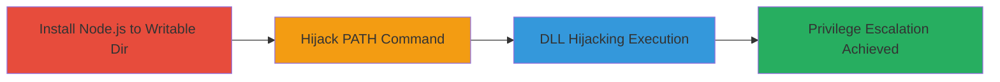

# Node.js Installer Local Privilege Escalation via Writable PATH Directory

Multi-stage attack chain demonstrating local privilege escalation on Windows by exploiting the Node.js installer's failure to set proper permissions on the installation directory, allowing unprivileged users to hijack PATH-dependent commands like 'npm' or load malicious DLLs into node.exe.

## Chain Metrics Dashboard

| Metric | Value |
|--------|-------|
| Chain Status | Unverified |
| Total Steps | 3 |
| Execution Time | ~10 minutes |
| Skill Level | Intermediate |
| Complexity | Medium |
| Impact Level | High |

## Attack Flow Visualization

## Prerequisites & Requirements

### Required Tools

- [[tools/Process-Monitor]]

### Target Environment

- Windows OS (tested on Windows 10/11)
- Local unprivileged user account
- Administrative privileges for installation (but escalation targets higher privileges)
- No specific services or ports required; local access only

### Initial Access Requirements

- Local user access (standard user)
- Ability to create directories and files in root drive (e.g., C:\)
- Node.js installer access from https://nodejs.org

## Detailed Attack Procedures

### Step 1: Install Node.js to Custom Writable Directory
procedure: [[procedures/Install-Node.js-to-Custom-Writable-Directory]]

**Objective**: Set up Node.js in a custom directory that inherits overly permissive ACLs from the drive root, enabling write access for all users and adding it to the system PATH.

**Instructions**: Download the Node.js installer (e.g., version 14.17.0 or later) from the official site and install to C:\tools. Use the GUI to select the custom path and enable automatic tool installation. Verify permissions show full control for BUILTIN\Users and confirm PATH addition by restarting the shell.

**Expected Output**: Node.js installed; C:\tools in PATH; writable by unprivileged users.

**Success Indicators**:
- Installation completes without errors
- `echo %PATH%` includes C:\tools
- Unprivileged user can write to C:\tools (e.g., via `echo test > C:\tools\test.txt`)

### Step 2: Hijack NPM Command via PATH Precedence
procedure: [[procedures/Hijack-NPM-Command-via-PATH-Precedence]]

**Objective**: As an unprivileged user, place a malicious executable in the writable directory to hijack the 'npm' command, executing with the privileges of any user who runs it.

**Instructions**: Create an unprivileged user if needed. Switch to that user and copy or place a malicious file named npm.exe in C:\tools (e.g., copy node.exe as npm.exe for demo). When a privileged user runs 'npm', Windows prioritizes the .exe over the legitimate npm.cmd, executing the malicious payload.

**Expected Output**: Malicious npm.exe executes instead of legitimate npm; drops to Node shell or runs payload.

**Success Indicators**:
- File placed successfully as unprivileged user
- Privileged user running `npm` triggers the hijack
- Process runs with elevated privileges

### Step 3: Exploit DLL Hijacking in Node.exe
procedure: [[procedures/Exploit-DLL-Hijacking-in-Node.exe]]

**Objective**: Leverage the writable directory in the DLL search order to load a malicious DLL when node.exe runs, achieving code execution under the caller's privileges.

**Instructions**: Use [[tools/Process-Monitor]] to monitor node.exe and identify DLLs loaded from the installation directory. As unprivileged user, place a malicious DLL (matching an unverified load) in C:\tools. Run node.exe as privileged user to trigger loading.

**Expected Output**: Malicious DLL loads and executes; arbitrary code runs with elevated privileges.

**Success Indicators**:
- ProcMon shows DLL load from C:\tools
- Payload executes (e.g., privilege escalation to admin)
- No legitimate DLL conflicts

## Attack Chain Summary

### Key Achievements

1. Installed Node.js with exploitable permissions, enabling local writes to a PATH directory.
2. Hijacked 'npm' command for arbitrary execution as any user.
3. Demonstrated DLL hijacking for broader code execution vectors.

## Technique & Tactic Coverage

### MITRE ATT&CK Techniques

- [[Registry Run Keys - Startup Folder]]
- [[DLL Search Order Hijacking]]

### MITRE ATT&CK Tactics

- [[Privilege Escalation]]

---

*Last updated: 2023-10-01T00:00:00Z*
