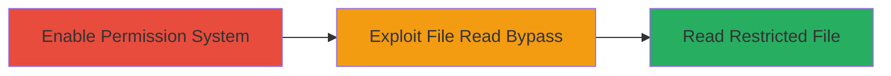

# Node.js fs.openAsBlob() Permission Bypass for Unauthorized File Read

Multi-stage attack chain demonstrating the exploitation of a Node.js vulnerability that allows bypassing the experimental permission system to read files without explicit read permissions.

## Chain Metrics Dashboard

| Metric | Value |
|--------|-------|
| Chain Status | Unverified |
| Total Steps | 2 |
| Execution Time | ~1 minute |
| Skill Level | Intermediate |
| Complexity | Low |
| Impact Level | High |

## Attack Flow Visualization



## Prerequisites & Requirements

### Required Tools

- [[tools/Node.js]]

### Target Environment

- Node.js runtime (version affected by CVE or similar, e.g., pre-patch versions)
- A target file (e.g., file.txt) in the script's directory
- No network access required; local execution

### Initial Access Requirements

- Local access to a Node.js environment
- Ability to execute Node.js scripts
- No prior credentials needed beyond shell access

## Detailed Attack Procedures

### Step 1: Enable Experimental Permission System
procedure: [[procedures/Enable-Node.js-Experimental-Permission-Without-Read-Access]]

**Objective**: Start Node.js with the experimental permission system enabled but without granting read access to the target file, setting up the restricted environment.

**Instructions**: Run the Node.js script using the --experimental-permission flag without specifying any read permissions for the target file. Create a simple script.js if needed, but focus on launching in restricted mode.

Execute [[commands/run-node-with-experimental-permission]]:

```bash
node --experimental-permission script.js
```

**Expected Output**: Node.js starts in permission-restricted mode; the script proceeds to the next step without immediate errors on permissions.

**Success Indicators**:
- Node.js launches with the flag applied (verifiable via process flags)
- No initial permission errors for setup

### Step 2: Exploit fs.openAsBlob for File Read
procedure: [[procedures/Exploit-fs.openAsBlob-for-Unauthorized-File-Read]]

**Objective**: Use fs.openAsBlob() to read the contents of a file despite lacking explicit read permissions, demonstrating the bypass.

**Instructions**: Within the running Node.js script, import the fs module and call fs.openAsBlob() on the target file path, then extract and log the contents using blob.text(). This succeeds due to the missing permission check in BlobFromFilePath.

Execute the JavaScript code via [[commands/fs-openasblob-read-file]] (integrated in script.js):

```javascript
const fs = require('node:fs');
async function main() {
  const blob = await fs.openAsBlob(__dirname + '/file.txt');
  console.log(await blob.text());
}
main();
```

**Expected Output**: The contents of file.txt are printed to the console, confirming the unauthorized read.

**Success Indicators**:
- File contents are successfully read and logged
- No permission denial errors occur during fs.openAsBlob() call

## Attack Chain Summary

### Key Achievements

1. Enabled Node.js experimental permissions without read access to target file
2. Bypassed permission checks using fs.openAsBlob() to read restricted file
3. Demonstrated undermining of Node.js permission controls for file system operations

## Technique & Tactic Coverage

### MITRE ATT&CK Techniques

- [[File and Directory Discovery]] File and Directory Discovery
- [[JavaScript]] JavaScript

### MITRE ATT&CK Tactics

- [[Defense Evasion]] Defense Evasion
- [[Discovery]] Discovery

---
*Last updated: 2023-10-01T00:00:00Z*
