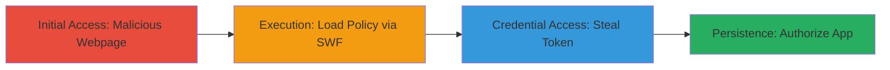

# OAuth 2 Authorization Bypass via CSRF and Flash Cross-Domain Policy Bypass in Vimeo

Multi-stage attack chain demonstrating a complete attack workflow exploiting Vimeo's misconfigured crossdomain.xml to enable unauthorized OAuth token theft and app authorization via Adobe Flash.

## Chain Metrics Dashboard

| Metric | Value |
|--------|-------|
| Chain Status | Unverified |
| Total Steps | 4 |
| Execution Time | ~5 minutes |
| Skill Level | Intermediate |
| Complexity | Medium |
| Impact Level | High |

## Attack Flow Visualization



## Prerequisites & Requirements

### Required Tools

- [[tools/Adobe-Flash-SWF]]
- [[tools/xss-swf]]

### Target Environment

- Web platform with Vimeo API access
- Victim must be logged into Vimeo and have Adobe Flash enabled
- Services: Vimeo OAuth 2.0 API
- Tech stack: OAuth 2.0, Adobe Flash, XML

### Initial Access Requirements

- Social engineering to trick victim into visiting malicious link
- No prior credentials needed; relies on victim's active Vimeo session
- Network access: Public internet to host webpage and access api.vimeo.com

## Detailed Attack Procedures

### Step 1: Host Malicious Webpage
procedure: [[procedures/Host-Malicious-Webpage-with-SWF-for-Vimeo-OAuth-Bypass]]

**Objective**: Lure the victim to a webpage that embeds a malicious SWF file to initiate the Flash-based exploit.

**Instructions**: Create and host a simple HTML page embedding the SWF. Ensure the victim is logged into Vimeo and Flash is enabled. Example HTML:

```html
<!DOCTYPE html>
<html>
<body>
<object type="application/x-shockwave-flash" data="malicious.swf"></object>
</body>
</html>
```

Host on a server like http://opnsec.com/vimeo/vimeoOAuth2Bypass.html.

**Expected Output**: Victim loads the page, triggering SWF execution.

**Success Indicators**:
- Victim confirms page load
- Flash player activates without errors

### Step 2: Load Permissive Crossdomain Policy
procedure: [[procedures/Load-Permissive-Crossdomain-Policy-via-Flash-SWF]]

**Objective**: Use the SWF to load Vimeo's permissive crossdomain.xml, allowing cross-domain access from any domain.

**Instructions**: In the SWF (ActionScript), call Security.loadPolicyFile to fetch the policy:

```actionscript
Security.loadPolicyFile('https://api.vimeo.com/oauth/crossdomain.xml');
```

This overrides stricter policies, enabling * domain access.

**Expected Output**: Policy loaded successfully, no Flash security errors.

**Success Indicators**:
- SWF logs policy load confirmation
- No cross-domain restriction errors in Flash console

### Step 3: Steal OAuth Token
procedure: [[procedures/Steal-OAuth-Token-via-Cross-Domain-Flash-Request]]

**Objective**: Request the /oauth/authorize endpoint via SWF to read and extract the OAuth token cross-domain.

**Instructions**: With policy loaded, use SWF to load the endpoint:

```actionscript
var loader:URLLoader = new URLLoader();
loader.load(new URLRequest('https://api.vimeo.com/oauth/authorize'));
// Extract token from response
```

Send extracted token to attacker-controlled server.

**Expected Output**: Token retrieved in SWF variables.

**Success Indicators**:
- Token value captured (e.g., via trace or network exfil)
- No access denied errors

### Step 4: Complete OAuth Authorization
procedure: [[procedures/Complete-OAuth-Authorization-with-Stolen-Token]]

**Objective**: Use the stolen token to authorize the attacker's app, gaining full privileges over the victim's account.

**Instructions**: Submit the token to Vimeo's API for the app 'OAuthBypass'. Victim can verify at https://vimeo.com/settings/apps.

**Expected Output**: App authorized; attacker has access.

**Success Indicators**:
- App listed in victim's settings
- API calls succeed with new privileges

## Attack Chain Summary

### Key Achievements

1. Bypassed OAuth authorization without user interaction
2. Stole sensitive token via Flash cross-domain exploit
3. Gained full app privileges on victim's Vimeo account

## Technique & Tactic Coverage

### MITRE ATT&CK Techniques

- [[Exploit Public-Facing Application]]
- [[Drive-by Compromise]]
- [[Credentials In Files]]

### MITRE ATT&CK Tactics

- [[Initial Access]]
- [[Credential Access]]

---

*Last updated: 2023-10-01T00:00:00Z*
