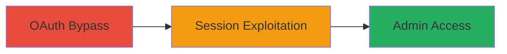

---
tags:
  - oauth
  - auth-bypass
  - session-hijacking
type: attack_chain
tools: []
tactics:
  - '[[Initial Access]]'
commands: []
platforms:
  - Web
complexity: medium
procedures:
  - '[[procedures/Exploit-OAuth-Authentication-Bypass]]'
  - '[[procedures/Access-Admin-Panel-with-Bypassed-Session]]'
step_count: 2
techniques:
  - '[[Valid Accounts]]'
description: >-
  A multi-stage attack exploiting flawed session handling in Mapbox's OAuth flow
  to bypass authentication and gain unauthorized access to the admin panel.
skill_level: intermediate
impact_level: high
id: 652cb9e2-059c-4836-ab87-c787176ec150
created_at: '2025-12-14T17:30:47.334Z'
updated_at: '2025-12-14T17:30:47.334Z'
verified: false
validated: true
submitted: true
mitre_tactics:
  - '[[Initial Access]]'
mitre_techniques:
  - '[[Valid Accounts]]'
---
# OAuth Authentication Bypass in Mapbox Internal Portal for Admin Access

Multi-stage attack chain demonstrating a complete attack workflow exploiting an OAuth authentication bypass in Mapbox's internal portal to generate valid sessions without proper authentication, leading to unauthorized admin access.

## Chain Metrics Dashboard

| Metric | Value |
|--------|-------|
| Chain Status | Unverified |
| Total Steps | 2 |
| Execution Time | ~5 minutes |
| Skill Level | Intermediate |
| Complexity | Medium |
| Impact Level | High |

## Attack Flow Visualization

## Prerequisites & Requirements

### Required Tools

- Web browser or proxy tool like Burp Suite for intercepting requests

### Target Environment

- Web platform
- Access to Mapbox internal portal URL
- No specific services/ports beyond standard HTTPS (443)

### Initial Access Requirements

- Public access to the Mapbox internal portal (no prior credentials needed due to bypass)
- Network access to the portal
- No prior authentication required

## Detailed Attack Procedures

### Step 1: Trigger OAuth Authentication Bypass
procedure: [[procedures/Exploit-OAuth-Authentication-Bypass]]

**Objective**: Identify and exploit the flaw in OAuth session handling to generate a valid session cookie without successful authentication.

**Instructions**: Navigate to the Mapbox internal portal's OAuth login endpoint. Initiate an OAuth flow but intentionally fail the authentication (e.g., by providing invalid credentials or interrupting the callback). Due to flawed session handling, the server will still issue a valid session cookie. Capture this cookie using browser developer tools or a proxy.

**Expected Output**: A session cookie (e.g., JSESSIONID or similar) that is valid for authenticated areas despite the failed auth.

**Success Indicators**:
- Session cookie generated after failed OAuth attempt
- Cookie persists and allows navigation without re-authentication

### Step 2: Access Authenticated Areas with Bypassed Session
procedure: [[procedures/Access-Admin-Panel-with-Bypassed-Session]]

**Objective**: Use the invalidly generated session to reach restricted areas, including the admin panel, and view sensitive information.

**Instructions**: Inject the captured session cookie into subsequent requests to the portal (e.g., via browser extensions like EditThisCookie or proxy tools). Navigate to protected endpoints such as the admin panel URL. The session will grant access without further authentication checks.

**Expected Output**: Successful loading of the admin panel with access to user lists, configurations, or other authenticated data.

**Success Indicators**:
- Unauthorized entry into admin panel
- Visibility of restricted information without login prompts

## Attack Chain Summary

### Key Achievements

1. Bypassed OAuth authentication to obtain a valid session
2. Gained unauthorized access to the internal portal's admin panel
3. Viewed sensitive authenticated information without credentials

## Technique & Tactic Coverage

### MITRE ATT&CK Techniques

- [[Valid Accounts]]

### MITRE ATT&CK Tactics

- [[Initial Access]]

---
*Last updated: 2023-10-01*
