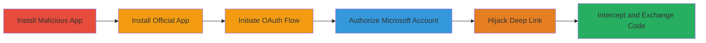

---
tags:
  - oauth
  - deep-link-hijacking
  - mobile-security
  - authorization-code-interception
  - shopify
  - microsoft-outlook
type: attack_chain
tools:
  - '[[tools/Shop-PRO-Malicious-App]]'
tactics:
  - '[[Initial Access]]'
  - '[[Collection]]'
commands: []
platforms:
  - Mobile
  - Android
  - iOS
complexity: medium
procedures:
  - '[[procedures/Install-Malicious-App-to-Hijack-Shopapp-Scheme]]'
  - '[[procedures/Install-Official-Shopify-Shop-App]]'
  - '[[procedures/Initiate-Outlook-Connection-in-Shop-App]]'
  - '[[procedures/Authorize-Microsoft-Account-in-OAuth-Flow]]'
  - '[[procedures/Select-Malicious-App-for-Deep-Link-Handling]]'
  - '[[procedures/Intercept-and-Exchange-Authorization-Code]]'
step_count: 6
techniques:
  - '[[Adversary-in-the-Middle]]'
  - '[[Network Device Authentication]]'
  - '[[Steal Web Session Cookie]]'
description: >-
  Multi-stage attack exploiting insecure OAuth flow in Shopify Shop App using
  deep link hijacking to intercept authorization codes and gain access to
  Microsoft Outlook emails.
skill_level: intermediate
impact_level: high
id: 6c61e60d-b8e8-42c6-93ca-822564e49567
created_at: '2025-12-14T17:31:31.038Z'
updated_at: '2025-12-14T17:31:31.038Z'
verified: false
validated: true
submitted: true
mitre_tactics:
  - '[[Initial Access]]'
  - '[[Collection]]'
mitre_techniques:
  - '[[Adversary-in-the-Middle]]'
  - '[[Network Device Authentication]]'
  - '[[Steal Web Session Cookie]]'
---
# OAuth Authorization Code Interception via Deep Link Hijacking in Shopify Shop App

Multi-stage attack chain demonstrating exploitation of the Shopify Shop App's OAuth flow for Microsoft Outlook integration. The vulnerability stems from using insecure deep links (shopapp:// scheme) without PKCE, allowing a malicious app to register the same scheme and intercept the authorization code. This enables the attacker to exchange the code for an access token, reading victim emails or linking the account to the attacker's Shopify instance.

## Chain Metrics Dashboard

| Metric | Value |
|--------|-------|
| Chain Status | Unverified |
| Total Steps | 6 |
| Execution Time | ~10 minutes |
| Skill Level | Intermediate |
| Complexity | Medium |
| Impact Level | High |

## Attack Flow Visualization

## Prerequisites & Requirements

### Required Tools

- [[tools/Shop-PRO-Malicious-App]]

### Target Environment

- Mobile platforms: Android or iOS
- Installed Shopify Shop App
- Victim's Microsoft Outlook account
- No network access beyond app installation and OAuth redirects

### Initial Access Requirements

- Physical or social engineering access to install apps on the victim's device
- No prior credentials needed; relies on user interaction during OAuth

## Detailed Attack Procedures

### Step 1: Install Malicious App
procedure: [[procedures/Install-Malicious-App-to-Hijack-Shopapp-Scheme]]

**Objective**: Register a malicious app to hijack the shopapp:// deep link scheme, preparing for OAuth interception.

**Instructions**: Download and sideload the malicious APK on Android (or equivalent on iOS). The app registers the shopapp:// scheme in its manifest.

**Expected Output**: App installed successfully, scheme registered (verifiable via app settings or logs).

**Success Indicators**:
- Malicious app appears in app list
- No errors during installation

### Step 2: Install Official App
procedure: [[procedures/Install-Official-Shopify-Shop-App]]

**Objective**: Ensure the legitimate Shopify Shop App is present to trigger the OAuth flow.

**Instructions**: Download the official Shopify Shop App from the Google Play Store (Android) or App Store (iOS) and install it.

**Expected Output**: Official app installed and launchable.

**Success Indicators**:
- App icon visible on home screen
- App launches without issues

### Step 3: Initiate OAuth Flow
procedure: [[procedures/Initiate-Outlook-Connection-in-Shop-App]]

**Objective**: Start the Microsoft Outlook integration process to begin the vulnerable OAuth flow.

**Instructions**: Open the Shop App, create a new account if needed, and navigate to connect Microsoft Outlook, triggering the OAuth redirect.

**Expected Output**: Browser opens for Microsoft login.

**Success Indicators**:
- OAuth flow initiated
- Redirect to Microsoft authorization page

### Step 4: Authorize Account
procedure: [[procedures/Authorize-Microsoft-Account-in-OAuth-Flow]]

**Objective**: Complete user authorization to generate the vulnerable authorization code in the deep link.

**Instructions**: Log in to the Microsoft account in the browser and grant permissions for the Shop App to access emails.

**Expected Output**: Authorization granted, redirect to shopapp:// deep link.

**Success Indicators**:
- Permissions approved
- Deep link modal appears (or auto-handled)

### Step 5: Hijack Deep Link
procedure: [[procedures/Select-Malicious-App-for-Deep-Link-Handling]]

**Objective**: Trick the OS into routing the deep link to the malicious app instead of the official one.

**Instructions**: When the OS modal prompts for app selection on the shopapp:// link, choose the malicious 'Shop PRO' app. On iOS, install malicious app first for auto-selection.

**Expected Output**: Malicious app launches with the deep link.

**Success Indicators**:
- Malicious app receives the link
- No crash or fallback to official app

### Step 6: Intercept and Use Code
procedure: [[procedures/Intercept-and-Exchange-Authorization-Code]]

**Objective**: Capture the authorization code from the deep link and exchange it for access tokens.

**Instructions**: In the malicious app, parse the deep link to extract the code, then exchange it via Microsoft's OAuth endpoint or Shopify's GraphQL (https://server.shop.app/graphql, LinkOutlookAccount mutation).

**Expected Output**: Valid access token obtained, emails readable or account linked.

**Success Indicators**:
- Code extracted successfully
- Token exchange succeeds (API response with token)

## Attack Chain Summary

### Key Achievements

1. Successful hijacking of OAuth deep link without PKCE protection
2. Interception of authorization code leading to email access
3. Potential linking of victim account to attacker's Shopify for order tracking

## Technique & Tactic Coverage

### MITRE ATT&CK Techniques

- [[Adversary-in-the-Middle]] Adversary-in-the-Middle
- [[Network Device Authentication]] Network Device Authentication
- [[Steal Web Session Cookie]] Steal Web Session Cookie

### MITRE ATT&CK Tactics

- [[Initial Access]] Initial Access
- [[Collection]] Collection

---

*Last updated: 2023-10-01*
