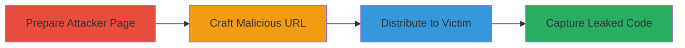

# OAuth Authorization Code Theft via Path Traversal in Pixiv Redirect URI

Multi-stage attack chain demonstrating exploitation of a path traversal vulnerability in Pixiv's OAuth authorization endpoint to steal users' OAuth authorization codes, enabling potential account takeover.

## Chain Metrics Dashboard

| Metric | Value |
|--------|-------|
| Chain Status | Unverified |
| Total Steps | 4 |
| Execution Time | ~5 minutes |
| Skill Level | Intermediate |
| Complexity | Medium |
| Impact Level | High |

## Attack Flow Visualization

## Prerequisites & Requirements

### Required Tools

- [[tools/Google-Analytics]]

### Target Environment

- Web platform with Pixiv OAuth integration (e.g., Booth.pm)
- Required services: OAuth 2.0 authorization endpoint
- Network access requirements: Public internet access to Pixiv and Booth.pm

### Initial Access Requirements

- Attacker account on Booth.pm
- No prior credentials on target; relies on victim authentication
- Social engineering to distribute link to victims

## Detailed Attack Procedures

### Step 1: Prepare Attacker-Controlled Product Page
procedure: [[procedures/Prepare-Attacker-Controlled-Booth-Product-Page]]

**Objective**: Set up a public product page on Booth.pm to receive redirected victims and track query parameters.

**Instructions**: Create a Booth.pm shop, add a product, and configure Google Analytics tracking on the product page to capture query strings.

**Expected Output**: A live product page URL (e.g., https://booth.pm/ja/items/4503924) with analytics enabled.

**Success Indicators**:
- Shop and product are public and accessible
- Google Analytics tracking ID is embedded in the page

### Step 2: Craft Malicious OAuth Authorization URL
procedure: [[procedures/Craft-Malicious-OAuth-Authorization-URL]]

**Objective**: Construct a malicious authorization URL exploiting path traversal in the redirect_uri to point to the attacker's product page.

**Instructions**: Use the Pixiv OAuth endpoint with a path traversal payload in redirect_uri, such as ../../../../ja/items/[product_id]. Encode the URL properly for distribution.

**Expected Output**: A clickable authorization link like https://oauth.secure.pixiv.net/v2/auth/authorize?client_id=a1Z7w6JssUQkw5Hid0uIDeuesue9&redirect_uri=https%3A%2F%2Fbooth.pm%2Fusers%2Fauth%2Fpixiv%2Fcallback/../../../../ja/items/4503924&response_type=code&scope=read-works+read-favorite-users+read-friends+read-profile+read-email+write-profile&state=%3A1a38b53563599621ce25094661b1c4458ddb52d79d771149.

**Success Indicators**:
- URL validates without errors
- Path traversal payload is URL-encoded correctly

### Step 3: Distribute Malicious Link to Victim
procedure: [[procedures/Distribute-Malicious-Link-to-Victim]]

**Objective**: Deliver the crafted URL to potential victims to initiate the OAuth flow.

**Instructions**: Share the link via email, social media, or phishing campaigns, enticing the victim to authenticate with Pixiv.

**Expected Output**: Victim receives and clicks the link, starting the login process.

**Success Indicators**:
- Victim accesses the authorization endpoint
- OAuth flow begins with victim credentials

### Step 4: Capture Leaked OAuth Code
procedure: [[procedures/Capture-Leaked-OAuth-Code-via-Google-Analytics]]

**Objective**: Monitor the attacker-controlled page for redirects containing the leaked authorization code in the query string.

**Instructions**: Access Google Analytics real-time reports to view query parameters from incoming traffic after victim login.

**Expected Output**: Query string with OAuth code (e.g., ?code=leaked_code) visible in analytics data.

**Success Indicators**:
- Redirect to product page with code in URL
- Code captured for further exploitation (e.g., token exchange)

## Attack Chain Summary

### Key Achievements

1. Bypassed OAuth redirect validation using path traversal
2. Leaked authorization codes via exposed query strings
3. Enabled potential account takeover without direct access

## Technique & Tactic Coverage

### MITRE ATT&CK Techniques

- [[Exploit Public-Facing Application]] Exploit Public-Facing Application
- [[Domain Controller Authentication]] Domain Policy Modification: Local Policy (OAuth misconfig)
- [[Steal Application Access Token]] Steal Application Access Token

### MITRE ATT&CK Tactics

- [[Initial Access]] Initial Access
- [[Credential Access]] Credential Access

---
*Last updated: 2023-10-01T00:00:00Z*
