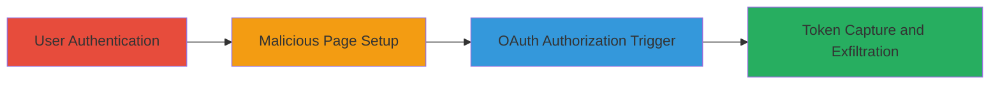

---
tags:
  - oauth
  - token-leak
  - postmessage
  - psn
  - sony
  - authorization-bypass
type: attack_chain
tools: []
tactics:
  - '[[Credential Access]]'
  - '[[Initial Access]]'
verified: false
platforms:
  - Web
submitted: true
complexity: medium
created_at: '2023-10-01T00:00:00Z'
procedures:
  - '[[procedures/User-Login-to-PlayStation-Network]]'
  - '[[procedures/Navigate-to-Malicious-PoC-Page]]'
  - '[[procedures/Trigger-OAuth-Authorization-with-Modified-Parameters]]'
  - '[[procedures/Capture-Leaked-Authorization-Token]]'
step_count: 4
techniques:
  - '[[Steal Application Access Token]]'
  - '[[T1528.001]]'
  - '[[Exploit Public-Facing Application]]'
updated_at: '2025-12-14T17:30:35.056Z'
description: >-
  Multi-stage attack exploiting OAuth misconfiguration in PlayStation Network to
  leak authorization tokens to malicious sites via unvalidated postMessage
  targetOrigin.
skill_level: intermediate
impact_level: high
id: 2347f521-f9fd-4d9d-8142-8aff807be602
validated: true
mitre_tactics:
  - '[[Credential Access]]'
  - '[[Initial Access]]'
mitre_techniques:
  - '[[Steal Application Access Token]]'
  - '[[T1528.001]]'
  - '[[Exploit Public-Facing Application]]'
---
# OAuth Authorization Token Leakage via postMessage Wildcard in PlayStation Network

Multi-stage attack chain demonstrating exploitation of an OAuth misconfiguration in the PlayStation Network (PSN) authorization flow. The vulnerability allows attackers to control the targetOrigin parameter in postMessage, setting it to a wildcard (*), which bypasses origin validation and leaks authorization tokens to malicious sites. This enables account impersonation, access to sensitive data like friends lists, and unauthorized actions such as posting on the victim's news feed.

## Chain Metrics Dashboard

| Metric | Value |
|--------|-------|
| Chain Status | Unverified |
| Total Steps | 4 |
| Execution Time | ~5 minutes |
| Skill Level | Intermediate |
| Complexity | Medium |
| Impact Level | High |

## Attack Flow Visualization

## Prerequisites & Requirements

### Required Tools

- None (relies on browser and custom HTML/JS PoC)

### Target Environment

- Web browser (e.g., Chrome, Firefox)
- Access to PlayStation Network (https://my.playstation.com or https://store.playstation.com)
- No specific ports required; operates over HTTPS

### Initial Access Requirements

- Victim must be authenticated to PSN
- Attacker hosts a malicious PoC page (e.g., on free hosting like 000webhostapp.com)
- Network access to PSN endpoints

## Detailed Attack Procedures

### Step 1: User Login to PlayStation Network
procedure: [[procedures/User-Login-to-PlayStation-Network]]

**Objective**: Establish an authenticated session on PSN to enable OAuth flow exploitation.

**Instructions**: Direct the victim to log in via the official PSN portal to create a session cookie necessary for the authorization endpoint.

**Expected Output**: Successful login with session established; user redirected to PSN dashboard.

**Success Indicators**:
- PSN session cookie present in browser
- Access to authenticated PSN features

### Step 2: Navigate to Malicious PoC Page
procedure: [[procedures/Navigate-to-Malicious-PoC-Page]]

**Objective**: Load the attacker's hosted proof-of-concept page that sets up the token capture mechanism.

**Instructions**: Have the victim visit the malicious HTML page containing JavaScript for window.open and onmessage listener.

**Expected Output**: PoC page loaded with a 'start' button visible.

**Success Indicators**:
- Malicious page renders without errors
- Event listeners for postMessage initialized

### Step 3: Trigger OAuth Authorization with Modified Parameters
procedure: [[procedures/Trigger-OAuth-Authorization-with-Modified-Parameters]]

**Objective**: Open the PSN OAuth authorize endpoint in a popup window with tampered parameters to set targetOrigin to '*'.

**Instructions**: Click the start button on the PoC page, which executes window.open with the modified URL including requestID starting with 'window_' and targetOrigin=*.

**Expected Output**: Popup window opens to PSN auth; upon implicit grant, it attempts to postMessage back to the malicious origin.

**Success Indicators**:
- Popup loads PSN authorize endpoint
- No origin validation errors in console

### Step 4: Capture Leaked Authorization Token
procedure: [[procedures/Capture-Leaked-Authorization-Token]]

**Objective**: Intercept the authorization token sent via postMessage due to the wildcard origin.

**Instructions**: The onmessage listener on the malicious page captures the token; display it in a div for viewing.

**Expected Output**: Token visible in the 'token-plate' div on the malicious page.

**Success Indicators**:
- Token received and displayed
- Ability to use token for API calls (e.g., impersonate user)

## Attack Chain Summary

### Key Achievements

1. Bypassed OAuth origin validation using controllable targetOrigin parameter
2. Leaked authorization token to attacker-controlled site
3. Enabled full account impersonation and sensitive data access

## Technique & Tactic Coverage

### MITRE ATT&CK Techniques

- [[Steal Application Access Token]] Steal Application Access Token
- [[T1528.001]] Steal Application Access Token: OAuth 2.0 Implicit Flow
- [[Exploit Public-Facing Application]] Exploit Public-Facing Application

### MITRE ATT&CK Tactics

- [[Credential Access]] Credential Access
- [[Initial Access]] Initial Access

---
*Last updated: 2023-10-01T00:00:00Z*
