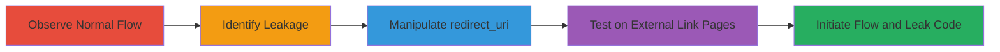

# OAuth Code Leakage via Manipulated Redirect URI and Referer Header

Multi-stage attack chain demonstrating exploitation of OAuth misconfiguration in the comments widget login flow on edoverflow.com, leading to potential leakage of short-lived authorization codes to third-party sites via the Referer header.

## Chain Metrics Dashboard

| Metric | Value |
|--------|-------|
| Chain Status | Unverified |
| Total Steps | 5 |
| Execution Time | ~5 minutes |
| Skill Level | Intermediate |
| Complexity | Medium |
| Impact Level | Low |

## Attack Flow Visualization



## Prerequisites & Requirements

### Required Tools

- Web browser (e.g., Chrome Developer Tools for inspection)

### Target Environment

- Web platform with GitHub OAuth integration
- Services: GitHub OAuth, external links to sites like keybase.io, twitter.com
- Tech stack: JavaScript, Jekyll-based site

### Initial Access Requirements

- No prior credentials needed
- Ability to trick a victim into authenticating via manipulated OAuth URL
- Victim must click external links post-authentication

## Detailed Attack Procedures

### Step 1: Observe Normal OAuth Flow
procedure: [[procedures/Observe-Normal-OAuth-Flow]]

**Objective**: Understand the standard OAuth behavior on pages with comments widget to identify code stripping mechanism.

**Instructions**: Navigate to a blog post with comments enabled, such as https://edoverflow.com/2017/[post-title]/, and initiate GitHub login. Observe that after authentication, the code parameter is removed from the URL.

**Expected Output**: URL without code parameter after successful auth, preventing Referer leakage on external clicks.

**Success Indicators**:
- Code stripped from URL on widget-enabled pages
- No leakage observed during normal flow

### Step 2: Identify Initial Code Leakage
procedure: [[procedures/Identify-Initial-Code-Leakage]]

**Objective**: Detect minor leakage in the verification phase to Google Fonts.

**Instructions**: During the OAuth code verification on a widget page, inspect network requests. Note requests to https://fonts.googleapis.com/css?family=Inconsolata that include the code and return 200 OK.

**Expected Output**: Network log showing code in Referer or query to Google Fonts endpoint.

**Success Indicators**:
- Request to external font service includes auth code
- 200 OK response confirms leakage path

### Step 3: Manipulate Redirect URI to Arbitrary Path
procedure: [[procedures/Manipulate-Redirect-URI-to-Arbitrary-Path]]

**Objective**: Bypass code stripping by redirecting to a path without the comments widget.

**Instructions**: Craft an OAuth authorization URL with redirect_uri set to an arbitrary non-existent path like https://edoverflow.com/1. Use [[commands/github-oauth-manipulate-redirect-to-arbitrary]] to initiate:

```bash
# In browser or curl: Visit the manipulated URL
https://github.com/login/oauth/authorize?client_id=5f45cc999f7812d0b6d2&redirect_uri=https%3A%2F%2Fedoverflow.com%2F1&scope=public_repo
```

**Expected Output**: After auth, redirect to /1 with code parameter intact in URL.

**Success Indicators**:
- Code remains in URL post-redirect
- No widget present to strip code

### Step 4: Test Redirect on Pages with External Links
procedure: [[procedures/Test-Redirect-on-Pages-with-External-Links]]

**Objective**: Target pages containing external links without rel=noreferrer to enable Referer leakage.

**Instructions**: Modify redirect_uri to pages like /about/ or /metadata. Use [[commands/github-oauth-manipulate-redirect-to-about]]:

```bash
# In browser: Visit
https://github.com/login/oauth/authorize?client_id=5f45cc999f7812d0b6d2&redirect_uri=https%3A%2F%2Fedoverflow.com%2Fabout%2F&scope=public_repo
```
Inspect the page for external links to keybase.io, twitter.com, etc.

**Expected Output**: Redirect to /about/ with code in URL; external links present without noreferrer.

**Success Indicators**:
- Page loads with code visible in URL
- External links identified for potential click

### Step 5: Initiate OAuth and Leak Code via Referer
procedure: [[procedures/Initiate-OAuth-and-Leak-Code-via-Referer]]

**Objective**: Trick victim into auth and clicking external link to leak code.

**Instructions**: Send victim the manipulated URL from Step 4. After auth, victim clicks external link. Inspect network for Referer header containing full URL with code to sites like keybase.io, liberapay.com, etc.

**Expected Output**: Referer header in external request includes code, e.g., Referer: https://edoverflow.com/about/?code=abc123.

**Success Indicators**:
- Code leaked to third-party via Referer
- No direct auth bypass, but potential for code interception

## Attack Chain Summary

### Key Achievements

1. Bypassed OAuth code stripping via redirect_uri manipulation
2. Exposed code to external sites through user-clicked links
3. Demonstrated low-severity impact requiring interaction

## Technique & Tactic Coverage

### MITRE ATT&CK Techniques

- [[Exploit Public-Facing Application]] Exploit Public-Facing Application
- [[Unsecured Credentials]] Unsecured Credentials

### MITRE ATT&CK Tactics

- [[Initial Access]] Initial Access
- [[Collection]] Collection

---

*Last updated: 2023-10-01T00:00:00Z*
