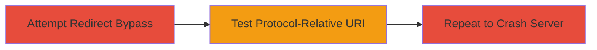

---
tags:
  - oauth
  - dos
  - twitter
  - redirect
  - protocol-relative
  - meteor
  - authorization
type: attack_chain
tools: []
tactics:
  - '[[Initial Access]]'
  - '[[Impact]]'
verified: false
platforms:
  - Web
submitted: true
complexity: medium
created_at: '2023-10-01T00:00:00Z'
procedures:
  - '[[procedures/Attempt-OAuth-Redirect-Bypass]]'
  - '[[procedures/Test-Protocol-Relative-Redirect-URI]]'
  - '[[procedures/Repeat-Authorization-to-Cause-Server-Crash]]'
step_count: 3
techniques:
  - '[[Exploit Public-Facing Application]]'
  - '[[Endpoint Denial of Service]]'
updated_at: '2025-12-14T17:24:35.142Z'
description: >-
  A multi-step attack exploiting an OAuth implementation flaw in Respondly's
  Twitter integration, using a protocol-relative redirect URI to trigger
  unhandled errors and cause server crashes on repeated attempts, with potential
  for OAuth token exposure.
skill_level: intermediate
impact_level: high
id: 30714d55-fbeb-4bd7-98e6-3c6c53162d9b
validated: true
mitre_tactics:
  - '[[Initial Access]]'
  - '[[Impact]]'
mitre_techniques:
  - '[[Exploit Public-Facing Application]]'
  - '[[Endpoint Denial of Service]]'
---
# OAuth DoS via Protocol-Relative Redirect URI in Respondly Twitter Integration

Multi-stage attack chain demonstrating exploitation of an OAuth bug in Respondly's Twitter integration, leading to denial-of-service through server crashes and potential exposure of OAuth tokens in error messages.

## Chain Metrics Dashboard

| Metric | Value |
|--------|-------|
| Chain Status | Unverified |
| Total Steps | 3 |
| Execution Time | ~5 minutes |
| Skill Level | Intermediate |
| Complexity | Medium |
| Impact Level | High |

## Attack Flow Visualization



## Prerequisites & Requirements

### Required Tools

- Web browser or [[commands/curl-access-oauth-endpoint]]

### Target Environment

- Web application using Meteor framework
- Twitter OAuth integration endpoint
- No specific ports required beyond standard HTTPS (443)

### Initial Access Requirements

- Public access to the OAuth endpoint
- No credentials needed
- Internet connectivity

## Detailed Attack Procedures

### Step 1: Attempt OAuth Redirect Bypass
procedure: [[procedures/Attempt-OAuth-Redirect-Bypass]]

**Objective**: Test the OAuth redirect validation by attempting to use a full URL in the redirect parameter to identify potential bypass opportunities.

**Instructions**: Access the Twitter OAuth endpoint with a standard redirect URI to observe normal behavior and inspire further malformed input testing.

Use [[commands/curl-access-oauth-endpoint]] to simulate the request:

```bash
curl "https://app.respond.ly/_oauth/twitter/?requestTokenAndRedirect=https://hackerone.com"
```

**Expected Output**: Normal OAuth flow initiation without errors, possibly redirecting or prompting for authorization.

**Success Indicators**:
- Request processes without crash
- Identifies valid parameter handling for further manipulation

### Step 2: Test Protocol-Relative URL in Redirect Parameter
procedure: [[procedures/Test-Protocol-Relative-Redirect-URI]]

**Objective**: Introduce a protocol-relative URI in the redirect parameter to trigger an error during the Twitter authorization process due to improper validation.

**Instructions**: Modify the requestTokenAndRedirect parameter to use a protocol-relative URL (//hackerone.com), which causes unhandled errors in the OAuth flow.

Execute [[commands/curl-test-protocol-relative-uri]]:

```bash
curl "https://app.respond.ly/_oauth/twitter/?requestTokenAndRedirect=//hackerone.com"
```

**Expected Output**: Error during authorization, potentially displaying internal error details without crashing on first attempt.

**Success Indicators**:
- Error response indicating mishandling of the protocol-relative URI
- No immediate crash, confirming vulnerability for repetition

### Step 3: Repeat the Authorization Process
procedure: [[procedures/Repeat-Authorization-to-Cause-Server-Crash]]

**Objective**: Repeatedly trigger the malformed OAuth request to overwhelm error handling in the Meteor framework, resulting in a server crash and DoS condition.

**Instructions**: Perform the Twitter authorization multiple times using the protocol-relative redirect, exploiting the lack of validation to cause unhandled exceptions during token exchange or state handling.

Loop [[commands/curl-repeat-protocol-relative]] multiple times (e.g., 10-20 requests):

```bash
for i in {1..10}; do curl "https://app.respond.ly/_oauth/twitter/?requestTokenAndRedirect=//hackerone.com"; done
```

**Expected Output**: Server crashes after repeated requests, with potential clear-text exposure of OAuth tokens in error renders.

**Success Indicators**:
- Server becomes unresponsive (DoS)
- Error messages may leak sensitive OAuth data

## Attack Chain Summary

### Key Achievements

1. Identified OAuth redirect validation weakness through initial testing
2. Triggered authorization errors using protocol-relative URIs
3. Achieved denial-of-service by crashing the server on repetition, with risk of token exposure

## Technique & Tactic Coverage

### MITRE ATT&CK Techniques

- [[Exploit Public-Facing Application]]
- [[Endpoint Denial of Service]]

### MITRE ATT&CK Tactics

- [[Initial Access]]
- [[Impact]]

---
*Last updated: 2023-10-01T00:00:00Z*
