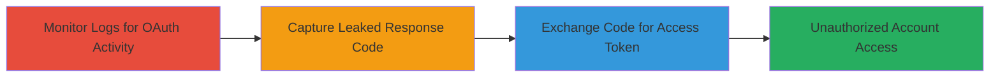

# OAuth Response Code Leakage via Android Logs Leading to Unauthorized Coinbase Access Token

Multi-stage attack chain demonstrating how a malicious app on an Android device can exploit the Coinbase app's insecure logging of OAuth response codes and hardcoded client secret to gain unauthorized access to a user's Coinbase account.

## Chain Metrics Dashboard

| Metric | Value |
|--------|-------|
| Chain Status | Unverified |
| Total Steps | 3 |
| Execution Time | ~5 minutes |
| Skill Level | Intermediate |
| Complexity | Medium |
| Impact Level | High |

## Attack Flow Visualization



## Prerequisites & Requirements

### Required Tools

- [[tools/adb]]

### Target Environment

- Android device with Coinbase app installed
- USB debugging enabled on the device
- Access to ADB for log monitoring
- Knowledge of Coinbase API endpoints

### Initial Access Requirements

- Malicious app or ADB access on the target Android device
- User performing OAuth authorization in Coinbase app
- No network restrictions; API calls to Coinbase servers required

## Detailed Attack Procedures

### Step 1: Monitor Android Logs for Coinbase OAuth Activity
procedure: [[procedures/Monitor-Android-Logs-for-Coinbase-OAuth-Activity]]

**Objective**: Set up log monitoring to capture Coinbase app activity during OAuth authorization.

**Instructions**: Connect the Android device via USB and enable developer options for debugging. Use [[commands/adb-logcat-filter-coinbase]] to filter logs tagged with 'Coinbase' while the user initiates OAuth in the app.

```bash
adb logcat -s Coinbase
```

**Expected Output**: Real-time log entries from the Coinbase app, including authorization flow details.

**Success Indicators**:
- Logs begin streaming with Coinbase tag
- No errors in ADB connection

### Step 2: Capture Leaked OAuth Response Code from Logs
procedure: [[procedures/Capture-Leaked-OAuth-Response-Code-from-Logs]]

**Objective**: Identify and extract the sensitive OAuth response code from the monitored logs.

**Instructions**: While the user completes the OAuth authorization (e.g., approving the request), scan the log output for the response code, which appears in plain text in logcat entries.

**Expected Output**: Log lines containing the OAuth response code, such as "OAuth response code: abc123def456".

**Success Indicators**:
- Response code visible in logs
- Code format matches OAuth standard (e.g., alphanumeric string)

### Step 3: Exchange OAuth Code for Access Token Using Hardcoded Client Secret
procedure: [[procedures/Exchange-OAuth-Code-for-Access-Token-Using-Hardcoded-Client-Secret]]

**Objective**: Use the captured code and extract the hardcoded client secret to request an access token from the Coinbase API.

**Instructions**: Extract the client secret from the Coinbase app's decompiled code (e.g., using APKTool). Then, make a POST request to the Coinbase token endpoint with the response code and secret.

```bash
curl -X POST https://api.coinbase.com/oauth/token \
  -d 'grant_type=authorization_code' \
  -d 'code=CAPTURED_CODE' \
  -d 'client_id=CLIENT_ID' \
  -d 'client_secret=HARDCODED_SECRET' \
  -d 'redirect_uri=REDIRECT_URI'
```

**Expected Output**: JSON response with access_token, e.g., {"access_token": "valid_token_here"}.

**Success Indicators**:
- Valid access token received
- Token usable for API calls to user's account

## Attack Chain Summary

### Key Achievements

1. Successful monitoring of device logs to intercept sensitive OAuth data
2. Extraction of hardcoded client secret from app binaries
3. Obtaining a valid access token for unauthorized account access without user interaction

## Technique & Tactic Coverage

### MITRE ATT&CK Techniques

- [[Steal Web Session Cookie]] Data from Local System
- [[Unsecured Credentials]] Unsecured Credentials

### MITRE ATT&CK Tactics

- [[Credential Access]] Credential Access

---
*Last updated: 2023-10-01T00:00:00Z*
