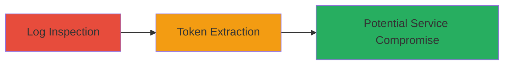

# OAuth Token Disclosure via Rocket.Chat Hubot Log Inspection

Multi-stage attack chain demonstrating a complete attack workflow.

## Chain Metrics Dashboard

| Metric | Value |
|--------|-------|
| Chain Status | Unverified |
| Total Steps | 1 |
| Execution Time | ~5 minutes |
| Skill Level | Intermediate |
| Complexity | Low |
| Impact Level | High |

## Attack Flow Visualization



## Prerequisites & Requirements

### Required Tools

- Log viewer or text editor (e.g., vim, grep)

### Target Environment

- Linux OS with Docker
- Rocket.Chat 4.1.0 running with Hubot integration
- NodeJS 12.22.1
- MongoDB 4.2.17
- Exposed port 3000 for Rocket.Chat access

### Initial Access Requirements

- Administrative or server access to inspect logs
- No external network access needed; local file system access required

## Detailed Attack Procedures

### Step 1: Log Inspection and Token Discovery
procedure: [[procedures/Inspect-Hubot-Logs-for-OAuth-Tokens]]

**Objective**: Identify and extract plaintext OAuth tokens from Hubot log files to assess exposure risk.

**Instructions**: Access the server hosting Rocket.Chat and navigate to the Hubot log directory. Use a text editor or search tool to review log entries for OAuth-related data. Look for patterns indicating token logging without redaction, such as access tokens or refresh tokens in cleartext.

For example, open the log file:

```bash
grep -i "oauth" /path/to/hubot/logs/hubot.log
```

Examine the output for unredacted tokens, which appear as long alphanumeric strings prefixed by identifiers like "access_token" or similar.

**Expected Output**: Log lines containing plaintext OAuth tokens, e.g., "OAuth token: eyJhbGciOiJIUzI1NiIsInR5cCI6IkpXVCJ9..."

**Success Indicators**:
- Presence of unredacted OAuth tokens in logs
- Confirmation of token scope allowing access to external services

## Attack Chain Summary

### Key Achievements

1. Successful identification of information disclosure vulnerability in Hubot logs
2. Extraction of sensitive OAuth tokens enabling potential unauthorized access
3. Assessment of impact on integrated services controlled by the tokens

## Technique & Tactic Coverage

### MITRE ATT&CK Techniques

- [[Unsecured Credentials]] Unsecured Credentials
- [[Credentials In Files]] Credentials In Files

### MITRE ATT&CK Tactics

- [[Collection]] Collection

---
*Last updated: 2023-10-01T00:00:00Z*
