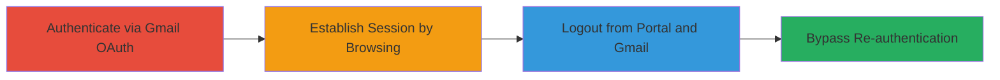

---
tags:
  - authentication-bypass
  - session-management
  - oauth
  - web-vulnerability
type: attack_chain
tools: []
tactics:
  - '[[Initial Access]]'
commands: []
verified: false
platforms:
  - Web
submitted: true
complexity: low
procedures:
  - '[[procedures/Authenticate-to-OWOX-Portal-using-Gmail-OAuth]]'
  - '[[procedures/Browse-OWOX-Portal-to-Establish-Session]]'
  - '[[procedures/Logout-from-OWOX-Portal-and-Gmail]]'
  - '[[procedures/Bypass-OWOX-Login-Reauthentication]]'
step_count: 4
techniques:
  - '[[Valid Accounts]]'
description: >-
  A multi-step attack exploiting broken session management in the OWOX support
  portal, allowing complete authentication bypass after logout by leveraging
  persistent session data from Gmail OAuth.
skill_level: low
impact_level: high
id: 4a598d49-a3d5-46cf-9dfa-d84d53e443d0
created_at: '2025-12-14T17:31:19.577Z'
updated_at: '2025-12-14T17:31:19.577Z'
validated: true
mitre_tactics:
  - '[[Initial Access]]'
mitre_techniques:
  - '[[Valid Accounts]]'
---
# OWOX Support Portal Login Bypass via Incomplete Session Invalidation

Multi-stage attack chain demonstrating a complete authentication bypass workflow in the OWOX support portal by exploiting failure to fully invalidate sessions after logout, enabling unauthorized access to user accounts.

## Chain Metrics Dashboard

| Metric | Value |
|--------|-------|
| Chain Status | Unverified |
| Total Steps | 4 |
| Execution Time | ~5 minutes |
| Skill Level | Low |
| Complexity | Low |
| Impact Level | High |

## Attack Flow Visualization

## Prerequisites & Requirements

### Required Tools

- Web browser (e.g., Chrome, Firefox)

### Target Environment

- Web platform
- OWOX support portal at https://support.owox.com/hc/
- Gmail OAuth service
- No specific ports or services beyond standard HTTPS (443)

### Initial Access Requirements

- Valid Gmail account for initial authentication
- Direct network access to the internet (no VPN or proxy restrictions)
- No prior access to the target account needed beyond the Gmail login

## Detailed Attack Procedures

### Step 1: Authenticate to Portal
procedure: [[procedures/Authenticate-to-OWOX-Portal-using-Gmail-OAuth]]

**Objective**: Gain initial access to the OWOX support portal using Gmail OAuth to establish a session.

**Instructions**: Open a web browser and navigate to https://support.owox.com/hc/. Click the Sign In button and select Gmail as the authentication method. Enter your Gmail credentials and authorize the OWOX app to access your account. Upon successful OAuth flow, you will be redirected to the portal dashboard.

**Expected Output**: Logged-in state with access to portal features, such as user-specific pages.

**Success Indicators**:
- Dashboard loads without errors
- User account details visible

### Step 2: Establish Active Session
procedure: [[procedures/Browse-OWOX-Portal-to-Establish-Session]]

**Objective**: Interact with the portal to create and solidify an active session cookie or token.

**Instructions**: From the dashboard, navigate to several pages within the portal, such as help articles or account settings at https://support.owox.com/hc/. Click through at least 3-5 different sections to generate session activity. This ensures the session is marked as active in the backend.

**Expected Output**: Pages load successfully under the authenticated session; no logout prompts.

**Success Indicators**:
- Multiple pages accessible without re-prompting for login
- Session remains active during navigation

### Step 3: Perform Logout
procedure: [[procedures/Logout-from-OWOX-Portal-and-Gmail]]

**Objective**: Simulate a complete user logout to trigger session invalidation, which fails due to the vulnerability.

**Instructions**: In the OWOX portal, locate and click the Logout button to end the session. Then, separately, log out from your Gmail account by visiting https://accounts.google.com/ and selecting Sign Out. Verify that both logouts complete without errors.

**Expected Output**: Logout confirmation messages; Gmail shows signed-out state.

**Success Indicators**:
- Portal redirects to login page
- Gmail account is no longer active in the browser

### Step 4: Bypass Re-authentication
procedure: [[procedures/Bypass-OWOX-Login-Reauthentication]]

**Objective**: Exploit residual session data to access the account without providing credentials again.

**Instructions**: Return to https://support.owox.com/hc/ and click the Sign In button. The system should not prompt for Gmail re-authentication and instead grant direct access to the dashboard due to uninvalidated session artifacts.

**Expected Output**: Immediate access to the authenticated dashboard without credential entry.

**Success Indicators**:
- No OAuth prompt appears
- Full account access restored, confirming bypass

## Attack Chain Summary

### Key Achievements

1. Successful initial authentication via Gmail OAuth
2. Session establishment through portal interaction
3. Incomplete logout leading to persistent access
4. Complete login bypass enabling unauthorized account takeover

## Technique & Tactic Coverage

### MITRE ATT&CK Techniques

- [[Valid Accounts]]

### MITRE ATT&CK Tactics

- [[Initial Access]]

---
*Last updated: 2023-10-01*
