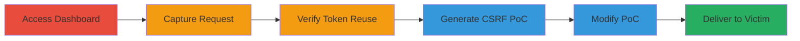

---
tags:
  - csrf
  - web
  - ruby-on-rails
  - authenticity-token
  - email-relay
type: attack_chain
tools:
  - '[[tools/Burp-Suite]]'
tactics:
  - '[[Initial Access]]'
commands:
  - '[[commands/omise-add-email-relay-post]]'
verified: false
platforms:
  - Web
submitted: true
complexity: medium
created_at: '2023-10-01T00:00:00Z'
procedures:
  - '[[procedures/Access-Omise-Dashboard-and-Prepare-Form]]'
  - '[[procedures/Capture-Omise-Email-Relay-Submission-with-Burp]]'
  - '[[procedures/Verify-Authenticity-Token-Reuse-in-Omise]]'
  - '[[procedures/Generate-CSRF-POC-for-Omise-Subscriptions]]'
  - '[[procedures/Modify-CSRF-POC-with-Attacker-Email]]'
  - '[[procedures/Deliver-and-Execute-CSRF-Attack-on-Victim]]'
step_count: 6
techniques:
  - '[[Exploit Public-Facing Application]]'
  - '[[Drive-by Compromise]]'
updated_at: '2025-12-14T17:27:15.222Z'
description: >-
  A multi-step attack exploiting a CSRF vulnerability in the Omise dashboard
  where the Ruby on Rails authenticity token does not expire after use, allowing
  reuse to add unauthorized email relays to a victim's account.
skill_level: intermediate
impact_level: high
id: 049c7d7a-428d-45bd-83d6-0446a8871fb0
validated: true
mitre_tactics:
  - '[[Initial Access]]'
mitre_techniques:
  - '[[Exploit Public-Facing Application]]'
  - '[[Drive-by Compromise]]'
---
# Omise CSRF Exploitation via Reusable Authenticity Token for Unauthorized Email Relay Addition

Multi-stage attack chain demonstrating a complete CSRF workflow against the Omise dashboard, exploiting the non-expiring authenticity token to add unauthorized email relays.

## Chain Metrics Dashboard

| Metric | Value |
|--------|-------|
| Chain Status | Unverified |
| Total Steps | 6 |
| Execution Time | ~10 minutes |
| Skill Level | Intermediate |
| Complexity | Medium |
| Impact Level | High |

## Attack Flow Visualization



## Prerequisites & Requirements

### Required Tools

- [[tools/Burp-Suite]]

### Target Environment

- Web platform
- Ruby on Rails application (Omise dashboard)
- Access to https://dashboard.omise.co/test/subscriptions/new

### Initial Access Requirements

- Valid user credentials for Omise dashboard
- Attacker's browser with Burp Suite proxy configured
- Victim must be logged in to the same session

## Detailed Attack Procedures

### Step 1: Access Dashboard and Prepare Form
procedure: [[procedures/Access-Omise-Dashboard-and-Prepare-Form]]

**Objective**: Log in to the Omise dashboard and navigate to the email relay addition form to prepare for request capture.

**Instructions**: Log in to the Omise dashboard using valid credentials and navigate to the new subscriptions page at https://dashboard.omise.co/test/subscriptions/new. This positions the form for capturing the authenticity token.

**Expected Output**: Form loaded, ready for submission with visible fields for email address and event groups.

**Success Indicators**:
- Successful login and form access
- No errors on page load

### Step 2: Capture Email Relay Submission
procedure: [[procedures/Capture-Omise-Email-Relay-Submission-with-Burp]]

**Objective**: Intercept a legitimate form submission to capture the POST request and authenticity token.

**Instructions**: Configure Burp Suite as a proxy, fill in a test email (e.g., testaccount1@gmail.com) in the form, select event groups like accounting and chargebacks, and submit. The request will be captured in Burp Proxy. Forward it to Repeater for inspection.

Use [[commands/omise-add-email-relay-post]] to replay if needed:

```http
POST /test/subscriptions HTTP/1.1
Host: dashboard.omise.co
...
```

**Expected Output**: Captured POST request with parameters including authenticity_token, email_relay[address], and supported event groups.

**Success Indicators**:
- Request intercepted successfully
- Token visible in parameters

### Step 3: Verify Token Reuse
procedure: [[procedures/Verify-Authenticity-Token-Reuse-in-Omise]]

**Objective**: Confirm the authenticity token remains valid for multiple submissions without regeneration.

**Instructions**: In Burp Repeater, submit a second email address using the same captured request, modifying only the email_relay[address] parameter. Observe the response and redirection.

Replay with [[commands/omise-add-email-relay-post]] adjusted for new email:

```http
POST /test/subscriptions HTTP/1.1
Host: dashboard.omise.co
... (same token, different email)
```

**Expected Output**: Successful submission with redirect to https://dashboard.omise.co/test/subscriptions; no token invalidation.

**Success Indicators**:
- Second submission succeeds with same token
- No regeneration of token on form reload

### Step 4: Generate CSRF PoC
procedure: [[procedures/Generate-CSRF-POC-for-Omise-Subscriptions]]

**Objective**: Create an HTML proof-of-concept file that auto-submits the captured POST request for CSRF exploitation.

**Instructions**: In Burp Suite, right-click the captured POST request in Repeater and select "Engagement tools" > "Generate CSRF PoC". Choose the HTML format with auto-submit. Save the generated file.

**Expected Output**: omise_csrf_poc.html file containing a form that posts to /test/subscriptions with the captured parameters.

**Success Indicators**:
- HTML file generated without errors
- Form includes all original parameters including token

### Step 5: Modify PoC with Attacker Email
procedure: [[procedures/Modify-CSRF-POC-with-Attacker-Email]]

**Objective**: Alter the PoC to target the attacker's email, enabling unauthorized addition to the victim's account.

**Instructions**: Open the generated HTML in a text editor and change the value of email_relay[address] to an attacker-controlled email (e.g., attacker@gmail.com). Retain the same authenticity_token and other parameters.

**Expected Output**: Modified HTML file ready for delivery.

**Success Indicators**:
- Parameter updated correctly
- Token unchanged

### Step 6: Deliver and Execute on Victim
procedure: [[procedures/Deliver-and-Execute-CSRF-Attack-on-Victim]]

**Objective**: Trick the logged-in victim into loading the PoC, triggering the unauthorized form submission.

**Instructions**: Save the modified file as omise_CSRF.html and deliver it to the victim via email, phishing link, or social engineering. When the victim opens it in their browser (while logged into Omise), the form auto-submits.

**Expected Output**: POST request sent from victim's browser, adding the attacker's email relay; redirect to subscriptions page on success.

**Success Indicators**:
- Victim's account now has attacker's email relay
- Attacker receives notifications or access via the relay

## Attack Chain Summary

### Key Achievements

1. Captured and verified reusable CSRF token in Omise dashboard
2. Generated and modified a functional CSRF PoC HTML
3. Successfully added unauthorized email relay to victim's account

## Technique & Tactic Coverage

### MITRE ATT&CK Techniques

- [[Exploit Public-Facing Application]] Exploit Public-Facing Application
- [[Drive-by Compromise]] Drive-by Compromise

### MITRE ATT&CK Tactics

- [[Initial Access]] Initial Access

---

*Last updated: 2023-10-01T00:00:00Z*
