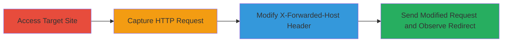

---
tags:
  - open-redirect
  - x-forwarded-host
  - phishing
  - web-vulnerability
type: attack_chain
tools:
  - '[[tools/Burp-Suite]]'
tactics:
  - '[[Initial Access]]'
verified: false
platforms:
  - Web
submitted: true
complexity: medium
created_at: '2023-10-01T00:00:00Z'
procedures:
  - '[[procedures/Manipulate-X-Forwarded-Host-for-Open-Redirect]]'
step_count: 4
techniques:
  - '[[Exploit Public-Facing Application]]'
  - '[[Drive-by Compromise]]'
updated_at: '2025-12-14T17:24:31.589Z'
description: >-
  A multi-step attack chain exploiting an open redirect vulnerability in the
  Omise payment link service by manipulating the X-Forwarded-Host HTTP header to
  redirect users to arbitrary malicious sites, enabling phishing.
skill_level: intermediate
impact_level: low
id: b966da86-6e5c-4e29-979f-a9a9c51d2a2c
validated: true
mitre_tactics:
  - '[[Initial Access]]'
mitre_techniques:
  - '[[Exploit Public-Facing Application]]'
  - '[[Drive-by Compromise]]'
---
# Omise Open Redirect via X-Forwarded-Host Header Manipulation

Multi-stage attack chain demonstrating exploitation of an open redirect in the Omise payment link service at https://link.omise.co/ by manipulating the X-Forwarded-Host header, allowing redirection to malicious sites for phishing.

## Chain Metrics Dashboard

| Metric | Value |
|--------|-------|
| Chain Status | Unverified |
| Total Steps | 4 |
| Execution Time | ~5 minutes |
| Skill Level | Intermediate |
| Complexity | Medium |
| Impact Level | Low |

## Attack Flow Visualization

## Prerequisites & Requirements

### Required Tools

- [[tools/Burp-Suite]]

### Target Environment

- Web platform
- Access to https://link.omise.co/
- No authentication required

### Initial Access Requirements

- Internet access
- No credentials needed
- Ability to intercept and modify HTTP requests

## Detailed Attack Procedures

### Step 1: Access the Target Site
procedure: [[procedures/Manipulate-X-Forwarded-Host-for-Open-Redirect]]

**Objective**: Navigate to the vulnerable Omise payment link service to initiate the request capture process.

**Instructions**: Open a web browser and visit https://link.omise.co/ in a new tab. No login is required; simply load the page to trigger the initial GET request.

**Expected Output**: The page loads, and the initial HTTP GET request to https://link.omise.co/ is generated.

**Success Indicators**:
- Page loads without errors
- Initial request is observable in proxy tool

### Step 2: Capture the HTTP Request
procedure: [[procedures/Manipulate-X-Forwarded-Host-for-Open-Redirect]]

**Objective**: Intercept the initial GET request using a proxy to prepare for header modification.

**Instructions**: Configure your proxy tool (e.g., Burp Suite) to intercept traffic from the browser. Refresh the page at https://link.omise.co/ to capture the GET request.

**Expected Output**: Captured GET request details, including the original Host header.

**Success Indicators**:
- Request intercepted successfully
- Headers visible for editing

### Step 3: Modify the Request Headers
procedure: [[procedures/Manipulate-X-Forwarded-Host-for-Open-Redirect]]

**Objective**: Inject a malicious X-Forwarded-Host header to control the redirect target.

**Instructions**: In the proxy tool, add the header `X-Forwarded-Host: example.com` below the existing `Host` header in the captured GET request to https://link.omise.co/.

**Expected Output**: Modified request ready for forwarding, with the new header in place.

**Success Indicators**:
- Header added without syntax errors
- Request structure intact

### Step 4: Send the Modified Request and Observe Redirect
procedure: [[procedures/Manipulate-X-Forwarded-Host-for-Open-Redirect]]

**Objective**: Execute the tampered request to trigger the open redirect to the attacker-controlled site.

**Instructions**: Forward the modified request through the proxy. Observe the server's response, which should issue a redirect to http://example.com.

**Expected Output**: HTTP redirect (e.g., 302) to the specified host in the X-Forwarded-Host header.

**Success Indicators**:
- Redirect occurs to the manipulated host
- No errors in response

## Attack Chain Summary

### Key Achievements

1. Successful manipulation of X-Forwarded-Host to bypass redirect controls
2. Demonstration of arbitrary redirection for phishing potential
3. Low-severity impact confirmed through reproduction

## Technique & Tactic Coverage

### MITRE ATT&CK Techniques

- [[Exploit Public-Facing Application]]
- [[Drive-by Compromise]]

### MITRE ATT&CK Tactics

- [[Initial Access]]

---
*Last updated: 2023-10-01T00:00:00Z*
