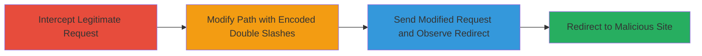

# Omise.co Open Redirect via Encoded Double Slashes

Multi-stage attack chain demonstrating the exploitation of an open redirect vulnerability in the Omise.co website through improper handling of URL paths with double slashes and encoding in URL rewriting for parameters. This allows attackers to craft malicious links that redirect users from the trusted domain to phishing or malicious sites, enabling credential theft or other attacks.

## Chain Metrics Dashboard

| Metric | Value |
|--------|-------|
| Chain Status | Unverified |
| Total Steps | 3 |
| Execution Time | ~5 minutes |
| Skill Level | Intermediate |
| Complexity | Medium |
| Impact Level | High |

## Attack Flow Visualization

## Prerequisites & Requirements

### Required Tools

- [[tools/Burp-Suite]]

### Target Environment

- Web platform
- Access to https://www.omise.co/
- No specific ports or services beyond standard HTTP/HTTPS

### Initial Access Requirements

- Network access to the internet
- No credentials required for public-facing site
- Prior knowledge of legitimate URLs (e.g., navigation to ?category=interview&page=2)

## Detailed Attack Procedures

### Step 1: Intercept Legitimate Request
procedure: [[procedures/Exploit-Omise-Open-Redirect-with-Double-Slash-Encoding]]

**Objective**: Capture a legitimate GET request to the Omise.co site during normal navigation to understand the base URL structure.

**Instructions**: Configure Burp Suite as a proxy to intercept traffic. Navigate to a page like https://www.omise.co/?category=interview&page=2 and capture the request in the Proxy history, then forward it to the Repeater module for modification.

**Expected Output**: A captured GET request with original path and parameters visible in Burp Repeater.

**Success Indicators**:
- Request intercepted successfully
- Original URL parameters preserved (e.g., category=interview&page=2)

### Step 2: Modify Path with Encoded Double Slashes
procedure: [[procedures/Exploit-Omise-Open-Redirect-with-Double-Slash-Encoding]]

**Objective**: Alter the URL path to include an encoded double slash pattern that bypasses validation and forces a redirect to an external domain.

**Instructions**: In Burp Repeater, modify the path to insert %2f%2f (decoded as //) followed by the target external domain, such as /%2f%2f%2fbing.com%2f, while preserving the original query parameters. The full path becomes /%2f%2f%2fbing.com%2f%3fwww.omise.co/?category=interview&page=2.

**Expected Output**: Modified request ready for execution, with the path showing the encoded payload.

**Success Indicators**:
- Path modification applied without syntax errors
- Encoded slashes (%2f%2f) correctly placed to trick URL rewriting

### Step 3: Send Modified Request and Observe Redirect
procedure: [[procedures/Exploit-Omise-Open-Redirect-with-Double-Slash-Encoding]]

**Objective**: Execute the tampered request to trigger the open redirect and verify the bypass.

**Instructions**: In Burp Repeater, send the modified GET request with standard headers (Host: www.omise.co, User-Agent, Accept, etc.). Observe the server's response for a 3xx redirect status code pointing to the external domain like bing.com.

**Expected Output**: HTTP 3xx response with Location header set to the external URL (e.g., http://bing.com/?www.omise.co/?category=interview&page=2).

**Success Indicators**:
- Redirect response received
- Browser or tool follows to the arbitrary external site

## Attack Chain Summary

### Key Achievements

1. Successful interception and modification of Omise.co requests using Burp Suite
2. Bypass of URL validation via double slash encoding, enabling arbitrary redirects
3. Demonstration of phishing potential by redirecting from trusted domain to malicious sites

## Technique & Tactic Coverage

### MITRE ATT&CK Techniques

- [[Drive-by Compromise]]
- [[Exploit Public-Facing Application]]

### MITRE ATT&CK Tactics

- [[Initial Access]]

---

*Last updated: 2023-10-01T00:00:00Z*
