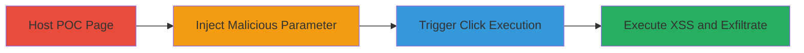

# One-Click XSS Exploitation on Shopify for Cookie Theft and Phishing

Multi-stage attack chain demonstrating a complete attack workflow exploiting a reflected Cross-Site Scripting (XSS) vulnerability on www.shopify.com. The attack involves hosting a proof-of-concept (POC) HTML file, injecting a malicious parameter, triggering execution via a click, and verifying impact, leading to severe consequences like session hijacking and credential theft.

## Chain Metrics Dashboard

| Metric | Value |
|--------|-------|
| Chain Status | Unverified |
| Total Steps | 4 |
| Execution Time | ~5 minutes |
| Skill Level | Intermediate |
| Complexity | Medium |
| Impact Level | High |

## Attack Flow Visualization

## Prerequisites & Requirements

### Required Tools

- [[tools/Local-Web-Server]]

### Target Environment

- Web platform (browser access to www.shopify.com)
- No specific services/ports required beyond HTTP
- Local network access for hosting POC

### Initial Access Requirements

- No credentials needed
- Victim must visit the attacker's hosted POC page
- Browser with JavaScript enabled

## Detailed Attack Procedures

### Step 1: Host POC HTML File
procedure: [[procedures/Host-POC-HTML-File-for-XSS]]

**Objective**: Set up a local web server to serve the malicious POC HTML file that will facilitate the XSS injection.

**Instructions**: Create a simple HTML file named poc.html containing a clickable element (e.g., a button) that loads content from www.shopify.com with an injected parameter. Use a local web server to host it over HTTP.

**Expected Output**: POC page accessible at http://localhost:port/poc.html.

**Success Indicators**:
- Web server running without errors
- POC page loads in browser

### Step 2: Visit Hosted POC with Malicious Parameter
procedure: [[procedures/Visit-Hosted-POC-with-Malicious-Parameter]]

**Objective**: Access the POC page with a URL parameter that injects the JavaScript payload targeting the Shopify domain.

**Instructions**: Append the malicious parameter to the URL, such as ?x=${alert(1)}, to prepare the injection for the vulnerable endpoint on www.shopify.com.

**Expected Output**: Page loads with the parameter embedded, ready for interaction.

**Success Indicators**:
- URL parameter visible in browser address bar
- No immediate errors on page load

### Step 3: Trigger XSS by Clicking Element
procedure: [[procedures/Trigger-XSS-by-Clicking-Element]]

**Objective**: Interact with the POC to execute the injected JavaScript on the Shopify domain.

**Instructions**: Click the designated element (e.g., button or link) in the POC HTML, which triggers a request to Shopify that reflects the unsanitized input, executing the payload.

**Expected Output**: JavaScript begins executing in the context of www.shopify.com.

**Success Indicators**:
- Click action completes without browser errors
- Payload ready for observation

### Step 4: Verify XSS Execution
procedure: [[procedures/Verify-XSS-Execution]]

**Objective**: Confirm arbitrary JavaScript execution and assess potential impacts like cookie theft.

**Instructions**: Observe the effects of the executed payload, such as an alert box, and extend to real exploits like sending cookies to an attacker-controlled server.

**Expected Output**: Alert box or other payload effects visible on Shopify domain.

**Success Indicators**:
- Alert with '1' appears
- Console logs confirm execution on www.shopify.com

## Attack Chain Summary

### Key Achievements

1. Successful hosting and access of POC for XSS delivery
2. One-click trigger of reflected XSS on a high-impact domain
3. Demonstration of impacts including cookie theft, arbitrary requests, malware prompts, defacement, and phishing via forms like https://www.shopify.com/nz/sell/fabric

## Technique & Tactic Coverage

### MITRE ATT&CK Techniques

- [[JavaScript]]

### MITRE ATT&CK Tactics

- [[Initial Access]]
- [[Execution]]
- [[Collection]]

---
*Last updated: 2023-10-01T00:00:00Z*
