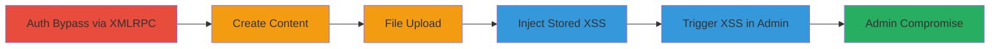

---
tags:
  - auth-bypass
  - xmlrpc
  - wordpress
  - xss
  - onelogin
type: attack_chain
tools:
  - '[[tools/Curl-for-XMLRPC-Exploitation]]'
tactics:
  - '[[Initial Access]]'
  - '[[Execution]]'
verified: false
platforms:
  - Web
submitted: true
complexity: medium
created_at: '2023-10-01T00:00:00Z'
procedures:
  - '[[procedures/Test-XMLRPC-Auth-with-Default-Credentials]]'
  - '[[procedures/Create-Draft-Post-via-XMLRPC]]'
  - '[[procedures/Upload-File-via-XMLRPC]]'
  - '[[procedures/Upload-SWF-File-for-CSRF-Exploitation]]'
  - '[[procedures/Inject-Stored-XSS-via-Attachment-Name]]'
  - '[[procedures/Trigger-XSS-in-Admin-Media-List]]'
step_count: 7
techniques:
  - '[[Valid Accounts]]'
  - '[[Exploit Public-Facing Application]]'
  - '[[JavaScript]]'
  - '[[Remote File Copy]]'
updated_at: '2025-12-14T17:31:52.556Z'
description: >-
  Exploits OneLogin plugin's default password handling on WordPress to bypass
  authentication via XMLRPC API, enabling unauthorized content creation, file
  uploads, and stored XSS in the admin panel.
skill_level: intermediate
impact_level: high
id: 98dd5674-11dd-41cb-ba28-70fb8dbd1189
validated: true
mitre_tactics:
  - '[[Initial Access]]'
  - '[[Execution]]'
mitre_techniques:
  - '[[Valid Accounts]]'
  - '[[Exploit Public-Facing Application]]'
  - '[[JavaScript]]'
  - '[[Remote File Copy]]'
---
# OneLogin Auth Bypass via XMLRPC Leading to Stored XSS on WordPress

Multi-stage attack chain demonstrating authentication bypass on WordPress sites using the OneLogin plugin, followed by unauthorized actions via XMLRPC and stored XSS injection for admin compromise.

## Chain Metrics Dashboard

| Metric | Value |
|--------|-------|
| Chain Status | Unverified |
| Total Steps | 7 |
| Execution Time | ~10 minutes |
| Skill Level | Intermediate |
| Complexity | Medium |
| Impact Level | High |

## Attack Flow Visualization



## Prerequisites & Requirements

### Required Tools

- [[tools/Curl-for-XMLRPC-Exploitation]]

### Target Environment

- WordPress 4.4.3 or similar
- OneLogin authentication plugin enabled
- XMLRPC endpoint exposed (/xmlrpc.php)
- Network access to the target WordPress site

### Initial Access Requirements

- Knowledge of OneLogin-created usernames (e.g., email like cbarry@uber.com)
- No prior credentials needed due to default password
- Direct HTTP access to the site

## Detailed Attack Procedures

### Step 1: Test Authentication via XMLRPC
procedure: [[procedures/Test-XMLRPC-Auth-with-Default-Credentials]]

**Objective**: Bypass normal login restrictions by authenticating with the default OneLogin password via XMLRPC.

**Instructions**: Prepare an XML payload for wp.getOptions and send it using [[commands/curl-xmlrpc-auth-bypass]] to verify access.

```bash
curl 'https://newsroom.uber.com/xmlrpc.php' --data-binary "`cat options.xml`" -H 'Content-type: application/xml'
```

**Expected Output**: XML response containing WordPress options like software_name 'WordPress' and version '4.4.3'.

**Success Indicators**:
- Authentication succeeds without errors
- Options are retrieved, confirming internal DB access

### Step 2: Create a Draft Post
procedure: [[procedures/Create-Draft-Post-via-XMLRPC]]

**Objective**: Demonstrate unauthorized content creation using authenticated XMLRPC access.

**Instructions**: Construct XML for wp.newPost with title and content, then execute using curl similar to auth test.

```bash
curl 'https://newsroom.uber.com/xmlrpc.php' --data-binary "`cat post.xml`" -H 'Content-type: application/xml'
```

**Expected Output**: XML response with new post ID.

**Success Indicators**:
- Post ID returned
- Draft appears in WordPress database

### Step 3: Upload a File
procedure: [[procedures/Upload-File-via-XMLRPC]]

**Objective**: Upload arbitrary files to the media library via metaWeblog.newMediaObject.

**Instructions**: Encode file contents in XML and send via curl.

```bash
curl 'https://newsroom.uber.com/xmlrpc.php' --data-binary "`cat upload.xml`" -H 'Content-type: application/xml'
```

**Expected Output**: XML response with attachment URL and ID.

**Success Indicators**:
- File uploaded to /wp-content/uploads/
- Accessible via site URL

### Step 4: Upload SWF File for CSRF
procedure: [[procedures/Upload-SWF-File-for-CSRF-Exploitation]]

**Objective**: Upload a Flash file to enable CSRF attacks on behalf of the authenticated user.

**Instructions**: Similar to file upload but with SWF binary encoded in XML.

```bash
curl 'https://newsroom.uber.com/xmlrpc.php' --data-binary "`cat swf.xml`" -H 'Content-type: application/xml'
```

**Expected Output**: Attachment ID; file may be renamed but embeddable.

**Success Indicators**:
- SWF file stored and embeddable
- Potential for cross-origin requests

### Step 5: Inject Stored XSS via Attachment
procedure: [[procedures/Inject-Stored-XSS-via-Attachment-Name]]

**Objective**: Create a malicious attachment with XSS payload in the filename to inject script into the database.

**Instructions**: Use wp.newPost with post_type 'attachment' and XSS in 'file' parameter, sent via [[commands/curl-xmlrpc-xss-injection]].

```bash
curl 'https://newsroom.uber.com/us-new-york/xmlrpc.php' --data-binary "`cat xss.xml`" -H 'Content-type: application/xml'
```

**Expected Output**: XML response with attachment ID.

**Success Indicators**:
- Malicious attachment created
- XSS payload stored unescaped in DB

### Step 6: Trigger XSS in Admin Panel
procedure: [[procedures/Trigger-XSS-in-Admin-Media-List]]

**Objective**: Execute the stored XSS when an admin views the Media list.

**Instructions**: No command needed; admin navigates to Dashboard > Media in list mode and clicks the attachment.

**Expected Output**: JavaScript alert or payload execution in admin's browser.

**Success Indicators**:
- JS executes on admin interaction
- Potential for session hijack or further escalation

## Attack Chain Summary

### Key Achievements

1. Bypassed OneLogin restrictions via XMLRPC using default '@@@nopass@@@' password
2. Gained access to ~80 XMLRPC methods for content and file manipulation
3. Injected persistent XSS exploitable by admins for site compromise

## Technique & Tactic Coverage

### MITRE ATT&CK Techniques

- [[Valid Accounts]] Valid Accounts
- [[Exploit Public-Facing Application]] Exploit Public-Facing Application
- [[JavaScript]] JavaScript
- [[Remote File Copy]] Ingress Tool Transfer

### MITRE ATT&CK Tactics

- [[Initial Access]] Initial Access
- [[Execution]] Execution

---

*Last updated: 2023-10-01T00:00:00Z*
