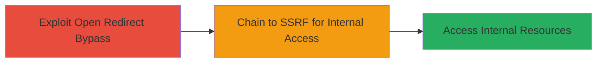

---
tags:
  - ssrf
  - open-redirect
  - bypass
  - web-vulnerability
type: attack_chain
tools: []
tactics:
  - '[[Initial Access]]'
  - '[[Discovery]]'
verified: false
platforms:
  - Web
submitted: true
complexity: medium
created_at: '2023-10-01T00:00:00Z'
procedures:
  - '[[procedures/Bypass-Open-Redirect-Validation]]'
  - '[[procedures/Exploit-SSRF-via-Redirect]]'
step_count: 2
techniques:
  - '[[Exploit Public-Facing Application]]'
  - '[[Drive-by Compromise]]'
updated_at: '2025-12-14T17:24:31.408Z'
description: >-
  A multi-stage attack exploiting a bypassable open redirect vulnerability in
  the Smule web application to chain into a Server-Side Request Forgery (SSRF),
  enabling unauthorized access to internal services.
skill_level: intermediate
impact_level: medium
id: 805de3b9-ebe4-4583-8e54-c77ebe2e1376
validated: true
mitre_tactics:
  - '[[Initial Access]]'
  - '[[Discovery]]'
mitre_techniques:
  - '[[Exploit Public-Facing Application]]'
  - '[[Drive-by Compromise]]'
---
# Open Redirect Bypass Chained to SSRF for Internal Resource Access in Smule

Multi-stage attack chain demonstrating exploitation of a bypassable open redirect in the Smule application to achieve SSRF and potential access to internal resources.

## Chain Metrics Dashboard

| Metric | Value |
|--------|-------|
| Chain Status | Unverified |
| Total Steps | 2 |
| Execution Time | ~5 minutes |
| Skill Level | Intermediate |
| Complexity | Medium |
| Impact Level | Medium |

## Attack Flow Visualization



## Prerequisites & Requirements

### Required Tools

- Browser or proxy tool like Burp Suite for URL manipulation

### Target Environment

- Smule web application
- Web platform with redirect functionality
- Network access to public-facing endpoints

### Initial Access Requirements

- Valid user session or public access to redirect endpoint
- No special credentials required for initial redirect test

## Detailed Attack Procedures

### Step 1: Bypass Open Redirect Validation
procedure: [[procedures/Bypass-Open-Redirect-Validation]]

**Objective**: Identify and bypass validation in the Smule application's redirect feature to force redirection to arbitrary external URLs, setting up for phishing or chaining attacks.

**Instructions**: Use [[commands/curl-redirect-test]] to probe the redirect endpoint with a crafted URL that bypasses validation, such as encoding or using alternative schemes.

```bash
curl -X GET "https://app.smule.com/redirect?url=ja%vascript:alert(1)" -v
```

Verify the response headers or body to confirm the redirect occurs to the intended arbitrary URL.

**Expected Output**: HTTP 302 redirect to the bypassed URL, or execution of the payload in the context.

**Success Indicators**:
- Redirect to non-whitelisted domain succeeds
- No validation error returned

### Step 2: Chain Open Redirect to SSRF Exploitation
procedure: [[procedures/Exploit-SSRF-via-Redirect]]

**Objective**: Leverage the bypassed open redirect to induce the server to make unauthorized requests to internal resources, such as metadata services or local networks.

**Instructions**: Craft a redirect URL that points to an internal resource via the SSRF vector, using [[commands/curl-ssrf-payload]] to test server-side request initiation.

```bash
curl -X GET "https://app.smule.com/redirect?url=http://169.254.169.254/latest/meta-data/" -v
```

Monitor the response for leaked internal data or successful SSRF execution.

**Expected Output**: Server response containing internal metadata or access to restricted resources.

**Success Indicators**:
- Internal resource data returned in response
- No access denial from server-side checks

## Attack Chain Summary

### Key Achievements

1. Successful bypass of open redirect validation in Smule
2. Chained exploitation leading to SSRF
3. Potential unauthorized access to internal services

## Technique & Tactic Coverage

### MITRE ATT&CK Techniques

- [[Drive-by Compromise]]
- [[Exploit Public-Facing Application]]

### MITRE ATT&CK Tactics

- [[Initial Access]]
- [[Discovery]]

---
*Last updated: 2023-10-01T00:00:00Z*
