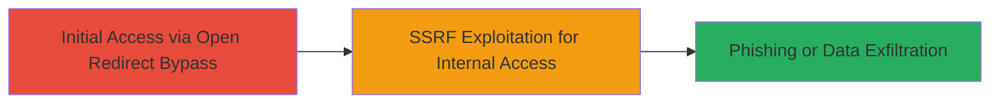

# Open Redirect Bypass and SSRF Exploitation in Smule Web Application

Multi-stage attack chain demonstrating exploitation of open redirect bypass and SSRF vulnerabilities in Smule's web application, reported in January 2020. The chain begins with bypassing open redirect controls to facilitate phishing and progresses to SSRF for potential internal network reconnaissance or access.

## Chain Metrics Dashboard

| Metric | Value |
|--------|-------|
| Chain Status | Unverified |
| Total Steps | 2 |
| Execution Time | ~5 minutes |
| Skill Level | Intermediate |
| Complexity | Medium |
| Impact Level | Medium |

## Attack Flow Visualization



## Prerequisites & Requirements

### Required Tools

- Browser or proxy tool like Burp Suite for testing redirects and requests

### Target Environment

- Web platform (Smule application endpoints)
- Required services/ports: HTTP/HTTPS on standard ports (80/443)
- Network access requirements: Public internet access to Smule's web app

### Initial Access Requirements

- No credentials required (public-facing vulnerability)
- Network position: External attacker
- Prior access needed: None

## Detailed Attack Procedures

### Step 1: Bypass Open Redirect
procedure: [[procedures/Bypass-Open-Redirect-for-Phishing]]

**Objective**: Bypass controls on the open redirect vulnerability to craft malicious URLs for phishing or unauthorized redirects.

**Instructions**: Identify the redirect endpoint in Smule's application, typically a URL parameter like ?redirect= or ?url=. Test with a benign external URL first, then attempt bypass using techniques like URL encoding or double encoding to evade filters. Use [[commands/curl-open-redirect-test]] to send a request:

```bash
curl -X GET "https://app.smule.com/redirect?url=//evil.com" -v
```

If successful, the response will show a 302 redirect to the unauthorized domain. Chain this with phishing by embedding in emails or links.

**Expected Output**: HTTP 302 redirect header pointing to the attacker-controlled URL.

**Success Indicators**:
- Redirect occurs to unauthorized external domain
- No validation errors or blocks from the application

### Step 2: Exploit SSRF for Internal Access
procedure: [[procedures/Exploit-SSRF-for-Internal-Access]]

**Objective**: Leverage the SSRF vulnerability to make server-side requests to internal or unauthorized endpoints, potentially accessing metadata services or internal networks.

**Instructions**: Locate the SSRF-prone endpoint, often an image loader or URL fetcher in the Smule app. Craft a payload targeting internal IPs like 127.0.0.1 or cloud metadata (e.g., http://169.254.169.254). Use [[commands/curl-ssrf-test]] to probe:

```bash
curl -X POST "https://app.smule.com/fetch?url=http://169.254.169.254/latest/meta-data/" -v
```

Monitor the response for leaked internal data. If SSRF allows, chain with open redirect for broader impact like exfiltrating data via redirects.

**Expected Output**: Server response containing internal endpoint data, such as AWS metadata if hosted on cloud.

**Success Indicators**:
- Application fetches and returns internal resource content
- No firewall or WAF blocks on internal requests

## Attack Chain Summary

### Key Achievements

1. Successful bypass of open redirect filters enabling phishing campaigns
2. SSRF exploitation leading to potential internal network reconnaissance
3. Combined impact for unauthorized access and data exposure in Smule's web app

## Technique & Tactic Coverage

### MITRE ATT&CK Techniques

- [[Exploit Public-Facing Application]]
- [[T1566.002]]

### MITRE ATT&CK Tactics

- [[Initial Access]]
- [[Collection]]

---
*Last updated: 2024-10-01*
