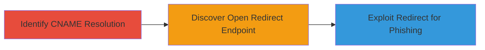

# Open Redirect Exploitation via Third-Party CNAME on HackerOne Subdomain

Multi-stage attack chain demonstrating the discovery and exploitation of an open redirect vulnerability through a third-party vendor's service, exposed via HackerOne's 'events.hackerone.com' subdomain CNAME. This allows redirection from a trusted domain to arbitrary attacker-controlled sites, potentially enabling phishing attacks on users who trust the HackerOne brand.

## Chain Metrics Dashboard

| Metric | Value |
|--------|-------|
| Chain Status | Unverified |
| Total Steps | 3 |
| Execution Time | ~5 minutes |
| Skill Level | Beginner |
| Complexity | Low |
| Impact Level | Low |

## Attack Flow Visualization



## Prerequisites & Requirements

### Required Tools

- Web browser or DNS lookup tool (e.g., nslookup, dig)
- URL testing tool (e.g., browser or curl)

### Target Environment

- Web platform
- Access to DNS resolution tools
- No special credentials required

### Initial Access Requirements

- Public internet access
- No prior authentication needed

## Detailed Attack Procedures

### Step 1: Identify Subdomain CNAME Resolution
procedure: [[procedures/Identify-Subdomain-CNAME-Resolution]]

**Objective**: Determine if the target subdomain resolves to a third-party service via CNAME, exposing potential misconfigurations.

**Instructions**: Perform a DNS lookup on the target subdomain 'events.hackerone.com' to check for CNAME records pointing to external vendors.

Use a DNS resolution tool like dig or nslookup:

```bash
dig CNAME events.hackerone.com
```

or

```bash
nslookup -type=CNAME events.hackerone.com
```

**Expected Output**: Resolution showing a CNAME to a third-party domain, such as a vendor's service endpoint.

**Success Indicators**:
- CNAME record identified pointing to external domain
- Confirmation of third-party dependency

### Step 2: Discover Open Redirect Endpoint
dprocedure: [[procedures/Discover-Open-Redirect-Endpoint]]

**Objective**: Identify vulnerable endpoints on the third-party service that allow unrestricted URL redirects.

**Instructions**: Once the third-party domain is known, enumerate common endpoints like '/redirect' and test parameters for open redirect behavior. Access the endpoint via browser or request tool, appending a test URL parameter.

For example, navigate to or request:

```http
http://third-party-domain/redirect?url=http://example.com
```

Observe if the response initiates an unrestricted redirect to the provided URL without validation.

**Expected Output**: Server responds with a 302 redirect to the arbitrary URL, confirming the vulnerability.

**Success Indicators**:
- Redirect occurs without domain validation or allowlisting
- Arbitrary external URLs are accepted

### Step 3: Exploit Open Redirect for Phishing
procedure: [[procedures/Exploit-Open-Redirect-for-Phishing]]

**Objective**: Demonstrate the vulnerability by crafting a redirect from the trusted HackerOne subdomain to an attacker-controlled site, simulating a phishing scenario.

**Instructions**: Leverage the discovered endpoint through the HackerOne subdomain by appending an attacker-controlled URL to the parameter. For instance, use a GitHub page or similar as the target.

Construct the URL:

```http
http://events.hackerone.com/redirect?url=https://naglinagli.github.io
```

Access this URL in a browser to trigger the redirect from the trusted domain.

**Expected Output**: User is redirected from events.hackerone.com to the external attacker site, potentially tricking users into believing the content is from HackerOne.

**Success Indicators**:
- Successful redirect from trusted subdomain
- No security interruptions or validations

## Attack Chain Summary

### Key Achievements

1. Exposed third-party dependency via DNS reconnaissance
2. Identified unvalidated redirect parameter in vendor service
3. Demonstrated phishing potential through trusted domain spoofing

## Technique & Tactic Coverage

### MITRE ATT&CK Techniques

- [[Exploit Public-Facing Application]] Exploit Public-Facing Application
- [[Drive-by Compromise]] Drive-by Compromise

### MITRE ATT&CK Tactics

- [[Initial Access]] Initial Access
- [[Lateral Movement]] Lateral Movement

---
*Last updated: 2023-10-01T00:00:00Z*
