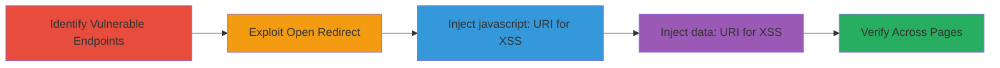

---
tags:
  - open-redirect
  - xss
  - reflected-xss
  - bypass
  - shopify
  - web
type: attack_chain
tools: []
tactics:
  - '[[Initial Access]]'
  - '[[Execution]]'
verified: false
platforms:
  - Web
submitted: true
complexity: medium
created_at: '2023-10-01T00:00:00Z'
procedures:
  - '[[procedures/Identify-Vulnerable-Path-Parameter-Endpoints]]'
  - '[[procedures/Exploit-Open-Redirect-with-Double-Slash-Bypass]]'
  - '[[procedures/Execute-Reflected-XSS-via-Javascript-URI]]'
  - '[[procedures/Execute-Reflected-XSS-via-Data-URI]]'
  - '[[procedures/Verify-Vulnerability-Across-Multiple-Pages]]'
step_count: 5
techniques:
  - '[[Exploit Public-Facing Application]]'
  - '[[JavaScript]]'
updated_at: '2025-12-13T23:52:33.815Z'
description: >-
  A multi-stage attack exploiting insufficient validation in the 'path'
  parameter on Shopify's supporthiring.shopify.com to achieve open redirects for
  phishing and reflected XSS for script execution.
skill_level: intermediate
impact_level: high
id: 47661163-4b29-4a75-8321-03156d285295
validated: true
mitre_tactics:
  - '[[Initial Access]]'
  - '[[Execution]]'
mitre_techniques:
  - '[[Exploit Public-Facing Application]]'
  - '[[JavaScript]]'
---
# Open Redirect and Reflected XSS via Path Parameter Bypass in Shopify Support Pages

Multi-stage attack chain demonstrating exploitation of open redirect and reflected XSS vulnerabilities in the 'path' parameter on supporthiring.shopify.com under /apps/locksmith/resource/pages/ endpoints. The attack bypasses URL validation using double slashes (%2F%2F) for redirects and injects javascript: or data: URIs for XSS, enabling phishing or data theft across multiple browsers and pages.

## Chain Metrics Dashboard

| Metric | Value |
|--------|-------|
| Chain Status | Unverified |
| Total Steps | 5 |
| Execution Time | ~5 minutes |
| Skill Level | Intermediate |
| Complexity | Medium |
| Impact Level | High |

## Attack Flow Visualization

## Prerequisites & Requirements

### Required Tools

- Web browser (e.g., Chrome, Firefox)
- URL encoding tool or browser developer tools

### Target Environment

- Web platform
- Shopify-hosted application (supporthiring.shopify.com)
- Endpoints under /apps/locksmith/resource/pages/

### Initial Access Requirements

- Public access to the target website
- No authentication required
- Ability to craft and visit malicious URLs

## Detailed Attack Procedures

### Step 1: Identify Vulnerable Endpoints
procedure: [[procedures/Identify-Vulnerable-Path-Parameter-Endpoints]]

**Objective**: Locate pages using the 'path' parameter for internal routing without proper validation.

**Instructions**: Navigate to example endpoints like https://supporthiring.shopify.com/apps/locksmith/resource/pages/gauntlet-challenge and inspect for the 'path=' parameter in URLs or forms.

**Expected Output**: Confirmation of 'path' parameter presence on pages such as /gauntlet-challenge.

**Success Indicators**:
- 'path' parameter identified in URL structure
- Parameter accepts arbitrary input without immediate rejection

### Step 2: Exploit Open Redirect
procedure: [[procedures/Exploit-Open-Redirect-with-Double-Slash-Bypass]]

**Objective**: Bypass validation to redirect users to external malicious sites after a brief 404 page.

**Instructions**: Append ?&path=%2F%2Fevil.com to a vulnerable URL, e.g., https://supporthiring.shopify.com/apps/locksmith/resource/pages/gauntlet-challenge?&path=%2F%2Fevil.com. Observe the 404 page followed by a 2-second redirect to https://evil.com.

**Expected Output**: Temporary 404 page then automatic redirect to the external domain.

**Success Indicators**:
- Redirect occurs to arbitrary external site
- Works in all major browsers

### Step 3: Execute XSS via javascript: URI
procedure: [[procedures/Execute-Reflected-XSS-via-Javascript-URI]]

**Objective**: Inject and execute JavaScript code to demonstrate script control, such as alerting the domain.

**Instructions**: Append ?&path=javascript:alert(document.domain) to the vulnerable URL, e.g., https://supporthiring.shopify.com/apps/locksmith/resource/pages/gauntlet-challenge?&path=javascript:alert(document.domain).

**Expected Output**: Alert popup displaying the document domain (supporthiring.shopify.com).

**Success Indicators**:
- JavaScript alert executes
- No sanitization blocks the URI scheme

### Step 4: Execute XSS via data: URI
procedure: [[procedures/Execute-Reflected-XSS-via-Data-URI]]

**Objective**: Use a base64-encoded data URI to execute arbitrary HTML and JavaScript for advanced payloads.

**Instructions**: Append ?&path=data%3Atext%2fhtml%3Bbase64%2CPHNjcmlwdD5hbGVydCgvWFNTIFBvQy8pPC9zY3JpcHQ%3E to the URL, e.g., https://supporthiring.shopify.com/apps/locksmith/resource/pages/gauntlet-challenge?&path=data%3Atext%2fhtml%3Bbase64%2CPHNjcmlwdD5hbGVydCgvWFNTIFBvQy8pPC9zY3JpcHQ%3E.

**Expected Output**: Alert popup with 'XSS PoC' message from the decoded script.

**Success Indicators**:
- Base64-decoded script executes
- Arbitrary code injection confirmed

### Step 5: Verify Across Multiple Pages
procedure: [[procedures/Verify-Vulnerability-Across-Multiple-Pages]]

**Objective**: Confirm the vulnerability affects numerous endpoints for broader impact assessment.

**Instructions**: Test the payloads from previous steps on additional pages like /gauntlet-book-a-time, /life-story-bc-ireland, /life-story-on-nb, and /gauntlet-resources.

**Expected Output**: Consistent redirect or XSS behavior on all tested endpoints.

**Success Indicators**:
- Exploitation succeeds on multiple pages
- Uniform bypass across the application

## Attack Chain Summary

### Key Achievements

1. Bypassed URL validation using double slashes to enable open redirects for phishing attacks.
2. Achieved reflected XSS via javascript: and data: URIs, allowing arbitrary script execution.
3. Demonstrated impact across multiple Shopify support pages, affecting user data and trust.

## Technique & Tactic Coverage

### MITRE ATT&CK Techniques

- [[Exploit Public-Facing Application]] Exploit Public-Facing Application
- [[JavaScript]] JavaScript

### MITRE ATT&CK Tactics

- [[Initial Access]] Initial Access
- [[Execution]] Execution

---
*Last updated: 2023-10-01T00:00:00Z*
